# Kubernetes Tutorial: Complete Learning Path

*Master DevOps by building a real application that scales from local development to global production*

## 🎯 What You'll Learn

By the end of this tutorial, you'll know how to:
- **Deploy applications** on Kubernetes (the industry standard)
- **Monitor performance** with production-grade tools
- **Automate deployments** using GitOps principles
- **Scale globally** with CDN and load balancing
- **Troubleshoot issues** like a professional DevOps engineer

## Why This Matters

This project teaches you enterprise-grade DevOps by building a real application that scales from local development to global production. You'll learn the same patterns used by companies like Netflix, Airbnb, and GitHub.

**Career Impact**: Kubernetes skills are in high demand. DevOps engineers with Kubernetes experience earn 20-30% more than those without it.

## What You'll Build

A complete production application stack featuring:

- **Multi-service application** running on Kubernetes
- **Production networking** with Ingress and TLS termination  
- **Comprehensive monitoring** with Prometheus and Grafana dashboards
- **Database persistence** with PostgreSQL and Redis
- **Professional DevOps workflows** using GitOps and automation

## Architecture Overview

```mermaid
graph TB
    subgraph "🌐 Client Layer"
        Client[🌐 Client Browser]
        Mobile[📱 Mobile App]
    end
    
    subgraph "☁️ CDN & Edge"
        CDN[☁️ Cloudflare CDN<br/>gameapp.games]
        Tunnel[🔗 Cloudflare Tunnel<br/>app.gameapp.games]
    end
    
    subgraph "🚪 Ingress Layer"
        Ingress[ Ingress Controller<br/>humor-game-nginx<br/>Port 80/443]
        LB[⚖️ Load Balancer<br/>Port 8080:80]
    end
    
    subgraph "🏗️ Application Layer"
        Frontend[🌐 Frontend Service<br/>Port 80<br/>humor-game namespace]
        Backend[🔧 Backend API Service<br/>Port 3001<br/>humor-game namespace]
    end
    
    subgraph "🗄️ Data Layer"
        Postgres[(🗄️ PostgreSQL<br/>humor_memory_game<br/>Port 5432)]
        Redis[(🔴 Redis Cache<br/>Port 6379)]
    end
    
    subgraph "📊 Monitoring Stack"
        Prometheus[📊 Prometheus<br/>Port 9090<br/>monitoring namespace]
        Grafana[📈 Grafana<br/>Port 3000<br/>monitoring namespace]
    end
    
    subgraph "🔄 GitOps Layer"
        ArgoCD[🔄 ArgoCD<br/>Port 8080<br/>argocd namespace]
        Git[📚 Git Repository<br/>Configuration as Code]
    end
    
    subgraph "🔒 Security Layer"
        NP[🛡️ Network Policies<br/>Pod-to-Pod Security]
        SC[🔐 Security Contexts<br/>Non-root Containers]
        TLS[🔒 TLS Certificates<br/>Let's Encrypt]
    end
    
    %% Client connections
    Client --> CDN
    Mobile --> CDN
    Client --> Tunnel
    
    %% CDN to Ingress
    CDN --> Ingress
    Tunnel --> Ingress
    
    %% Ingress to Services
    Ingress --> Frontend
    Ingress --> Backend
    
    %% Service to Data
    Backend --> Postgres
    Backend --> Redis
    
    %% Monitoring connections
    Backend --> Prometheus
    Prometheus --> Grafana
    
    %% GitOps connections
    Git --> ArgoCD
    ArgoCD --> Frontend
    ArgoCD --> Backend
    
    %% Security connections
    NP --> Frontend
    NP --> Backend
    SC --> Frontend
    SC --> Backend
    TLS --> Ingress
    
    %% Load Balancer
    LB --> Ingress
    
    %% Styling
    classDef clientLayer fill:#e1f5fe
    classDef cdnLayer fill:#f3e5f5
    classDef ingressLayer fill:#e8f5e8
    classDef appLayer fill:#fff3e0
    classDef dataLayer fill:#fce4ec
    classDef monitoringLayer fill:#e0f2f1
    classDef gitopsLayer fill:#f1f8e9
    classDef securityLayer fill:#ffebee
    
    class Client,Mobile clientLayer
    class CDN,Tunnel cdnLayer
    class Ingress,LB ingressLayer
    class Frontend,Backend appLayer
    class Postgres,Redis dataLayer
    class Prometheus,Grafana monitoringLayer
    class ArgoCD,Git gitopsLayer
    class NP,SC,TLS securityLayer
```

## Learning Path

| Milestone | Goal | What You'll Learn | ⏱️ Time |
|-----------|------|-------------------|----------|
| **0. Setup** | Tools ready | Install Docker/Colima, kubectl, k3d, Helm, Node, jq | 15-30 min |
| **1. Compose** | App works locally | Docker Compose with postgres, redis, backend, frontend services | 20-40 min |
| **2. K8s Core** | App on k3d | Kubernetes deployment to humor-game namespace | 30-60 min |
| **3. Ingress** | Prod-style access | humor-game-nginx controller with gameapp.local and gameapp.games | 20-40 min |
| **4. Observability** | See/measure | Prometheus and Grafana in monitoring namespace | 45-90 min |
| **5. GitOps** | Automate | ArgoCD in argocd namespace for automated deployments | 30-60 min |
| **6. Global** | Ship worldwide | Cloudflare tunnel with app.gameapp.games, prometheus.gameapp.games, grafana.gameapp.games | 60-120 min |

## Success Metrics

**By the end, you'll have:**
- ✅ **4 pods running** in humor-game namespace (postgres, redis, backend, frontend)
- ✅ **Monitoring stack** in monitoring namespace (prometheus, grafana)
- ✅ **GitOps automation** in argocd namespace
- ✅ **Global access** via Cloudflare CDN
- ✅ **Production security** with network policies and security contexts

## Technology Stack

**Application Layer:**
- **Frontend**: Vanilla JS with nginx (port 80)
- **Backend**: Node.js Express API (port 3001)
- **Database**: PostgreSQL 15 (port 5432)
- **Cache**: Redis 7 (port 6379)

**Infrastructure Layer:**
- **Containerization**: Docker & Docker Compose
- **Orchestration**: Kubernetes (k3d)
- **Ingress**: humor-game-nginx controller
- **Monitoring**: Prometheus (port 9090) + Grafana (port 3000)
- **GitOps**: ArgoCD
- **CDN**: Cloudflare

**Development Tools:**
- **Cluster**: k3d (lightweight Kubernetes)
- **Package Manager**: Helm
- **CLI**: kubectl, docker, docker-compose
- **Scripting**: Node.js, jq

## Prerequisites

**System Requirements:**
- 4GB+ RAM available
- 10GB+ disk space
- macOS or Linux (Windows via WSL2)

**Required Tools:**
- Docker 20.0+ / Colima (macOS)
- kubectl 1.28+
- k3d 5.6+
- Helm 3.18+
- Node.js 18+
- jq 1.6+

## Getting Started

1. **Install tools** → [01-prereqs.md](01-prereqs.md)
2. **Verify setup** → Run verification commands
3. **Start building** → [02-compose.md](02-compose.md)

## What Makes This Different

**Real Application**: Not just "hello world" - a working memory game with leaderboards
**Production Patterns**: Same infrastructure used by major tech companies
**Hands-on Learning**: Every concept is practiced, not just explained
**Progressive Complexity**: Each milestone builds on the previous one
**Troubleshooting Skills**: Learn to debug real infrastructure issues

## Next Steps

Ready to begin? Start with [01-prereqs.md](01-prereqs.md) to set up your development environment.
