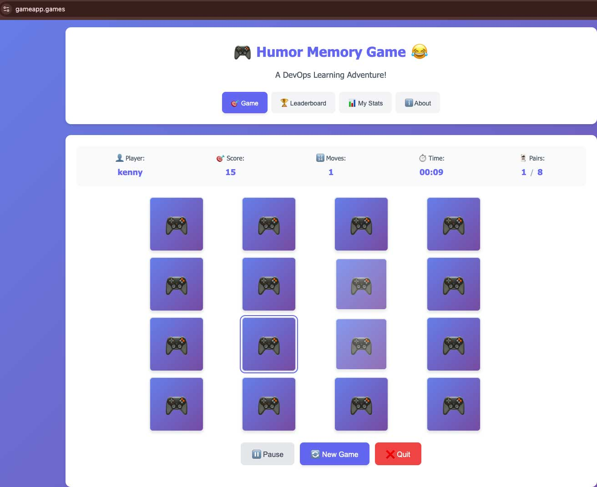

# 📚 Kubernetes Tutorial Documentation Hub

*Learn DevOps by building a real application: Docker → Kubernetes → Monitoring → GitOps → Global Deployment*

[](./00-overview.md)
[](./01-prereqs.md)
[](./07-global.md)

## 🎮 **Application Preview**



*The Humor Memory Game: A DevOps Learning Adventure! - A web-based memory game featuring a 4x4 grid of cards, game statistics, and navigation tabs for Game, Leaderboard, My Stats, and About.*

---

## 🎯 **Quick Navigation**

| 🚀 **Start Here** | 📚 **Core Guides** | 🔧 **Reference** | 🎓 **Career** |
|-------------------|-------------------|------------------|---------------|
| [Overview](00-overview.md) | [Prerequisites](01-prereqs.md) | [Troubleshooting](08-troubleshooting.md) | [Interview Prep](../interviewprep.md) |
| [Learning Path](#learning-path) | [Docker Compose](02-compose.md) | [FAQ](09-faq.md) | [Medium Article](../medium-blog-post.md) |
| [Prerequisites](01-prereqs.md) | [Kubernetes Basics](03-k8s-basics.md) | [Glossary](10-glossary.md) | [Technical Deep Dives](#technical-deep-dives) |

---

## 📋 **Complete Learning Path**

### **🎯 Core Milestones** *(Follow in order)*

| Step | Guide | What You'll Learn | Time | Difficulty |
|------|-------|-------------------|------|------------|
| **0** | [📖 Learning Path Overview](00-overview.md) | Complete tutorial roadmap and architecture | 15 min | 🟢 Beginner |
| **1** | [⚙️ Development Environment Setup](01-prereqs.md) | Install Docker, Kubernetes tools, and dev environment | 30 min | 🟢 Beginner |
| **2** | [🐳 Docker Multi-Container App](02-compose.md) | Build your first containerized application | 45 min | 🟢 Beginner |
| **3** | [☸️ Kubernetes Production Deployment](03-k8s-basics.md) | Deploy apps on Kubernetes with databases | 60 min | 🟡 Intermediate |
| **4** | [🌐 Internet Access & Networking](04-ingress.md) | Make your app accessible from the internet | 45 min | 🟡 Intermediate |
| **5** | [📊 Performance Monitoring](05-observability.md) | Track app health with Prometheus & Grafana | 90 min | 🟡 Intermediate |
| **6** | [🔄 Automated Deployments](06-gitops.md) | Deploy with GitOps automation | 60 min | 🟠 Advanced |
| **7** | [🌍 Global Scale & Security](07-global.md) | Production hardening, CDN, and auto-scaling | 120 min | 🔴 Expert |

**⏱️ Total Time**: 5-8 hours  
**🎯 Final Result**: Production-ready Kubernetes deployment with global access

---

## 🔧 **Reference Documentation**

### **📖 Technical References**
- **[🚨 Troubleshooting Guide](08-troubleshooting.md)** - Common issues and solutions
- **[❓ Frequently Asked Questions](09-faq.md)** - Quick answers to common questions  
- **[📖 Technical Glossary](10-glossary.md)** - Terms and definitions explained
- **[📝 Architecture Decisions](11-decision-notes.md)** - Why we chose specific technologies

### **🛠️ Advanced Guides**
- **[🔒 Security Contexts Deep Dive](security-contexts-guide.md)** - Production security hardening
- **[📊 Custom Dashboard Guide](custom-dashboard-guide.md)** - Building monitoring dashboards
- **[🌐 Cloudflare Setup Guide](cloudflare-tunnel-setup-guide.md)** - Global CDN configuration
- **[🔍 Monitoring Troubleshooting](monitoring-troubleshooting.md)** - Observability issues

### **🎓 Career Development**
- **[🎤 Interview Preparation](../interviewprep.md)** - Technical interview questions and answers
- **[📝 Medium Blog Template](../medium-blog-post.md)** - Professional project writeup
- **[🏗️ Architecture Diagrams](architecture/)** - Visual system documentation

---

## 🎭 **Choose Your Learning Style**

### **🚀 Fast Track** *(Experienced Users)*
```bash
# Deploy everything at once
git clone https://github.com/Osomudeya/DevOps-Home-Lab-2025.git
cd humor-memory-game
make deploy-all
make verify
```
**Time**: 30-60 minutes  
**Skills**: Kubernetes, Docker, kubectl experience required

### **📚 Guided Learning** *(Recommended for Beginners)*
1. Start with [Project Overview](00-overview.md)
2. Follow each milestone guide in order
3. Complete hands-on exercises
4. Build production skills incrementally

**Time**: 5-8 hours  
**Skills**: Suitable for beginners to intermediate

### **🎯 Topic-Specific** *(Focused Learning)*
- **Monitoring Only**: [Observability Guide](05-observability.md)
- **Security Focus**: [Security Contexts Guide](security-contexts-guide.md)
- **GitOps Workflow**: [GitOps Guide](06-gitops.md)
- **Global Deployment**: [Global Production Guide](07-global.md)

---

## 🏗️ **Technical Deep Dives**

### **🔍 Architecture Analysis**
- **[System Architecture Overview](00-overview.md#architecture-overview)** - Complete system design
- **[Network Flow Diagrams](04-ingress.md#network-architecture)** - Traffic routing and load balancing
- **[Security Architecture](security-contexts-guide.md)** - Defense-in-depth implementation
- **[Monitoring Strategy](05-observability.md#monitoring-strategy)** - Observability best practices

### **⚙️ Technology Choices**
- **[Kubernetes vs. Docker Compose](11-decision-notes.md#orchestration)** - When and why to use each
- **[Ingress Controller Comparison](04-ingress.md#controller-options)** - NGINX vs. Traefik vs. others
- **[Monitoring Stack Selection](05-observability.md#tool-comparison)** - Prometheus vs. alternatives
- **[GitOps Tool Analysis](06-gitops.md#tool-comparison)** - ArgoCD vs. Flux vs. others

### **🚀 Performance Optimization**
- **[Resource Tuning Guide](03-k8s-basics.md#resource-optimization)** - CPU and memory optimization
- **[Auto-scaling Configuration](07-global.md#horizontal-pod-autoscaling)** - HPA setup and tuning
- **[CDN Integration](07-global.md#cloudflare-optimization)** - Global performance optimization
- **[Database Performance](03-k8s-basics.md#database-optimization)** - PostgreSQL and Redis tuning

---

## 🆘 **Getting Help**

### **🔧 Quick Diagnostic Commands**
```bash
# Application health check
kubectl get pods -n humor-game
kubectl get svc -n humor-game
curl -H "Host: gameapp.local" http://localhost:8080/api/health

# Monitoring status
kubectl get pods -n monitoring
kubectl port-forward svc/grafana -n monitoring 3000:3000

# GitOps status
kubectl get applications -n argocd
kubectl get pods -n argocd
```

### **📞 Support Channels**
- 🐛 **Found a bug?** → [Open GitHub Issue](https://github.com/Osomudeya/DevOps-Home-Lab-2025.git/issues)
- 💬 **Have questions?** → [GitHub Discussions](https://github.com/Osomudeya/DevOps-Home-Lab-2025.git/discussions)
- 📖 **Need clarification?** → Check [FAQ](09-faq.md) or [Glossary](10-glossary.md)
- 🎓 **Want to contribute?** → See [GitHub Issues](https://github.com/Osomudeya/DevOps-Home-Lab-2025.git/issues)

### **🚨 Emergency Troubleshooting**
1. **Pods won't start**: Check [Troubleshooting Guide](08-troubleshooting.md#pod-issues)
2. **Can't access application**: See [Network Troubleshooting](08-troubleshooting.md#network-issues)
3. **ArgoCD problems**: Check [GitOps Troubleshooting](gitops-troubleshooting.md)
4. **Monitoring not working**: See [Monitoring Troubleshooting](monitoring-troubleshooting.md)

---

## 🎯 **Success Criteria**

### **✅ Milestone Completion Checklist**

**After completing all guides, you should have:**
- ✅ **4 microservices** running in separate pods
- ✅ **Local Kubernetes cluster** with k3d
- ✅ **Production ingress** with custom domains
- ✅ **Comprehensive monitoring** with Prometheus and Grafana
- ✅ **GitOps automation** with ArgoCD
- ✅ **Global CDN access** via Cloudflare
- ✅ **Production security** with network policies and security contexts
- ✅ **Auto-scaling** with horizontal pod autoscaling

### **🎓 Skills Gained**
- **Container Orchestration**: Deploy and manage Kubernetes applications
- **Infrastructure as Code**: Declarative configuration management
- **Monitoring & Observability**: Metrics collection and visualization
- **GitOps Workflows**: Automated, auditable deployments
- **Production Security**: Network isolation and container hardening
- **Global Scale**: CDN integration and performance optimization

### **💼 Career Impact**
- **Resume Projects**: Production-grade Kubernetes deployment
- **Interview Preparation**: Technical questions and hands-on experience
- **Industry Knowledge**: Modern DevOps practices and tools
- **Portfolio Development**: Documented, live-running application

---

## 📊 **Learning Resources**

### **🎥 Video Supplements** *(Coming Soon)*
- Architecture walkthrough and explanation
- Live troubleshooting sessions
- Interview preparation mock sessions
- Advanced topics deep dives

### **📝 External Learning**
- **[Kubernetes Official Documentation](https://kubernetes.io/docs/)**
- **[Prometheus Monitoring Guide](https://prometheus.io/docs/)**
- **[ArgoCD Documentation](https://argo-cd.readthedocs.io/)**
- **[Cloudflare Developers](https://developers.cloudflare.com/)**

### **🏢 Enterprise Considerations**
- **Multi-cluster deployments** and federation
- **Enterprise security** and compliance requirements
- **Cost optimization** strategies at scale
- **Team collaboration** and access control

---

## 🌟 **Community Success Stories**

> *"Followed this guide to land my first DevOps role at a Fortune 500 company. The interview prep was invaluable!"*  
> **— Sarah K., DevOps Engineer**

> *"Used this as the foundation for our startup's infrastructure. Saved us 6 months of research and trial-and-error."*  
> **— Alex T., CTO**

> *"Finally understand the connection between Docker, Kubernetes, and production deployments. Best hands-on tutorial I've found."*  
> **— Mike R., Full-Stack Developer**

---

## 🤝 **Contributing to Documentation**

We welcome contributions to improve these guides! Here's how you can help:

### **📝 Documentation Improvements**
- Fix typos and grammatical errors
- Add missing explanations or examples
- Improve code snippets and commands
- Enhance troubleshooting sections

### **🎓 Educational Enhancements**
- Add beginner-friendly explanations
- Create visual diagrams and flowcharts
- Develop hands-on exercises
- Share real-world use cases

### **🔧 Technical Updates**
- Update for new tool versions
- Add advanced configuration options
- Improve security recommendations
- Optimize performance suggestions

**📋 See**: [GitHub Issues](https://github.com/Osomudeya/DevOps-Home-Lab-2025.git/issues) for detailed instructions

---

*Ready to start your production Kubernetes journey? Begin with the [Project Overview](00-overview.md) or jump straight into [Prerequisites Setup](01-prereqs.md)!*
