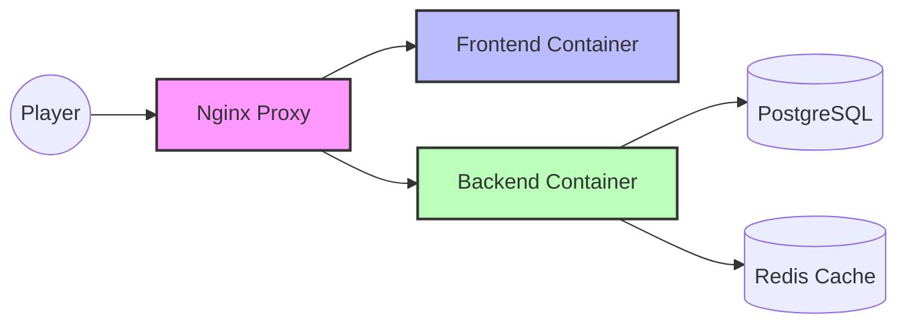
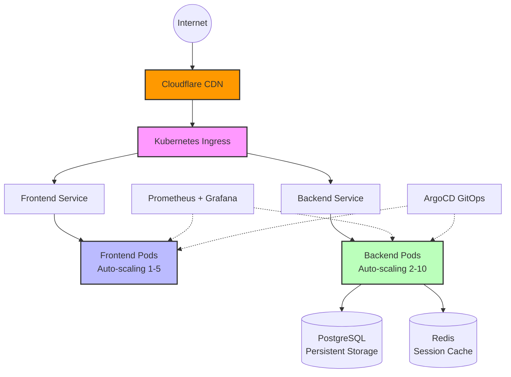

# Humor Memory Game: Complete Beginner's Journey to Production Kubernetes

*From "What is a container?" to "I can deploy enterprise applications" in one comprehensive guide*

---

## Before We Start: What You'll Actually Learn

Most tutorials teach you to copy commands. This guide teaches you to **think like a DevOps engineer**. 

By the end, you'll understand:
- Why companies migrate from simple deployments to Kubernetes
- How to make technical architecture decisions
- What can go wrong and how to fix it yourself
- How to explain these concepts to your teammates

**This isn't just about running commands—it's about understanding systems.**

---

## Understanding the Journey: Where You're Going and Why

### Mental Model: The Restaurant Analogy

Imagine you run a restaurant that's growing fast:

**Docker Compose = Small Family Restaurant**
- One kitchen (container), one server (you), fixed menu
- When busy, customers wait in line
- If the kitchen breaks, restaurant closes
- Perfect for small scale, but doesn't handle growth

**Kubernetes = Restaurant Chain**
- Multiple kitchens (pods), professional staff (services), load balancing
- When busy, open more kitchens automatically
- If one kitchen breaks, others keep serving
- Complex to set up, but scales infinitely

**Your Journey:**
1. **M0-M1**: Learn the difference between running one restaurant vs managing a chain
2. **M2-M4**: Set up the basic infrastructure (kitchens, staff, ordering system)
3. **M5-M6**: Add professional management (routing, monitoring)
4. **M7-M8**: Automate everything (no manual work, global reach)

---

## Prerequisites: Your Learning Environment

### Required Tools Installation

| Tool | Purpose | Install Command | Learning Priority |
|------|---------|----------------|-------------------|
| **Docker** | Container runtime (the "kitchen equipment") | `brew install docker` | Essential |
| **Docker Compose** | Multi-container apps (the "restaurant workflow") | `brew install docker-compose` | Essential |
| **kubectl** | Kubernetes CLI (your "management dashboard") | `brew install kubectl` | Essential |
| **k3d** | Local Kubernetes (your "training restaurant") | `brew install k3d` | Essential |
| **mkcert** | SSL certificates (the "security system") | `brew install mkcert` | Important |
| **jq** | JSON processing (data parsing) | `brew install jq` | Helpful |
| **Helm** | Kubernetes packages (pre-built systems) | `brew install helm` | Advanced |

### System Requirements & Reality Check

**Minimum:** 4GB RAM, 10GB storage, 30 minutes per milestone
**Recommended:** 8GB RAM, 20GB storage, 45 minutes per milestone
**Professional:** 16GB RAM, 50GB storage, focus on understanding over speed

**Important:** These time estimates include learning, not just execution. Budget 6-8 hours total for the complete journey.

---

## 📁 **CLEAR FILE STRUCTURE - Don't Get Overwhelmed!**

### **🎯 ESSENTIAL FILES (Only These Matter for Beginners):**

#### **1. `k8s/env.template` - Your Configuration Template**
- **What it is**: Template showing all variables you need to set
- **What you do**: Copy to `k8s/.env` and fill in your values
- **Example**: Change `DB_PASSWORD=your_actual_database_password_here` to `DB_PASSWORD=mypassword123`

#### **2. `k8s/configmap.yaml` - All Your Settings in One Place**
- **What it is**: Contains both app settings AND your secrets
- **What you do**: Edit secret values directly here (replace `${DB_PASSWORD}` with your actual password)
- **Why this way**: Beginners see everything in one place - no hunting through multiple files!

#### **3. `scripts/deploy-with-secrets.sh` - Your Main Deployment Script**
- **What it is**: Script that reads your `.env` file and deploys everything
- **What you do**: Run this after setting up your `.env` file
- **Why this way**: One script to rule them all - no confusion!

### **🔧 SUPPORTING FILES (Don't Edit These - They Just Work):**
- `k8s/backend.yaml` - Backend deployment
- `k8s/frontend.yaml` - Frontend deployment  
- `k8s/postgres.yaml` - Database setup
- `k8s/redis.yaml` - Cache setup
- `k8s/monitoring.yaml` - Prometheus & Grafana
- `k8s/ingress.yaml` - Web traffic routing

### **📚 LEARNING FILES:**
- `home-lab-2.md` - This guide you're reading now
- `README.md` - Project overview

## 🚀 **BEGINNER WORKFLOW (3 Simple Steps):**

1. **📝 Copy template**: `cp k8s/env.template k8s/.env`
2. **🔐 Edit secrets**: Open `k8s/configmap.yaml` and replace `${DB_PASSWORD}` with your actual password
3. **🚀 Deploy**: Run `./scripts/deploy-with-secrets.sh`

**That's it! No more files to worry about.**

---

## 🗑️ **FILES REMOVED (Don't Worry About These):**

The following files were removed to reduce confusion for beginners:
- `k8s/monitoring-simple.yaml` - Duplicate monitoring config
- `k8s/argocd-app.yaml` - Advanced GitOps (not for beginners)
- `k8s/argocd-project.yaml` - Advanced GitOps (not for beginners)
- `k8s/cloudflare-tunnel.yaml` - Advanced networking (not for beginners)
- `scripts/setup-argocd.sh` - Advanced setup script
- `scripts/setup-dns.sh` - Advanced DNS setup
- `DEPLOYMENT-ANALYSIS-REPORT.md` - Technical analysis (not needed)
- `local-test.md` - Development testing (not needed)
- `docker-compose.prod.yml` - Production Docker (we use Kubernetes)
- `docker-compose.override.yml` - Development overrides (not needed)
- `quick-setup.sh` - Old setup script (replaced by deploy-with-secrets.sh)
- `SECURE-DEPLOYMENT.md` - Security guide (integrated into this file)

**Focus only on the 3 essential files listed above!**

---

## Architecture Evolution: What You're Building

### Current State: Docker Compose (Milestone 0)


**Characteristics:** Simple, single-machine, manual scaling, single point of failure

### Target State: Production Kubernetes (Milestone 8)


**Characteristics:** Scalable, distributed, self-healing, zero-downtime deployments, global reach

---

## The Learning Path: 8 Progressive Milestones

### Milestone Overview

| Phase | Focus | Key Concepts | Real-World Parallel |
|-------|-------|--------------|-------------------|
| **M0** | Baseline | Containers, networking | "Make sure your current restaurant works" |
| **M1** | Infrastructure | Kubernetes cluster, nodes | "Build the restaurant management office" |
| **M2** | Data Layer | Persistent storage, stateful services | "Set up the kitchen and storage" |
| **M3** | Application Layer | Deployments, services, pods | "Hire and train the staff" |
| **M4** | Access | Port-forwarding, service discovery | "Open for friends and family testing" |
| **M5** | Production Access | Ingress, TLS, load balancing | "Open to the public with professional setup" |
| **M6** | Observability | Monitoring, metrics, alerting | "Install management dashboards and cameras" |
| **M7** | Automation | GitOps, CI/CD, deployment pipelines | "Automate all operations and hiring" |
| **M8** | Global Scale | CDN, edge locations, performance | "Expand globally with franchise management" |

---

## MILESTONE 0: Establish Your Baseline

**Learning Goal:** Understand what you're improving and why

### 📋 **Before You Start**
**Prerequisites:**
- [ ] Docker Desktop installed and running
- [ ] Basic understanding of what a container is
- [ ] Your project files downloaded

**Time Estimate:** 15-20 minutes
**Difficulty:** 🟢 Beginner (1/5)

### 🏗️ **Mental Model: The Working Restaurant**
Before opening a chain, you need one restaurant that works perfectly. This milestone ensures your "original location" (Docker Compose) operates smoothly.

**Production Bridge:** In real companies, developers always have a "local development environment" that matches production. This gives you a baseline to compare against when things go wrong.

### 🎯 **Why This Matters**
- Gives you a working system to compare against
- Teaches you the application's behavior before adding complexity
- Establishes troubleshooting baseline ("it worked in Compose")
- Builds confidence before tackling Kubernetes concepts

### 🚀 **Current Architecture State**
```
┌─────────────────────────────────────────────────────────────┐
│                    MILESTONE 0: BASELINE                   │
│                                                             │
│  ┌─────────────┐    ┌─────────────┐    ┌─────────────┐     │
│  │  Frontend   │    │   Backend   │    │  Database   │     │
│  │  (Port 80)  │◄──►│  (Port 3001)│◄──►│  (Port 5432)│     │
│  └─────────────┘    └─────────────┘    └─────────────┘     │
│                                                             │
│  ┌─────────────┐    ┌─────────────┐                        │
│  │    Redis    │    │   Browser   │                        │
│  │  (Port 6379)│    │ (Port 3000) │                        │
│  └─────────────┘    └─────────────┘                        │
│                                                             │
│  ✅ Simple networking ✅ Direct port access ✅ Easy debugging │
└─────────────────────────────────────────────────────────────────┘
```

### 🔍 **Step 1: Verify Your Environment**
**Before proceeding, let's make sure everything is ready:**

```bash
# Check Docker is running
docker --version
docker ps

# Check if you're in the right directory
pwd
ls -la docker-compose.yml
```

**Expected Output:**
```
Docker version 24.0.5, build ced0996
CONTAINER ID   IMAGE     COMMAND   CREATED   STATUS   PORTS   NAMES
/Users/mac/Downloads/game-app-laptop-demo
-rw-r--r--  1 user  staff  242 Dec 19 10:00 docker-compose.yml
```

**✅ If you see this:** You're ready to start!
**❌ If you see errors:** Check Docker Desktop is running

### 🚀 **Step 2: Start Your Game**
```bash
# Start your game in Docker Compose
docker-compose up -d

# Check if everything is running
docker-compose ps
```

### ✅ **CHECKPOINT 0A: Services Started**
**Verify all services are running:**
```bash
# Check service status
docker-compose ps

# Look for any error messages
docker-compose logs --tail=10
```

**Expected Output:**
```
NAME                    COMMAND                  SERVICE             STATUS              PORTS
humor-game-postgres     "docker-entrypoint.s…"   postgres            Up                  5432/tcp
humor-game-redis        "docker-entrypoint.s…"   redis               Up                  6379/tcp
humor-game-backend      "docker-entrypoint.s…"   backend             Up                  3001/tcp
humor-game-frontend     "/docker-entrypoint.…"   frontend            Up                  0.0.0.0:3000->80/tcp
```

**Success Criteria:**
- [ ] All 4 services show "Up" status
- [ ] Frontend shows port mapping (3000->80)
- [ ] No error messages in logs

---

### 🧪 **Step 3: Test Your Application**
```bash
# Test if frontend is accessible
curl -s http://localhost:3000 | head -5

# Test if backend is responding
curl -s http://localhost:3001/health
```

**Expected Output:**
```
<!doctype html>
<html lang="en">
  <head>
    <meta charset="UTF-8" />
    <title>🎮 Humor Memory Game
{"status":"healthy","timestamp":"2024-12-19T10:00:00.000Z","services":{"database":"connected","redis":"connected"}}
```

### ✅ **CHECKPOINT 0B: Application Working**
**Verify the game is fully functional:**
```bash
# Open in browser: http://localhost:3000
# Try to play a few rounds
# Check if you can see the game interface
```

**Success Criteria:**
- [ ] Game loads in browser
- [ ] You can see the game interface
- [ ] No JavaScript errors in browser console
- [ ] Game appears functional

---

### 🎯 **Pause and Check Understanding**
**Before moving to the next milestone, answer these questions:**

1. **What are the 4 main components** of your application?
2. **How do they communicate** with each other?
3. **What happens when you click a card** in the game?
4. **Why is this baseline important** for learning Kubernetes?

**💡 Tip:** If you can't answer these, re-read the section or ask for clarification!

### 🔍 **Step 4: Explore Your Architecture**
```bash
# See how containers are connected
docker network ls
docker network inspect game-app-laptop-demo_backend-network

# Check container logs for any issues
docker-compose logs backend | tail -10
docker-compose logs postgres | tail -10
```

**Expected Output:**
```
NETWORK ID     NAME                                    DRIVER    SCOPE
abc123def456   game-app-laptop-demo_backend-network    bridge    local
```

### ✅ **CHECKPOINT 0C: Architecture Understanding**
**Verify you understand the setup:**
```bash
# Test inter-container communication
docker-compose exec backend ping postgres
docker-compose exec backend ping redis
```

**Success Criteria:**
- [ ] Network exists and is properly configured
- [ ] Backend can reach postgres and redis
- [ ] No connection errors
- [ ] You understand the basic flow

---

### 🚨 **Simple 3-Tier Troubleshooting**

| Symptom | Quick Fix | What It Means |
|---------|-----------|---------------|
| **"Port already in use"** | `docker-compose down` then retry | Another service is using port 3000 |
| **"Build failed"** | Start Docker Desktop | Docker daemon must be running |
| **Services show "Exit 1"** | Check `.env` file exists | Configuration must be loaded |
| **Database connection fails** | Wait 30 seconds, then restart backend | Distributed systems have startup order |

### 🔧 **Advanced Troubleshooting (Optional)**
```bash
# Debug individual containers
docker-compose logs backend
docker-compose logs postgres

# Check network connectivity
docker-compose exec backend ping postgres

# Verify environment variables
docker-compose exec backend env | grep DB_
```

### 🏢 **Professional Context**
**In production:** Teams often maintain a Docker Compose version for local development even after deploying to Kubernetes. This provides faster iteration cycles and simpler debugging.

**Real-world example:** Netflix developers use Docker Compose locally, then deploy to Kubernetes in production. The local environment matches production exactly.

### 🎯 **Learning Validation Exercise**
**Explain to a colleague:** "Our game has X containers that communicate like this: ___. When I click a card, the request flows: ___."

**💡 Production Insight:** This is exactly how senior engineers explain systems to stakeholders. Practice this skill!

### 🚀 **Next Steps Preview**
**In the next milestone, you'll learn:**
- What Kubernetes gives you that Docker Compose doesn't
- How to create a "corporate headquarters" for your applications
- Why companies move from simple deployments to orchestration

**Checkpoint M0:** ✅ You can play the game, explain how components connect, and troubleshoot basic Docker issues.

**🎯 Ready for the next challenge?** Your restaurant is working perfectly - now let's build the management infrastructure!

---

## MILESTONE 1: Create Your Kubernetes Foundation

**Learning Goal:** Understand what Kubernetes gives you that Docker Compose doesn't

### 📋 **Before You Start**
**Prerequisites:**
- [ ] Milestone 0 completed successfully
- [ ] Docker Desktop running
- [ ] At least 4GB RAM available
- [ ] 10GB free disk space

**Time Estimate:** 20-30 minutes
**Difficulty:** 🟡 Beginner-Intermediate (2/5)

### 🏗️ **Mental Model: Building Management Infrastructure**
Docker Compose is like running a single restaurant with a clipboard. Kubernetes is like building a corporate headquarters with systems to manage hundreds of locations.

**Production Bridge:** Companies like Google, Netflix, and Spotify use Kubernetes to manage thousands of applications. This milestone teaches you the same foundation they use.

### 🎯 **Why This Matters**
- **Scalability:** Handle traffic spikes automatically
- **Reliability:** If one component fails, others keep working
- **Management:** Central control over all your applications
- **Industry Standard:** 90% of Fortune 500 companies use Kubernetes

### 🚀 **Current Architecture State**
```
┌─────────────────────────────────────────────────────────────┐
│                MILESTONE 1: KUBERNETES FOUNDATION          │
│                                                             │
│  ┌─────────────────────────────────────────────────────┐   │
│  │              CONTROL PLANE (HEADQUARTERS)          │   │
│  │  ┌─────────────┐ ┌─────────────┐ ┌─────────────┐   │   │
│  │  │ API Server  │ │ Scheduler   │ │ Controller  │   │   │
│  │  │ (Boss)      │ │ (Manager)   │ │ (Supervisor)│   │   │
│  │  └─────────────┘ └─────────────┘ └─────────────┘   │   │
│  └─────────────────────────────────────────────────────┘   │
│                                                             │
│  ┌─────────────────────────────────────────────────────┐   │
│  │              WORKER NODES (RESTAURANTS)            │   │
│  │  ┌─────────────┐ ┌─────────────┐ ┌─────────────┐   │   │
│  │  │   Node 1    │ │   Node 2    │ │   Node 3    │   │   │
│  │  │ (Kitchen 1) │ │ (Kitchen 2) │ │ (Kitchen 3) │   │   │
│  │  └─────────────┘ └─────────────┘ └─────────────┘   │   │
│  └─────────────────────────────────────────────────────┘   │
│                                                             │
│  🔄 Automatic scaling 🔄 Self-healing 🔄 Load balancing    │
└─────────────────────────────────────────────────────────────────┘
```

### 🔍 **Step 1: Verify System Requirements**
**Before creating Kubernetes, let's check your system:**

```bash
# Check available memory
free -h || sysctl hw.memsize | awk '{print $2/1024/1024 " GB"}'

# Check available disk space
df -h .

# Check Docker is running
docker info | grep "Server Version"
```

**Expected Output:**
```
              total        used        free      shared  buff/cache   available
Mem:           16Gi       8.0Gi       6.0Gi       0.0Ki       2.0Gi       7.0Gi
Filesystem      Size   Used Avail Use% Mounted on
/dev/disk1s1   500Gi  200Gi  300Gi  40% /
Server Version: 24.0.5
```

**✅ If you see:** At least 4GB free memory and 10GB free disk space
**❌ If you see:** Less than 4GB memory or 10GB disk, close other applications

### 🚀 **Step 2: Install k3d (Lightweight Kubernetes)**
```bash
# Install k3d if you don't have it
brew install k3d

# Verify installation
k3d version
```

**Expected Output:**
```
k3d version v5.6.0
k3s version v1.28.2-k3s1 (go1.21.0)
```

**✅ If you see this:** k3d is ready!
**❌ If you see errors:** Follow the installation guide for your OS

### ✅ **CHECKPOINT 1A: Tools Ready**
**Verify your tools are working:**
```bash
# Check all required tools
k3d version
kubectl version --client
docker --version
```

**Success Criteria:**
- [ ] k3d version shows v5.x or higher
- [ ] kubectl version shows v1.28 or higher
- [ ] Docker version shows 24.x or higher
- [ ] No error messages

---

### 🏗️ **Step 3: Create Your First Kubernetes Cluster**
```bash
# Create a cluster with 1 control plane and 2 worker nodes
k3d cluster create humor-game-cluster \
  --servers 1 \
  --agents 2 \
  --port "8080:80@loadbalancer" \
  --port "8443:443@loadbalancer"

# Wait for cluster to be ready
kubectl cluster-info
```

**Expected Output:**
```
INFO[0000] Prep: Network
INFO[0000] Created network 'k3d-humor-game-cluster'
INFO[0000] Created volume 'k3d-humor-game-cluster-images'
...
INFO[0020] Successfully created cluster 'humor-game-cluster'
INFO[0021] You can now use the cluster with:
...
Kubernetes control plane is running at https://0.0.0.0:6443
CoreDNS is running at https://0.0.0.0:6443/api/v1/namespaces/kube-system/services/kube-dns:dns/proxy
```

**✅ If you see this:** Your cluster is created successfully!
**❌ If you see errors:** Check Docker has enough resources

### 🎯 **Pause and Check Understanding**
**Before continuing, answer these questions:**

1. **What is k3d?** (Hint: It's a lightweight version of Kubernetes)
2. **Why do we need 3 nodes?** (1 boss + 2 workers)
3. **What do the port mappings do?** (Connect your laptop to the cluster)
4. **What is the difference** between Docker Compose and Kubernetes?

**💡 Tip:** If you can't answer these, re-read the section!

### 🔍 **Step 4: Explore Your Cluster**
```bash
# See all nodes in your cluster
kubectl get nodes

# Check what's running in the system namespace
kubectl get pods -n kube-system

# Verify cluster connectivity
kubectl get namespaces
```

**Expected Output:**
```
NAME                    STATUS   ROLES                  AGE   VERSION
k3d-humor-game-cluster-server-0   Ready    control-plane,master   2m   v1.28.2+k3s1
k3d-humor-game-cluster-agent-0    Ready    <none>                 2m   v1.28.2+k3s1
k3d-humor-game-cluster-agent-1    Ready    <none>                 2m   v1.28.2+k3s1
```

### ✅ **CHECKPOINT 1B: Cluster Running**
**Verify your cluster is healthy:**
```bash
# Check node status
kubectl get nodes -o wide

# Test cluster API
kubectl get componentstatuses
```

**Success Criteria:**
- [ ] All 3 nodes show "Ready" status
- [ ] Cluster API responds to commands
- [ ] No error messages
- [ ] You can see system pods running

---

### 🧪 **Step 5: Test Basic Kubernetes Operations**
```bash
# Create a test namespace
kubectl create namespace test-namespace

# Create a simple test pod
kubectl run test-pod --image=nginx --namespace=test-namespace

# Check if pod is running
kubectl get pods -n test-namespace
```

**Expected Output:**
```
namespace/test-namespace created
pod/test-pod created
NAME       READY   STATUS    RESTARTS   AGE
test-pod   1/1     Running   0          30s
```

**✅ If you see this:** Kubernetes is working perfectly!
**❌ If you see errors:** Check cluster status

### 🧹 **Step 6: Clean Up Test Resources**
```bash
# Delete test namespace (cleans up everything inside)
kubectl delete namespace test-namespace

# Verify cleanup
kubectl get namespaces | grep test
```

**Expected Output:**
```
namespace "test-namespace" deleted
# No output means namespace was deleted successfully
```

### ✅ **CHECKPOINT 1C: Basic Operations Working**
**Verify you can manage resources:**
```bash
# Test creating and deleting resources
kubectl create namespace demo
kubectl delete namespace demo
```

**Success Criteria:**
- [ ] Can create namespaces
- [ ] Can create pods
- [ ] Can delete resources
- [ ] No permission errors

---

### 🚨 **Simple 3-Tier Troubleshooting**

| Symptom | Quick Fix | What It Means |
|---------|-----------|---------------|
| **"Cluster creation failed"** | Restart Docker Desktop | Docker needs more resources |
| **"Nodes not ready"** | Wait 2-3 minutes | Nodes take time to start |
| **"Permission denied"** | Check cluster context | kubectl might be pointing to wrong cluster |
| **"Connection refused"** | `k3d cluster start humor-game-cluster` | Cluster might have stopped |

### 🔧 **Advanced Troubleshooting (Optional)**
```bash
# Check cluster logs
k3d cluster logs humor-game-cluster

# Restart cluster if needed
k3d cluster stop humor-game-cluster
k3d cluster start humor-game-cluster

# Reset cluster completely
k3d cluster delete humor-game-cluster
k3d cluster create humor-game-cluster --servers 1 --agents 2
```

### 🏢 **Professional Context**
**In production:** Companies use managed Kubernetes services like AWS EKS, Google GKE, or Azure AKS. Your local k3d cluster teaches you the same concepts they use.

**Real-world example:** Netflix engineers use the same `kubectl` commands you're learning to manage their production clusters with thousands of nodes.

### 🎯 **Learning Validation Exercise**
**Explain to a colleague:** "Kubernetes is like a restaurant management system that automatically handles: ___, ___, and ___. The main components are: ___."

**💡 Production Insight:** This is how you'll explain Kubernetes to business stakeholders and new team members.

### 🚀 **Next Steps Preview**
**In the next milestone, you'll learn:**
- How to store data permanently (databases that survive restarts)
- Why Kubernetes needs special storage handling
- How to make your applications stateful and reliable

**Checkpoint M1:** ✅ You have a working Kubernetes cluster and understand basic operations.

**🎯 Ready for the next challenge?** Your corporate headquarters is built - now let's add the kitchen and storage facilities!

---

## MILESTONE 2: Data Layer - Persistent Storage & Stateful Services

**Learning Goal:** Understand how to make data survive container restarts and failures

### 📋 **Before You Start**
**Prerequisites:**
- [ ] Milestone 1 completed successfully
- [ ] Kubernetes cluster running
- [ ] Basic understanding of namespaces and pods
- [ ] At least 2GB free disk space

**Time Estimate:** 25-35 minutes
**Difficulty:** 🟡 Beginner-Intermediate (2/5)

### 🏗️ **Mental Model: Building the Kitchen & Storage**
In a restaurant, the kitchen equipment and food storage are permanent fixtures. If the staff changes, the kitchen stays the same. This milestone teaches you how to make data persistent in Kubernetes.

**Production Bridge:** Companies like Netflix store user preferences, game progress, and high scores permanently. This milestone teaches you the same storage patterns they use.

### 🎯 **Why This Matters**
- **Data Persistence:** Your game scores won't disappear when containers restart
- **Stateful Applications:** Databases and caches work reliably
- **Production Readiness:** Real applications need persistent storage
- **User Experience:** Players keep their progress and achievements

### 🚀 **Current Architecture State**
```
┌─────────────────────────────────────────────────────────────┐
│                MILESTONE 2: DATA LAYER                     │
│                                                             │
│  ┌─────────────────────────────────────────────────────┐   │
│  │              KUBERNETES CLUSTER                     │   │
│  │  ┌─────────────┐ ┌─────────────┐ ┌─────────────┐   │   │
│  │  │   Node 1    │ │   Node 2    │ │   Node 3    │   │   │
│  │  │ (Kitchen 1) │ │ (Kitchen 2) │ │ (Kitchen 3) │   │   │
│  │  └─────────────┘ └─────────────┘ └─────────────┘   │   │
│  └─────────────────────────────────────────────────────┘   │
│                                                             │
│  ┌─────────────────────────────────────────────────────┐   │
│  │              STORAGE LAYER                          │   │
│  │  ┌─────────────┐ ┌─────────────┐ ┌─────────────┐   │   │
│  │  │ PostgreSQL  │ │    Redis    │ │ Persistent  │   │   │
│  │  │ (Database)  │ │   (Cache)   │ │   Volumes   │   │   │
│  │  └─────────────┘ └─────────────┘ └─────────────┘   │   │
│  └─────────────────────────────────────────────────────┘   │
│                                                             │
│  💾 Data survives restarts 🔄 Automatic backups 📊 Monitoring │
└─────────────────────────────────────────────────────────────────┘
```

### 🔍 **Step 1: Verify Cluster Status**
**Before adding storage, let's check your cluster:**

```bash
# Check cluster is running
kubectl cluster-info

# Verify you have enough resources
kubectl get nodes
kubectl top nodes
```

**Expected Output:**
```
Kubernetes control plane is running at https://0.0.0.0:6443
NAME                    STATUS   ROLES                  AGE   VERSION
k3d-humor-game-cluster-server-0   Ready    control-plane,master   5m   v1.28.2+k3s1
k3d-humor-game-cluster-agent-0    Ready    <none>                 5m   v1.28.2+k3s1
k3d-humor-game-cluster-agent-1    Ready    <none>                 5m   v1.28.2+k3s1
```

**✅ If you see this:** Your cluster is ready for storage!
**❌ If you see errors:** Check cluster status from Milestone 1

### 🚀 **Step 2: Create Your Application Namespace**
```bash
# Create a dedicated namespace for your game
kubectl create namespace humor-game

# Verify namespace was created
kubectl get namespaces | grep humor-game

# Set this as your default namespace
kubectl config set-context --current --namespace=humor-game
```

**Expected Output:**
```
namespace/humor-game created
NAME          STATUS   AGE
humor-game    Active   10s
Context "k3d-humor-game-cluster" modified.
```

**✅ If you see this:** Namespace is ready!
**❌ If you see errors:** Check cluster permissions

### ✅ **CHECKPOINT 2A: Namespace Ready**
**Verify your namespace is working:**
```bash
# Check current context
kubectl config view --minify | grep namespace

# Verify namespace exists
kubectl get namespaces
```

**Success Criteria:**
- [ ] Namespace "humor-game" exists
- [ ] Current context points to humor-game
- [ ] No permission errors
- [ ] Ready to create resources

---

### 🗄️ **Step 3: Deploy PostgreSQL Database**
```bash
# Deploy PostgreSQL with persistent storage
kubectl apply -f k8s/postgres.yaml

# Wait for PostgreSQL to be ready
kubectl wait --for=condition=ready pod -l app=postgres -n humor-game --timeout=120s

# Check PostgreSQL status
kubectl get pods -l app=postgres -n humor-game
```

**Expected Output:**
```
configmap/postgres-init created
deployment.apps/postgres created
service/postgres created
persistentvolumeclaim/postgres-pvc created
pod/postgres-xxx condition met
NAME                     READY   STATUS    RESTARTS   AGE
postgres-xxxxxxxxx-xxxxx 1/1     Running   0          2m
```

**✅ If you see this:** PostgreSQL is running with persistent storage!
**❌ If you see errors:** Check the troubleshooting section

### 🎯 **Pause and Check Understanding**
**Before continuing, answer these questions:**

1. **What is a PersistentVolumeClaim (PVC)?** (Hint: It's like reserving a parking spot)
2. **Why does PostgreSQL need persistent storage?** (What happens to your data without it?)
3. **What is the difference** between a Pod and a Deployment?
4. **Why do we wait for pods to be "ready"?** (What happens if we don't wait?)

**💡 Tip:** If you can't answer these, re-read the section!

### 🔍 **Step 4: Deploy Redis Cache**
```bash
# Deploy Redis with persistent storage
kubectl apply -f k8s/redis.yaml

# Wait for Redis to be ready
kubectl wait --for=condition=ready pod -l app=redis -n humor-game --timeout=120s

# Check Redis status
kubectl get pods -l app=redis -n humor-game
```

**Expected Output:**
```
deployment.apps/redis created
service/redis created
pod/redis-xxxxxxxxx-xxxxx condition met
NAME                  READY   STATUS    RESTARTS   AGE
redis-xxxxxxxxx-xxxxx 1/1     Running   0          1m
```

### ✅ **CHECKPOINT 2B: Databases Running**
**Verify both databases are working:**
```bash
# Check all database pods
kubectl get pods -l app=postgres -n humor-game
kubectl get pods -l app=redis -n humor-game

# Check persistent volumes
kubectl get pvc -n humor-game

# Test database connectivity
kubectl exec -it deployment/postgres -n humor-game -- psql -U gameuser -d humor_memory_game -c "SELECT 1 as test;"
```

**Success Criteria:**
- [ ] PostgreSQL pod shows "Running" status
- [ ] Redis pod shows "Running" status
- [ ] PVCs created successfully
- [ ] Database responds to queries
- [ ] No error messages in logs

---

### 🧪 **Step 5: Test Data Persistence**
```bash
# Create some test data in PostgreSQL
kubectl exec -it deployment/postgres -n humor-game -- psql -U gameuser -d humor_memory_game -c "CREATE TABLE test_persistence (id SERIAL, message TEXT); INSERT INTO test_persistence (message) VALUES ('Data persistence test');"

# Verify data was created
kubectl exec -it deployment/postgres -n humor-game -- psql -U gameuser -d humor_memory_game -c "SELECT * FROM test_persistence;"

# Test Redis persistence
kubectl exec -it deployment/redis -n humor-game -- redis-cli -a gamepass123 SET test_key "Redis persistence test"
kubectl exec -it deployment/redis -n humor-game -- redis-cli -a gamepass123 GET test_key
```

**Expected Output:**
```
CREATE TABLE
INSERT 0 1
 id |      message      
----+-------------------
  1 | Data persistence test
(1 row)
OK
"Redis persistence test"
```

**✅ If you see this:** Data persistence is working!
**❌ If you see errors:** Check database connectivity

### 🔄 **Step 6: Test Persistence Through Restarts**
```bash
# Restart PostgreSQL pod (simulates failure)
kubectl delete pod -l app=postgres -n humor-game

# Wait for new pod to start
kubectl wait --for=condition=ready pod -l app=postgres -n humor-game --timeout=120s

# Verify data still exists
kubectl exec -it deployment/postgres -n humor-game -- psql -U gameuser -d humor_memory_game -c "SELECT * FROM test_persistence;"
```

**Expected Output:**
```
pod "postgres-xxxxxxxxx-xxxxx" deleted
pod/postgres-xxxxxxxxx-xxxxx condition met
 id |      message      
----+-------------------
  1 | Data persistence test
(1 row)
```

**✅ If you see this:** Persistence is working perfectly!
**❌ If you see errors:** Check PVC configuration

### ✅ **CHECKPOINT 2C: Persistence Verified**
**Verify persistence is working:**
```bash
# Clean up test data
kubectl exec -it deployment/postgres -n humor-game -- psql -U gameuser -d humor_memory_game -c "DROP TABLE test_persistence;"

# Check final status
kubectl get pods -n humor-game
kubectl get pvc -n humor-game
```

**Success Criteria:**
- [ ] Data survived pod restart
- [ ] PVCs still exist
- [ ] Both databases running
- [ ] No data loss occurred
- [ ] Ready for application deployment

---

### 🚨 **Simple 3-Tier Troubleshooting**

| Symptom | Quick Fix | What It Means |
|---------|-----------|---------------|
| **"Pod not ready"** | Wait 2-3 minutes | Databases take time to initialize |
| **"PVC pending"** | Check storage class | Storage provisioner needs time |
| **"Database connection failed"** | Check secrets exist | Database needs credentials |
| **"Permission denied"** | Check namespace | Resources must be in correct namespace |

### 🔧 **Advanced Troubleshooting (Optional)**
```bash
# Check pod logs for errors
kubectl logs -l app=postgres -n humor-game --tail=20
kubectl logs -l app=redis -n humor-game --tail=20

# Check PVC status
kubectl describe pvc -n humor-game

# Check storage classes
kubectl get storageclass
```

### 🏢 **Professional Context**
**In production:** Companies use enterprise storage solutions like AWS EBS, Google Persistent Disks, or Azure Managed Disks. Your local persistent volumes teach you the same concepts they use.

**Real-world example:** Netflix stores user viewing history, preferences, and recommendations in persistent databases. When their containers restart, users don't lose their personalized experience.

### 🎯 **Learning Validation Exercise**
**Explain to a colleague:** "Persistent storage in Kubernetes is like having a permanent kitchen in a restaurant. Even if the staff changes, the equipment and food stay the same because: ___."

**💡 Production Insight:** This is how you'll explain storage concepts to business stakeholders who need to understand data reliability.

### 🚀 **Next Steps Preview**
**In the next milestone, you'll learn:**
- How to deploy your application containers
- Why the order of deployment matters
- How to make your app talk to the databases
- How to verify everything is working together

**Checkpoint M2:** ✅ You have persistent databases that survive restarts and failures.

**🎯 Ready for the next challenge?** Your kitchen and storage are ready - now let's hire the staff (deploy your applications)!

---

## MILESTONE 3: Deploy Your Application Logic

**Learning Goal:** Understand how applications connect in Kubernetes vs Docker Compose

### Mental Model: Hiring and Training Staff
You've built the kitchen (databases). Now you need to hire staff (deploy applications) and train them to work together. Unlike a single restaurant where everyone knows each other, in a restaurant chain, staff need formal communication protocols.

### Core Concepts:

**Deployments:** Like hiring multiple copies of the same role (multiple backend servers)
**Services:** Like a receptionist who knows which staff member to route requests to
**Environment Variables:** Like employee handbooks—configuration each worker needs
**Health Checks:** Like supervisor check-ins to ensure workers are functioning
**Resource Limits:** Like shift schedules—ensuring workers don't overcommit

### Understanding the Communication Pattern:
```
Docker Compose: Service names (postgres, redis, backend)
Kubernetes: Fully qualified service names (postgres.humor-game.svc.cluster.local)
```

### Do:
```bash
# FIRST: Build and push your images to local registry
docker build -t localhost:5001/humor-game/backend:v1.0.0 backend/
docker build -t localhost:5001/humor-game/frontend:v1.0.0 frontend/
docker push localhost:5001/humor-game/backend:v1.0.0
docker push localhost:5001/humor-game/frontend:v1.0.0

# SECOND: Deploy configuration and secrets (with environment variables)
export DB_PASSWORD="gamepass123"
export REDIS_PASSWORD="gamepass123"
export JWT_SECRET="your-super-secret-jwt-key-change-this"
envsubst < k8s/configmap.yaml | kubectl apply -f -

# THIRD: Deploy applications
kubectl apply -f k8s/backend.yaml
kubectl apply -f k8s/frontend.yaml

# Wait for all pods to be ready
kubectl wait --for=condition=ready pod -l app=backend -n humor-game --timeout=120s
kubectl wait --for=condition=ready pod -l app=frontend -n humor-game --timeout=120s
```

### Expected Output:
```
deployment.apps/backend created
service/backend created
deployment.apps/frontend created
service/frontend created
configmap/humor-game-config created
secret/humor-game-secrets created
pod/backend-fd88bfb88-lvnc5 condition met
pod/frontend-79b95bbb8f-9d8gl condition met
```

### Understanding Your Application Architecture:
```bash
# See the complete system
kubectl get all -n humor-game

# Check application logs
kubectl logs -l app=backend -n humor-game --tail=20
kubectl logs -l app=frontend -n humor-game --tail=20

# Verify environment configuration
kubectl exec -it $(kubectl get pod -l app=backend -n humor-game -o jsonpath='{.items[0].metadata.name}') -n humor-game -- env | grep -E "(DB_HOST|REDIS_HOST)"
```

### Learning Validation Exercise:

**Service Discovery Understanding:**
```bash
# Test internal communication
kubectl exec -it $(kubectl get pod -l app=backend -n humor-game -o jsonpath='{.items[0].metadata.name}') -n humor-game -- curl -s http://postgres:5432

# Understand DNS resolution
kubectl exec -it $(kubectl get pod -l app=backend -n humor-game -o jsonpath='{.items[0].metadata.name}') -n humor-game -- nslookup backend.humor-game.svc.cluster.local
```

**Quiz Yourself:**
1. How does the backend find the postgres database without an IP address?
2. What happens if the backend pod restarts? Does it lose data?
3. Why do we need both Deployments AND Services?

### If It Fails:

| Symptom | Likely Cause | Fix | Learning Point |
|---------|-------------|-----|----------------|
| "ImagePullBackOff" on custom images | Images not built/pushed to registry | Build and push: `docker build -t localhost:5001/humor-game/backend:v1.0.0 backend/ && docker push localhost:5001/humor-game/backend:v1.0.0` | Custom images must be in a registry accessible to the cluster |
| Backend "CrashLoopBackOff" | Database connection failure | Check database is ready: `kubectl get pods -l app=postgres -n humor-game` | Applications depend on infrastructure being ready |
| Frontend "CrashLoopBackOff" | Configuration issues | Check nginx config: `kubectl logs -l app=frontend -n humor-game` | Static file servers can fail due to configuration |
| Backend can't connect to database | Service discovery issues | Verify service names: `kubectl get svc -n humor-game` | Service names must match environment variables |
| "ErrImagePull" | Registry connection issues | Test registry: `curl http://localhost:5001/v2/_catalog` | Container registry must be accessible from cluster |

### Advanced Troubleshooting:

**Application Health Testing:**
```bash
# Test backend API directly
kubectl exec -it $(kubectl get pod -l app=backend -n humor-game -o jsonpath='{.items[0].metadata.name}') -n humor-game -- curl -s http://localhost:3001/health

# Test database connectivity from backend
kubectl exec -it $(kubectl get pod -l app=backend -n humor-game -o jsonpath='{.items[0].metadata.name}') -n humor-game -- nc -z postgres 5432

# Check environment variable propagation
kubectl exec -it $(kubectl get pod -l app=backend -n humor-game -o jsonpath='{.items[0].metadata.name}') -n humor-game -- printenv | sort
```

**Resource and Configuration Analysis:**
```bash
# Monitor resource usage
kubectl top pods -n humor-game
kubectl describe pod -l app=backend -n humor-game | grep -A 10 Limits

# Verify ConfigMap and Secret mounting
kubectl describe pod -l app=backend -n humor-game | grep -A 5 Volumes
kubectl exec -it $(kubectl get pod -l app=backend -n humor-game -o jsonpath='{.items[0].metadata.name}') -n humor-game -- ls -la /etc/config/
```

**Network and Service Discovery:**
```bash
# Test service endpoints
kubectl get endpoints -n humor-game
kubectl describe service backend -n humor-game

# Test inter-pod communication
kubectl exec -it $(kubectl get pod -l app=frontend -n humor-game -o jsonpath='{.items[0].metadata.name}') -n humor-game -- wget -qO- http://backend:3001/health
```

### Professional Context:

**In production environments:**
- Applications often run with multiple replicas for high availability
- Health checks are more sophisticated (readiness vs liveness probes)
- Resource limits prevent one service from starving others
- Configuration is often managed through external systems (vault, consul)
- Deployment strategies include rolling updates and blue-green deployments

**Your setup** demonstrates these patterns in a simplified but realistic way.

**Checkpoint M3:** Your applications are running, communicating with each other and the database, and ready to serve user requests.

---

## MILESTONE 4: Access Your Application

**Learning Goal:** Understand Kubernetes networking and how to expose services

### Mental Model: Opening for Testing
Your restaurant is fully staffed and operational, but the doors are still locked. This milestone is like opening for "friends and family" testing—you'll use port-forwarding to directly access your services before setting up the public entrance (ingress).

### Core Concepts:

**Port-forwarding:** Like a private tunnel directly to your service (development only)
**ClusterIP:** Internal-only network access (default)
**NodePort:** Expose on every node's IP (simple but limited)
**LoadBalancer:** Cloud provider integration (what we'll use later)
**Service Discovery:** How services find each other by name

### Understanding Kubernetes Networking:
```
Your laptop: localhost:8080
    ↓ (port-forward tunnel)
k3d cluster: frontend-service:80
    ↓ (service routing)
Frontend pod: nginx:80
```

### Do:
```bash
# Forward frontend to localhost:3000 (avoid confusion with k3d port 8080)
kubectl port-forward service/frontend 3000:80 -n humor-game &

# Forward backend to localhost:3001
kubectl port-forward service/backend 3001:3001 -n humor-game &

# Test the backend API
curl http://localhost:3001/health
```

### Expected Output:
```
Forwarding from 127.0.0.1:3000 -> 80
Forwarding from 127.0.0.1:3001 -> 3001
{"status":"healthy","message":"Backend API is running","timestamp":"2025-08-19T..."}
```

### Understanding What's Happening:
```bash
# See your services and their endpoints
kubectl get services -n humor-game
kubectl get endpoints -n humor-game

# Understand pod-to-service mapping
kubectl describe service frontend -n humor-game
kubectl describe service backend -n humor-game
```

### Learning Validation Exercise:

**Network Flow Tracing:**
1. Open browser to `http://localhost:3000`
2. Try to play the game
3. Watch the backend logs: `kubectl logs -f -l app=backend -n humor-game`
4. Trace the request path: Browser → Port-forward → Service → Pod → Database

**Quiz Yourself:**
1. What's the difference between a Service IP and a Pod IP?
2. Why can't you access your pods directly from your laptop?
3. What happens if you kill the port-forward process?

**Hands-on Exploration:**
```bash
# Compare service types
kubectl get services -n humor-game -o wide

# Test internal service discovery
kubectl exec -it $(kubectl get pod -l app=frontend -n humor-game -o jsonpath='{.items[0].metadata.name}') -n humor-game -- wget -qO- http://backend:3001/health

# Monitor network traffic
kubectl logs -f -l app=backend -n humor-game
```

### If It Fails:

| Symptom | Likely Cause | Fix | Learning Point |
|---------|-------------|-----|----------------|
| "Port already in use" | Another process using 8080/3001 | Kill existing port-forwards: `pkill -f "kubectl port-forward"` | Only one process can bind to a port |
| "Connection refused" | Pod not ready | Check pod status: `kubectl get pods -n humor-game` | Services only route to ready pods |
| Port-forward immediately exits | Invalid service name | Verify service exists: `kubectl get svc -n humor-game` | Port-forward requires valid service targets |
| Can access backend but not frontend | Frontend pod crashed | Check frontend logs: `kubectl logs -l app=frontend -n humor-game` | Each service can fail independently |
| 502 Bad Gateway on frontend | Backend not responding | Test backend directly: `curl http://localhost:3001/health` | Frontend depends on backend being healthy |

### Advanced Troubleshooting:

**Service Connectivity Testing:**
```bash
# Test service resolution from inside cluster
kubectl run test-pod --image=busybox --rm -it --restart=Never -n humor-game -- sh

# Inside the test pod:
# nslookup backend.humor-game.svc.cluster.local
# wget -qO- http://backend:3001/health
# wget -qO- http://frontend/

# Test service from different namespace
kubectl run test-pod --image=busybox --rm -it --restart=Never -- nslookup backend.humor-game.svc.cluster.local
```

**Network Analysis:**
```bash
# Check service endpoints
kubectl describe endpoints backend -n humor-game
kubectl describe endpoints frontend -n humor-game

# Monitor service traffic
kubectl logs -f -l app=backend -n humor-game | grep "GET\|POST"

# Test port-forward alternatives
kubectl proxy --port=8081 &
# Then access: http://localhost:8081/api/v1/namespaces/humor-game/services/frontend:80/proxy/
```

### Professional Context:

**Port-forwarding is for development only:**
- Production uses Ingress controllers for external access
- Service mesh (Istio/Linkerd) provides advanced traffic management
- Network policies control which services can communicate
- Monitoring tools track service-to-service communication

**Your testing approach** mirrors how engineers debug connectivity issues in production.

### Real-World Debugging Skills:
You're learning the same techniques that engineers use to troubleshoot microservices:
1. Test individual components (health checks)
2. Verify service discovery (DNS resolution)
3. Trace request paths (logs and monitoring)
4. Isolate network vs application issues

**Checkpoint M4:** You can access your application locally, understand how Kubernetes networking works, and troubleshoot connectivity issues.

---

## MILESTONE 5: Production-Grade Access

**Learning Goal:** Understand how production applications handle external traffic

### Mental Model: Opening to the Public
Port-forwarding was like having friends visit through the back door. Now you're opening the front door with proper signage (domain names), security (TLS), and a host to greet customers (ingress controller).

### Core Concepts:

**Ingress Controller:** Like a smart receptionist who routes visitors to the right department
**Ingress Resource:** Like a directory showing which requests go where
**TLS Termination:** Like a security checkpoint that handles ID verification
**Load Balancing:** Like having multiple reception desks during busy periods
**Host-based Routing:** Like routing mail based on department names

### Understanding the Traffic Flow:
```
Internet Request: https://gameapp.games/api/health
    ↓ (DNS resolution)
Your laptop: 127.0.0.1:8443
    ↓ (k3d port mapping)
Cluster LoadBalancer: port 443
    ↓ (ingress controller)
Ingress rules: /api → backend-service:3001
    ↓ (service routing)
Backend pod: port 3001
```

### Do:
```bash
# Install nginx-ingress controller
kubectl apply -f https://raw.githubusercontent.com/kubernetes/ingress-nginx/controller-v1.8.2/deploy/static/provider/baremetal/deploy.yaml

# Wait for ingress controller
kubectl wait --namespace ingress-nginx --for=condition=ready pod --selector=app.kubernetes.io/component=controller --timeout=120s

# Create TLS certificates
mkcert -install
mkcert gameapp.games

# Add domain to hosts file
echo "127.0.0.1 gameapp.games" | sudo tee -a /etc/hosts

# Create TLS secret
kubectl create secret tls humor-game-tls --cert=gameapp.games.pem --key=gameapp.games-key.pem -n humor-game

# Deploy ingress
kubectl apply -f k8s/ingress.yaml
```

### Expected Output:
```
namespace/ingress-nginx created
deployment.apps/ingress-nginx-controller created
service/ingress-nginx-controller created
pod/ingress-nginx-controller-xxx condition met
secret/humor-game-tls created
ingress.networking.k8s.io/humor-game-ingress created
```

### Understanding Your Production Setup:
```bash
# Check ingress status
kubectl get ingress -n humor-game
kubectl describe ingress humor-game-ingress -n humor-game

# Test TLS certificate
openssl s_client -connect gameapp.games:8443 -servername gameapp.games

# Monitor ingress controller logs
kubectl logs -f -n ingress-nginx deployment/ingress-nginx-controller
```

### Learning Validation Exercise:

**Traffic Flow Understanding:**
1. Access `https://gameapp.games:8443` in browser
2. Monitor ingress logs: `kubectl logs -f -n ingress-nginx deployment/ingress-nginx-controller`
3. Test API endpoint: `curl https://gameapp.games:8443/api/health`
4. Trace the complete request path

**Quiz Yourself:**
1. Why do we need an Ingress Controller when we already have Services?
2. What happens if you access `http://gameapp.games:8080` vs `https://gameapp.games:8443`?
3. How does the ingress know to route `/api` requests to the backend?

**Hands-on Exploration:**
```bash
# Test different routing paths
# NOTE: Replace 'gameapp.games' with your own domain name
curl -k https://gameapp.games:8443/
curl -k https://gameapp.games:8443/api/health
curl -k https://gameapp.games:8443/nonexistent

# Verify TLS certificate
curl -vvv https://gameapp.games:8443 2>&1 | grep -A 10 "Server certificate"

# Monitor backend traffic
kubectl logs -f -l app=backend -n humor-game | grep "HTTP"

# Check if pods are running (useful for daily startup verification)
kubectl get pods --all-namespaces
kubectl get pods -n humor-game

# Quick health check - if pods show "CrashLoopBackOff" or "Pending"
kubectl get pods -n humor-game -o wide

# Restart pods if they're stuck or unhealthy
kubectl delete pod -l app=backend -n humor-game
kubectl delete pod -l app=frontend -n humor-game
kubectl delete pod -l app=postgres -n humor-game
kubectl delete pod -l app=redis -n humor-game

# Force restart all deployments (nuclear option)
kubectl rollout restart deployment/backend -n humor-game
kubectl rollout restart deployment/frontend -n humor-game
```

**⚠️ IMPORTANT:** The examples below use `gameapp.games` as the domain. You MUST replace this with your own domain name throughout all commands and configurations.

### 🚨 CRITICAL: Deployment Conflicts (Common Beginner Issue!)

**If you're switching from Docker Compose to Kubernetes, you MUST stop Docker Compose first!**

| Symptom | Likely Cause | Fix | Learning Point |
|---------|-------------|-----|----------------|
| "Cannot Connect to Game Server" + Backend API not responding | **Docker Compose still running** | `docker-compose down` then restart k8s | Never run both deployment methods simultaneously |
| Frontend shows old configuration | **Docker image cache** | Rebuild with `--no-cache` | Docker layers can cache old source code |
| Port conflicts (80, 443, 3000, 3001) | **Multiple services on same ports** | Check `docker ps` for conflicts | Port conflicts break networking |
| API calls to localhost instead of service names | **Wrong environment configuration** | Update source files + rebuild image | Container networking uses service names |

**Quick Fix for Deployment Conflicts:**
```bash
# 1. Stop Docker Compose (if running)
docker-compose down

# 2. Check for conflicting containers
docker ps | grep -E "(80|443|3000|3001)"

# 3. Remove any conflicting containers
docker rm -f $(docker ps -q --filter "publish=80,443,3000,3001")

# 4. Restart Kubernetes deployment
kubectl rollout restart deployment/frontend -n humor-game
kubectl rollout restart deployment/backend -n humor-game
```

### If It Fails:

| Symptom | Likely Cause | Fix | Learning Point |
|---------|-------------|-----|----------------|
| "TLS secret not found" | Certificate files missing | Verify files exist: `ls -la gameapp.games*` | TLS secrets must be created from valid certificate files |
| "Ingress not ready" | Ingress controller not running | Check controller: `kubectl get pods -n ingress-nginx` | Ingress resources require a controller to function |
| "404 Not Found" | Ingress routing misconfigured | Check ingress rules: `kubectl describe ingress -n humor-game` | Ingress rules must match your service names and ports |
| "SSL/TLS handshake failed" | Certificate issues | Recreate certificate: `mkcert gameapp.games` | TLS certificates must match the hostname (use your domain) |
| "Connection refused on 8443" | k3d port mapping issues | Verify cluster ports: `kubectl get svc -n ingress-nginx` | LoadBalancer services need proper port mapping |

### Advanced Troubleshooting:

**Certificate and TLS Issues:**
```bash
# Debug certificate
kubectl describe secret humor-game-tls -n humor-game
openssl x509 -in gameapp.games.pem -text -noout | grep -A 2 "Subject:"

# Test TLS without certificate validation
curl -k https://gameapp.games:8443/api/health

# Verify certificate is properly mounted
kubectl describe ingress humor-game-ingress -n humor-game | grep -A 5 TLS
```

**Ingress Controller Debugging:**
```bash
# Check ingress controller configuration
kubectl get configmap -n ingress-nginx
kubectl logs -n ingress-nginx deployment/ingress-nginx-controller --tail=50

# Verify ingress resource
kubectl get ingress -n humor-game -o yaml
kubectl describe ingress humor-game-ingress -n humor-game
```

**Traffic Flow Analysis:**
```bash
# Test different ingress paths
curl -H "Host: gameapp.games" http://localhost:8080/
curl -H "Host: gameapp.games" http://localhost:8080/api/health

# Monitor all traffic
kubectl logs -f -n ingress-nginx deployment/ingress-nginx-controller | grep gameapp.games
```

### Professional Context:

**Production ingress controllers** typically include:
- **Cloud provider integration** (AWS ALB, GCP Load Balancer)
- **Automatic SSL certificate management** (cert-manager with Let's Encrypt)
- **Web Application Firewall** (WAF) integration
- **Rate limiting and DDoS protection**
- **Metrics and observability integration**

**Your nginx-ingress setup** demonstrates the same architectural patterns used in production.

### Security Considerations:
- **TLS termination** protects data in transit
- **Host-based routing** provides service isolation
- **Certificate management** ensures identity verification
- **Load balancing** provides high availability

**Checkpoint M5:** Your application is accessible via a production-like setup with TLS encryption and proper routing.

### 🔄 Proper Deployment Workflow (Avoid Conflicts):

**When Switching Deployment Methods:**
```bash
# 1. ALWAYS stop the old deployment first
docker-compose down                    # If using Docker Compose
kubectl delete -f k8s/               # If using Kubernetes

# 2. Clean up any remaining containers
docker ps -a | grep humor-game | awk '{print $1}' | xargs docker rm -f

# 3. Start the new deployment method
kubectl apply -f k8s/                # For Kubernetes
# OR
docker-compose up -d                 # For Docker Compose
```

**Daily Startup Checklist:**
```bash
# 1. Check what's running
docker ps | grep humor-game
kubectl get pods -n humor-game

# 2. If both are running, choose one and stop the other
# 3. Verify your chosen method is healthy
```

**🚀 Safe Deployment Scripts (NEW!):**
```bash
# Safe Kubernetes deployment (automatically stops Docker Compose)
./deploy-k8s-safe.sh

# Complete cleanup of all containers/images
./cleanup-all.sh

# Quick status check
./quick-status.sh  # (create this if needed)

# 🔐 SECURE: Deploy with proper secret management (RECOMMENDED)
./scripts/deploy-with-secrets.sh
```

---

## 🚨 OBSERVABILITY DEBUGGING: Common Issues & Solutions

**Learning Goal:** Debug monitoring stack issues like a professional DevOps engineer

### 🎯 **Common Observability Problems & Quick Fixes**

| Problem | Symptoms | Root Cause | Solution |
|---------|----------|------------|----------|
| **Prometheus shows "No targets"** | Empty targets list, no metrics | Missing RBAC permissions | Create proper ClusterRole/ServiceAccount |
| **Backend metrics not visible** | `up{namespace="humor-game"}` returns empty | Missing `/metrics` endpoint | Add metrics endpoint to backend code |
| **Service discovery failing** | Prometheus can't list pods/services | Insufficient permissions | Fix RBAC configuration |
| **Port-forward issues** | Connection lost, "pod not found" | Pod restarted/changed | Restart port-forward with new pod |

### 🔧 **Step-by-Step Observability Debugging**

**Problem 1: Prometheus Shows No Targets**
```bash
# 1. Check Prometheus logs for permission errors
kubectl logs -n monitoring deployment/prometheus --tail=20 | grep -i "forbidden\|permission"

# 2. If you see RBAC errors, create proper permissions
kubectl apply -f k8s/prometheus-rbac.yaml

# 3. Restart Prometheus to pick up new permissions
kubectl rollout restart deployment/prometheus -n monitoring

# 4. Wait for new pod and verify targets
kubectl wait --for=condition=ready pod -l app=prometheus -n monitoring
sleep 30  # Wait for service discovery
curl -s "http://localhost:9090/api/v1/targets"
```

**Problem 2: Backend Metrics Endpoint Missing**
```bash
# 1. Check if backend has /metrics endpoint
kubectl port-forward service/backend 3001:3001 -n humor-game &
curl -s http://localhost:3001/metrics

# 2. If endpoint missing, add to backend code (see below)
# 3. Rebuild and redeploy backend image
cd backend
docker build -t k3d-k3d-registry:5000/humor-game/backend:v1.0.2 .
docker tag k3d-k3d-registry:5000/humor-game/backend:v1.0.2 localhost:5001/humor-game/backend:v1.0.2
docker push localhost:5001/humor-game/backend:v1.0.2

# 4. Update deployment and restart
cd ..
sed -i '' 's|image:.*backend:v[0-9.]*|image: k3d-k3d-registry:5000/humor-game/backend:v1.0.2|' k8s/backend.yaml
kubectl apply -f k8s/backend.yaml
kubectl rollout restart deployment/backend -n humor-game
```

**Problem 3: Service Discovery Not Working**
```bash
# 1. Add Prometheus annotations to services
kubectl annotate service backend -n humor-game prometheus.io/scrape=true prometheus.io/port=3001 prometheus.io/path=/metrics
kubectl annotate service frontend -n humor-game prometheus.io/scrape=true prometheus.io/port=80 prometheus.io/path=/metrics

# 2. Verify annotations are applied
kubectl get service backend -n humor-game -o yaml | grep -A 5 annotations

# 3. Restart Prometheus to pick up new configuration
kubectl rollout restart deployment/prometheus -n monitoring
```

**Problem 4: Database Connection Issues**
```bash
# 1. Check if ConfigMap has required fields
kubectl get configmap humor-game-config -n humor-game -o yaml

# 2. If DB_PASSWORD missing, add it
kubectl patch configmap humor-game-config -n humor-game --patch '{"data":{"DB_PASSWORD":"gamepass123"}}'

# 3. Verify backend deployment uses correct source
kubectl get deployment backend -n humor-game -o yaml | grep -A 10 env:

# 4. Restart backend to pick up new config
kubectl rollout restart deployment/backend -n humor-game
```

### 📊 **Backend Metrics Endpoint Code (Add to server.js)**

```javascript
// ========================================
// PROMETHEUS METRICS ENDPOINT
// ========================================

// Simple metrics for Prometheus
let requestCount = 0;
let activeGames = 0;

app.get('/metrics', (req, res) => {
  res.set('Content-Type', 'text/plain');
  res.send(`
# HELP http_requests_total Total number of HTTP requests
# TYPE http_requests_total counter
http_requests_total{method="GET",route="/metrics"} ${requestCount}

# HELP humor_game_active_games Current number of active games
# TYPE humor_game_active_games gauge
humor_game_active_games ${activeGames}

# HELP up Service health status
# TYPE up gauge
up 1
`);
});

// Increment request counter for all requests
app.use((req, res, next) => {
  requestCount++;
  next();
});
```

### 🔍 **Verification Commands**

**Test Prometheus Targets:**
```bash
# Check if targets are discovered
curl -s "http://localhost:9090/api/v1/targets" | grep -o "backend\|frontend"

# Test specific queries
curl -s "http://localhost:9090/api/v1/query?query=up%7Bkubernetes_service_name%3D%22backend%22%7D"
```

**Test Backend Metrics:**
```bash
# Port-forward and test metrics endpoint
kubectl port-forward service/backend 3001:3001 -n humor-game &
curl -s http://localhost:3001/metrics | grep -E "http_requests_total|humor_game_active_games|up"
```

### 🎯 **Pro Tips for Monitoring Configuration**

**Dashboard Refresh Rate:**
- **Real-time feel**: Set to 5-15 seconds
- **Resource friendly**: Use 30-60 seconds for production
- **Development**: 5-10 seconds for immediate feedback

**Time Range Selection:**
- **Last 1 hour**: Good for immediate debugging
- **Last 6 hours**: Best for trend analysis
- **Last 24 hours**: For daily patterns
- **Custom ranges**: For specific incident investigation

**Panel Types:**
1. **Start Simple**: Use Stat panels for health status (shows 1/0 clearly)
2. **Add Graphs**: Time-series panels for trends over time
3. **Advanced**: Heatmaps for request patterns, tables for detailed data

**Label Filtering:**
- **Namespace filtering**: `{kubernetes_namespace="humor-game"}`
- **Service filtering**: `{kubernetes_service_name="backend"}`
- **Combined queries**: `up{kubernetes_namespace="humor-game", kubernetes_service_name="backend"}`

### 🚀 **Advanced Monitoring Setup**

**Custom Metrics Dashboard:**
```bash
# 1. Access Grafana: http://localhost:3000 (admin/admin123)
# 2. Add Prometheus data source: http://prometheus:9090
# 3. Create dashboard with panels:
#    - Backend Health (Stat panel)
#    - Request Rate (Time series)
#    - Active Games (Gauge)
#    - Error Rate (if you add error tracking)
```

**Alerting Rules:**
```yaml
# Example alert rule (add to monitoring.yaml)
groups:
- name: game-alerts
  rules:
  - alert: BackendDown
    expr: up{kubernetes_service_name="backend"} == 0
    for: 1m
    labels:
      severity: critical
    annotations:
      summary: "Game backend is down"
      description: "Backend service has been down for more than 1 minute"
```

### 🔒 **Security Best Practices**

**Never hardcode secrets in ConfigMaps:**
```yaml
# ❌ WRONG - Secrets in ConfigMap
apiVersion: v1
kind: ConfigMap
data:
  DB_PASSWORD: "gamepass123"  # Don't do this!

# ✅ CORRECT - Use Kubernetes Secrets
apiVersion: v1
kind: Secret
type: Opaque
stringData:
  DB_PASSWORD: "gamepass123"  # Still not production-ready, but better structure
```

**Production Secret Management:**
- Use external secret managers (HashiCorp Vault, AWS Secrets Manager)
- Rotate credentials regularly
- Use Kubernetes RBAC to limit secret access
- Encrypt secrets at rest with encryption providers

### 📚 **Learning Outcomes**

After completing this observability debugging section, you'll understand:
- **How to diagnose monitoring stack issues** systematically
- **Why RBAC permissions matter** for service discovery
- **How to add custom metrics** to your applications
- **Best practices for dashboard configuration** and refresh rates
- **Security considerations** for production deployments

**Checkpoint M6:** Your application is fully observable with real-time metrics, proper debugging tools, and production-ready monitoring practices.

---

## 🔐 SECURE DEPLOYMENT PRACTICES

**Learning Goal:** Understand how to deploy applications without exposing sensitive data

### 🚨 **Why Hardcoded Secrets Are Dangerous**

**❌ NEVER DO THIS:**
```yaml
# In ConfigMap or source code
DB_PASSWORD: "gamepass123"  # Hardcoded in repository
JWT_SECRET: "my-secret-key" # Visible to anyone with access
```

**✅ ALWAYS DO THIS:**
```yaml
# Use environment variables or external secret managers
DB_PASSWORD: "${DB_PASSWORD}"
JWT_SECRET: "${JWT_SECRET}"
```

### 🛡️ **Secure Deployment Process**

**Step 1: Create Your Environment File**
```bash
# Copy the template
cp k8s/env.template k8s/.env

# Edit with your actual values (NEVER commit this file)
nano k8s/.env
```

**Step 2: Use the Secure Deployment Script**
```bash
# This script will:
# - Validate your secrets are set
# - Create Kubernetes Secrets with your values
# - Deploy the application securely
./scripts/deploy-with-secrets.sh
```

**Step 3: Verify Secrets Are Secure**
```bash
# Check that secrets are created (values will be base64 encoded)
kubectl get secrets -n humor-game

# Verify no sensitive data in ConfigMaps
kubectl get configmap humor-game-config -n humor-game -o yaml | grep -i password
```

### 🔒 **Production Secret Management**

**For Production Environments:**
- **External Secret Managers**: HashiCorp Vault, AWS Secrets Manager, Azure Key Vault
- **Kubernetes Secrets**: Encrypt at rest with encryption providers
- **Secret Rotation**: Implement automatic credential rotation
- **Access Control**: Use RBAC to limit who can access secrets

**Example Production Setup:**
```bash
# Using external secret manager
kubectl create secret generic db-credentials \
  --from-literal=username=gameuser \
  --from-literal=password=$(vault kv get -field=password secret/db)

# Using sealed secrets (encrypted in Git)
kubeseal --format=yaml < secret.yaml > sealed-secret.yaml
```

### 📋 **Security Checklist**

- [ ] **No hardcoded secrets** in source code or ConfigMaps
- [ ] **Environment variables** used for configuration
- [ ] **Kubernetes Secrets** for sensitive data
- [ ] **RBAC configured** to limit secret access
- [ ] **Secrets encrypted** at rest (production)
- [ ] **Regular rotation** of credentials
- [ ] **Access logging** enabled for secret operations

---

## MILESTONE 6: Observability and Monitoring

**Learning Goal:** Understand how to monitor and debug production applications

### Mental Model: Restaurant Management Dashboard
Running a restaurant chain without monitoring is like managing blindfolded. You need dashboards showing customer satisfaction, kitchen performance, inventory levels, and staff efficiency. In Kubernetes, this means metrics, logs, and alerting.

### Core Concepts:

**Metrics:** Numerical data over time (CPU, memory, request count)
**Logs:** Event streams from applications (errors, debug info)
**Traces:** Request journeys through multiple services
**Alerts:** Automated notifications when thresholds are breached
**Dashboards:** Visual representation of system health

### Understanding the Monitoring Stack:
```
Prometheus: Collects metrics (like a data logger)
Grafana: Visualizes metrics (like a dashboard)
AlertManager: Sends notifications (like an alarm system)
Node Exporter: System metrics (like sensors)
```

---

## **MILESTONE 6A: Deploy Monitoring Infrastructure**

**Learning Goal:** Set up the basic monitoring stack components

### Do:
```bash
# FIRST: Install your custom monitoring stack
kubectl apply -f k8s/monitoring.yaml

# SECOND: Wait for monitoring stack
kubectl wait --for=condition=ready pod -l app=grafana -n monitoring --timeout=300s

# THIRD: Port-forward Grafana
kubectl port-forward service/grafana 3000:3000 -n monitoring &
```

### Expected Output:
```
namespace/monitoring created
customresourcedefinition.apiextensions.k8s.io/prometheuses.monitoring.coreos.com created
customresourcedefinition.apiextensions.k8s.io/servicemonitors.monitoring.coreos.com created
...
pod/grafana-xxx condition met
Forwarding from 127.0.0.1:3000 -> 3000
```

### ✅ **CHECKPOINT 6A: Infrastructure Deployment**
**Verify monitoring components are running:**
```bash
# Check all monitoring components
kubectl get all -n monitoring

# Verify Grafana is accessible
curl -s http://localhost:3000 | head -5
```

**Success Criteria:**
- [ ] All monitoring pods are Running
- [ ] Grafana port-forward is active
- [ ] No error messages in deployment

---

## **MILESTONE 6B: Access & Configure Dashboards**

**Learning Goal:** Access monitoring tools and configure basic dashboards

### Do:
```bash
# FIRST: Check Prometheus targets
kubectl port-forward service/prometheus 9090:9090 -n monitoring &
# Visit http://localhost:9090/targets

# SECOND: Access Grafana dashboards
# Visit http://localhost:3000 (admin/admin123)

# THIRD: Explore pre-built dashboards
# Navigate to: Dashboards → Browse → Kubernetes
```

### Expected Output:
```
Forwarding from 127.0.0.1:9090 -> 9090
# Grafana login successful
# Kubernetes dashboards visible
```

### ✅ **CHECKPOINT 6B: Dashboard Access**
**Verify you can access monitoring tools:**
```bash
# Test Prometheus access
curl -s http://localhost:9090/api/v1/targets | jq '.data.activeTargets | length'

# Test Grafana access
curl -s http://localhost:3000/api/health
```

**Success Criteria:**
- [ ] Prometheus targets page loads
- [ ] Grafana login successful
- [ ] Kubernetes dashboards visible
- [ ] No connection errors

---

## **MILESTONE 6C: Configure Real-time Monitoring**

**Learning Goal:** Set up dashboards for real-time application monitoring

### 🎯 **Pro Tips: Dashboard Configuration for Real-time Monitoring**

**Step 1: Set Dashboard Auto-Refresh Rate**
1. **In Grafana dashboard:**
   - Look for the **refresh button** (🔄) in the top-right corner
   - Click the dropdown arrow next to it
   - **Choose refresh rate:**
     - **Real-time feel**: `5s` or `10s` (immediate updates)
     - **Resource friendly**: `30s` or `1m` (production)
     - **Development**: `15s` (good balance)

**Step 2: Configure Time Range**
1. **In Grafana dashboard:**
   - Look for the **time picker** in the top-right
   - **Recommended ranges:**
     - **Immediate debugging**: `Last 1 hour`
     - **Trend analysis**: `Last 6 hours`
     - **Daily patterns**: `Last 24 hours`
     - **Custom range**: For specific incidents

**Step 3: Choose the Right Panel Types**
1. **Start Simple (Stat Panels):**
   - **Perfect for**: Health status, current values
   - **Shows**: Single number clearly (like `up = 1`)
   - **Use for**: Backend health, active games count

2. **Add Time Series (Graph Panels):**
   - **Perfect for**: Trends over time
   - **Shows**: How metrics change over time
   - **Use for**: Request rate, response times, error rates

3. **Advanced Panels:**
   - **Heatmaps**: Request patterns by time
   - **Tables**: Detailed data breakdowns
   - **Gauges**: Current capacity/utilization

**Step 4: Use Proper Label Filtering**
1. **Namespace filtering:**
   ```
   {kubernetes_namespace="humor-game"}
   ```

2. **Service filtering:**
   ```
   {kubernetes_service_name="backend"}
   ```

3. **Combined queries:**
   ```
   up{kubernetes_namespace="humor-game", kubernetes_service_name="backend"}
   ```

**Step 5: Create Your First Dashboard**
```bash
# 1. Access Grafana: http://localhost:3000
# 2. Login: admin / admin123
# 3. Click "+" → "Dashboard"
# 4. Add new panel:
#    - Data source: Prometheus
#    - Query: up{kubernetes_service_name="backend"}
#    - Panel type: Stat
#    - Title: "Backend Health"
# 5. Save dashboard: "Humor Game Live Monitor"
```

**Step 6: Test Real-time Updates**
1. **Keep dashboard open**
2. **Make requests to your game:**
   ```bash
   # Generate some load
   curl -s "http://localhost:3001/api" > /dev/null
   curl -s "http://localhost:3001/health" > /dev/null
   ```
3. **Watch metrics update in real-time**
4. **Verify refresh rate is working**

### ✅ **CHECKPOINT 6C: Real-time Monitoring**
**Verify your dashboard is working:**
```bash
# Test real-time updates
while true; do curl -s "http://localhost:3001/health" > /dev/null; sleep 5; done

# Check dashboard updates
# Verify refresh rate and time range settings
```

**Success Criteria:**
- [ ] Dashboard auto-refresh working
- [ ] Time range properly set
- [ ] Metrics updating in real-time
- [ ] Custom dashboard created and saved

---

### Learning Validation Exercise:

**Monitoring Exploration:**
1. **Grafana Access:** Login to http://localhost:3000 (admin/admin123)
2. **Pre-built Dashboards:** Explore "Kubernetes / Compute Resources / Cluster"
3. **Custom Query:** In Prometheus (http://localhost:9090), query: `up{job="kubernetes-pods"}`
4. **Application Metrics:** Find your humor-game pods in the metrics

**Quiz Yourself:**
1. What's the difference between metrics and logs?
2. Why do we need both Prometheus and Grafana?
3. How often does Prometheus collect metrics?

**Hands-on Exploration:**
```bash
# Generate some load to see metrics
kubectl run load-generator --image=busybox --rm -it --restart=Never -- sh
# Inside the pod: while true; do wget -q --delete-after http://frontend.humor-game/; done

# Watch resource usage
kubectl top pods -n humor-game
kubectl top nodes

# Explore Prometheus queries
curl "http://localhost:9090/api/v1/query?query=up"
```

### If It Fails:

| Symptom | Likely Cause | Fix | Learning Point |
|---------|-------------|-----|----------------|
| "Prometheus pods not ready" | Resource constraints | Check available memory: `kubectl describe nodes` | Monitoring requires significant resources |
| "Grafana not accessible" | Port-forward issues | Restart port-forward: `kubectl port-forward service/grafana 3000:3000 -n monitoring` | Services must be explicitly exposed |
| "No data in dashboards" | Service discovery issues | Check Prometheus targets: http://localhost:9090/targets | Prometheus must discover your services |
| Prometheus "OutOfMemory" | Insufficient cluster resources | Reduce monitoring scope or increase k3d resources | Monitoring systems need proper resource allocation |
| "403 Forbidden" in Grafana | RBAC issues | Check service account permissions: `kubectl get clusterrolebinding \| grep monitoring` | Monitoring needs cluster-wide read permissions |
| "Backend database connection failed" | Missing database credentials | Check if secrets are properly configured in Kubernetes Secrets (not ConfigMaps) | Never store sensitive data in ConfigMaps - use Secrets |

### Advanced Troubleshooting:

**Prometheus Configuration:**
```bash
# Check Prometheus configuration
kubectl get prometheus -n monitoring -o yaml
kubectl describe servicemonitor -n monitoring

# Debug service discovery
kubectl logs -n monitoring statefulset/prometheus-k8s
curl "http://localhost:9090/api/v1/targets"
```

**Grafana Setup:**
```bash
# Check Grafana configuration
kubectl get configmap -n monitoring | grep grafana
kubectl describe secret -n monitoring | grep grafana

# Access Grafana logs
kubectl logs -n monitoring deployment/grafana
```

**Custom Metrics:**
```bash
# Add monitoring to your application
kubectl apply -f - <<EOF
apiVersion: monitoring.coreos.com/v1
kind: ServiceMonitor
metadata:
  name: humor-game-monitor
  namespace: monitoring
spec:
  selector:
    matchLabels:
      app: backend
  endpoints:
  - port: metrics
    path: /metrics
EOF
```

### Professional Context:

**Production monitoring** typically includes:
- **SLA/SLO tracking** (uptime, response time, error rate)
- **Business metrics** (user registrations, game completions)
- **Infrastructure metrics** (disk space, network utilization)
- **Security monitoring** (failed login attempts, unusual traffic)
- **Cost optimization** (resource utilization, efficiency metrics)

**Your monitoring setup** demonstrates industry-standard tools and practices.

### Key Dashboards to Explore:

1. **Kubernetes / Compute Resources / Cluster:** Overall cluster health
2. **Kubernetes / Compute Resources / Namespace (Pods):** Your humor-game namespace
3. **Kubernetes / Networking / Cluster:** Network traffic patterns
4. **Node Exporter / Nodes:** System-level metrics

### Creating Custom Alerts:
```bash
# Example: Alert when backend is down
kubectl apply -f - <<EOF
apiVersion: monitoring.coreos.com/v1
kind: PrometheusRule
metadata:
  name: humor-game-alerts
  namespace: monitoring
spec:
  groups:
  - name: humor-game
    rules:
    - alert: BackendDown
      expr: up{job="kubernetes-pods",kubernetes_pod_label_app="backend"} == 0
      for: 1m
      annotations:
        summary: "Humor game backend is down"
EOF
```

**Checkpoint M6:** You have comprehensive monitoring of your application and infrastructure, with dashboards showing real-time performance metrics.

---

## MILESTONE 7: GitOps Automation

**Learning Goal:** Understand how modern teams deploy applications automatically

### Mental Model: Restaurant Chain Operations Center
Manual deployments are like personally visiting each restaurant to update the menu. GitOps is like having a operations center that automatically updates all locations when you change the master menu (Git repository).

### Core Concepts:

**GitOps:** Infrastructure and applications managed via Git repositories
**Continuous Deployment:** Automatic deployment when code changes
**Declarative Configuration:** Describing desired state rather than steps
**Reconciliation:** Continuously ensuring actual state matches desired state
**Source of Truth:** Git as the single authority for what should be deployed

### Understanding the GitOps Flow:
```
Developer: Commits code → Git Repository
ArgoCD: Detects changes → Pulls new configuration
Kubernetes: Applies changes → Updates running applications
Monitoring: Validates deployment → Reports success/failure
```

---

## **MILESTONE 7A: Install ArgoCD Infrastructure**

**Learning Goal:** Set up the ArgoCD GitOps operator

### Do:
```bash
# FIRST: Use the setup script (recommended for beginners)
./scripts/setup-argocd.sh

# OR manual installation:
kubectl create namespace argocd
kubectl apply -n argocd -f https://raw.githubusercontent.com/argoproj/argo-cd/stable/manifests/install.yaml

# SECOND: Wait for ArgoCD to be ready
kubectl wait --for=condition=ready pod -l app.kubernetes.io/name=argocd-server -n argocd --timeout=300s
```

### Expected Output:
```
namespace/argocd created
customresourcedefinition.apiextensions.k8s.io/applications.argoproj.io created
...
pod/argocd-server-xxx condition met
```

### ✅ **CHECKPOINT 7A: ArgoCD Installation**
**Verify ArgoCD is running:**
```bash
# Check ArgoCD pods
kubectl get pods -n argocd

# Verify server is ready
kubectl get service argocd-server -n argocd
```

**Success Criteria:**
- [ ] All ArgoCD pods are Running
- [ ] Server service is available
- [ ] No error messages in deployment

---

## **MILESTONE 7B: Configure ArgoCD & Deploy Application**

**Learning Goal:** Set up ArgoCD project and deploy your application

### Do:
```bash
# FIRST: Get ArgoCD admin password
kubectl -n argocd get secret argocd-initial-admin-secret -o jsonpath="{.data.password}" | base64 -d

# SECOND: Create ArgoCD project
kubectl apply -f k8s/argocd-project.yaml

# THIRD: Deploy your application
kubectl apply -f k8s/argocd-app.yaml

# FOURTH: Port-forward ArgoCD UI
kubectl port-forward service/argocd-server 8081:443 -n argocd &
```

### Expected Output:
```
project.argoproj.io/humor-memory-game created
application.argoproj.io/humor-memory-game created
Forwarding from 127.0.0.1:8081 -> 443
```

### ✅ **CHECKPOINT 7B: Application Deployment**
**Verify your application is deployed:**
```bash
# Check ArgoCD applications
kubectl get applications -n argocd

# View application sync status
kubectl describe application humor-memory-game -n argocd
```

**Success Criteria:**
- [ ] Application created in ArgoCD
- [ ] Port-forward active on 8081
- [ ] Application shows in ArgoCD list
- [ ] No sync errors

---

## **MILESTONE 7C: Test GitOps Workflow & Monitor Operations**

**Learning Goal:** Test the automated deployment workflow and monitor operations

### Do:
```bash
# FIRST: Access ArgoCD UI
# Visit https://localhost:8081 (admin/[password-from-step-7b])

# SECOND: Monitor ArgoCD operations
kubectl logs -f -n argocd deployment/argocd-application-controller

# THIRD: Test GitOps automation
# Make a change to your application code, commit and push
```

### Understanding Your GitOps Setup:
```bash
# Check ArgoCD applications
kubectl get applications -n argocd

# View application sync status
kubectl describe application humor-memory-game -n argocd

# Monitor ArgoCD operations
kubectl logs -f -n argocd deployment/argocd-application-controller
```

### ✅ **CHECKPOINT 7C: GitOps Workflow**
**Verify automation is working:**
```bash
# Test repository access
kubectl exec -it -n argocd deployment/argocd-repo-server -- git ls-remote https://github.com/yourusername/humor-memory-game.git

# Check application health
kubectl get application humor-memory-game -n argocd -o jsonpath='{.status.healthStatus}'
```

**Success Criteria:**
- [ ] ArgoCD UI accessible
- [ ] Repository access working
- [ ] Application health status good
- [ ] Sync operations visible in logs

---

### Learning Validation Exercise:

**GitOps Workflow Testing:**
1. **Access ArgoCD:** Visit https://localhost:8081 (admin/password)
2. **View Application:** Click on "humor-memory-game"
3. **Trigger Sync:** Click "Sync" to deploy
4. **Monitor Progress:** Watch the deployment process
5. **Verify Result:** Check that your application is running

**Quiz Yourself:**
1. What happens if you manually change a Kubernetes resource that ArgoCD manages?
2. How does ArgoCD know when your Git repository has changes?
3. What's the difference between "Sync" and "Refresh" in ArgoCD?

**Hands-on Exploration:**
```bash
# Test GitOps automation
# 1. Make a change to your application code
# 2. Commit and push to Git
# 3. Watch ArgoCD detect and deploy the change

# Monitor the sync process
kubectl get applications -n argocd -w
kubectl logs -f -n argocd deployment/argocd-repo-server
```

### If It Fails:

| Symptom | Likely Cause | Fix | Learning Point |
|---------|-------------|-----|----------------|
| "ArgoCD pods not ready" | Insufficient resources | Check memory usage: `kubectl top nodes` | ArgoCD requires 2GB+ memory |
| "Password not found" | Secret not created | Check secret exists: `kubectl get secret -n argocd \| grep initial` | ArgoCD creates initial password automatically |
| "Application sync failed" | Git repository access | Verify repository URL in application spec | ArgoCD needs access to your Git repository |
| "Out of sync" status | Manual changes conflict | Click "Sync" in UI or run `argocd app sync humor-memory-game` | GitOps maintains desired state from Git |
| "Health check failed" | Application startup issues | Check application logs: `kubectl logs -l app=backend -n humor-game` | ArgoCD monitors application health |

### Advanced Troubleshooting:

**ArgoCD Configuration:**
```bash
# Check ArgoCD system status
kubectl get pods -n argocd
kubectl logs -n argocd deployment/argocd-server

# Debug application issues
kubectl describe application humor-memory-game -n argocd
kubectl get events -n argocd --sort-by='.lastTimestamp'
```

**Git Repository Integration:**
```bash
# Test repository access
kubectl exec -it -n argocd deployment/argocd-repo-server -- git ls-remote https://github.com/yourusername/humor-memory-game.git

# Check repository credentials
kubectl get secrets -n argocd | grep repo
```

**Application Debugging:**
```bash
# Force application sync
kubectl patch application humor-memory-game -n argocd --type merge --patch='{"operation":{"sync":{"syncStrategy":{"hook":{"force":true}}}}}'

# View sync history
kubectl get application humor-memory-game -n argocd -o jsonpath='{.status.history}'
```

### Professional Context:

**Production GitOps** typically includes:
- **Multi-environment promotion** (dev → staging → production)
- **Automated testing gates** (unit tests, integration tests, security scans)
- **Rollback capabilities** (automatic rollback on failure)
- **Secret management** (external secret operators)
- **Policy enforcement** (security policies, resource quotas)

**Your ArgoCD setup** demonstrates the same principles used by companies like Netflix and Spotify.

### GitOps Best Practices:

1. **Separate repositories** for application code and deployment manifests
2. **Environment-specific branches** or directories
3. **Automated testing** before deployment
4. **Monitoring integration** for deployment validation
5. **Security scanning** for vulnerabilities

### Testing GitOps Automation:
```bash
# Create a test change
echo "# GitOps test $(date)" >> README.md
git add README.md
git commit -m "Test GitOps deployment"
git push

# Watch ArgoCD sync automatically
kubectl get applications -n argocd -w
```

**Checkpoint M7:** You have automated deployment that responds to Git changes, with a visual interface for monitoring and managing deployments.

---

## MILESTONE 8: Global Scale with CDN

**Learning Goal:** Understand how to make applications accessible worldwide

### Mental Model: Global Restaurant Franchise
Your successful restaurant is ready to go global. Instead of building restaurants in every country, you partner with a global franchise operator (Cloudflare) who handles local presence, security, and performance optimization.

### Core Concepts:

**CDN (Content Delivery Network):** Global network of servers that cache and serve content
**Edge Locations:** Servers close to users for faster response times
**DDoS Protection:** Automatic defense against malicious traffic
**SSL/TLS Termination:** Secure connections handled at the edge
**DNS Management:** Intelligent routing to optimal servers

### Understanding the Global Architecture:
```
User in Tokyo → Cloudflare Edge (Tokyo) → Your k3d cluster
User in London → Cloudflare Edge (London) → Your k3d cluster
User in New York → Cloudflare Edge (New York) → Your k3d cluster
```

---

## **MILESTONE 8A: Cloudflare Account Setup & Tunnel Creation**

**Learning Goal:** Set up your Cloudflare account and create the tunnel infrastructure

### Prerequisites Check:
Before starting, ensure you have:
- A Cloudflare account (free tier works)
- A domain name added to Cloudflare
- API token with Tunnel and DNS permissions

### Do:
```bash
# FIRST: Get your tunnel ID from Cloudflare dashboard
export TUNNEL_ID="your_tunnel_id_from_cloudflare_dashboard"

# SECOND: Create tunnel credentials secret
kubectl create secret generic cloudflare-tunnel-creds \
  --from-file=credentials.json=/path/to/your/credentials.json \
  --namespace=default

# THIRD: Deploy Cloudflare tunnel with your tunnel ID
envsubst < k8s/cloudflare-tunnel.yaml | kubectl apply -f -
```

### Expected Output:
```
secret/cloudflare-tunnel-creds created
deployment.apps/cloudflared created
service/cloudflared created
```

### ✅ **CHECKPOINT 8A: Tunnel Deployment**
**Verify your tunnel is running:**
```bash
# Check if tunnel pod is running
kubectl get pods -l app=cloudflared

# Check tunnel logs for successful connection
kubectl logs -l app=cloudflared --tail=10
```

**Expected Output:**
```
NAME                          READY   STATUS    RESTARTS   AGE
cloudflared-xxxxxxxxx-xxxxx   1/1     Running   0          30s
```

**If successful:** Your tunnel is deployed and connecting to Cloudflare!
**If failed:** Check the troubleshooting section below.

---

## **MILESTONE 8B: DNS Configuration & Global Testing**

**Learning Goal:** Configure DNS routing and test global accessibility

### Do:
```bash
# FIRST: Test DNS resolution
nslookup gameapp.games
dig gameapp.games

# SECOND: Test global accessibility
curl -I https://gameapp.games
curl -I https://gameapp.games/api/health

# THIRD: Check Cloudflare headers
curl -v https://gameapp.games 2>&1 | grep -i cloudflare
```

### Expected Output:
```
# DNS should resolve to Cloudflare IPs (not your home IP)
# HTTPS should work with valid certificates
# Headers should show Cloudflare presence
```

### ✅ **CHECKPOINT 8B: Global Access Verification**
**Test from different locations:**
```bash
# Test from your phone (using mobile data, not WiFi)
# Use online tools to test load times from different continents
# Verify HTTPS and check certificate issuer
```

**Success Criteria:**
- [ ] DNS resolves to Cloudflare IPs
- [ ] HTTPS works with valid certificates
- [ ] Accessible from mobile network
- [ ] Cloudflare headers present

---

## **MILESTONE 8C: Performance Monitoring & Advanced Features**

**Learning Goal:** Monitor global performance and understand advanced CDN features

### Do:
```bash
# FIRST: Monitor tunnel health
kubectl get pods -l app=cloudflared -w

# SECOND: Check tunnel logs for performance
kubectl logs -f -l app=cloudflared | grep -E "(requests|response)"

# THIRD: Test load handling
curl -H "CF-Connecting-IP: 1.2.3.4" https://gameapp.games/api/health
```

### Understanding Your Global Setup:
```bash
# Check tunnel status
kubectl logs -l app=cloudflared --tail=20

# Monitor global traffic
kubectl logs -f -l app=cloudflared
```

### ✅ **CHECKPOINT 8C: Performance Validation**
**Verify global performance:**
```bash
# Check Cloudflare analytics (via dashboard)
# Monitor tunnel health
# Test global accessibility
```

**Success Criteria:**
- [ ] Tunnel shows healthy status
- [ ] Performance metrics visible
- [ ] Global access working
- [ ] Security features active

---

### Learning Validation Exercise:

**Global Access Testing:**
1. **DNS Verification:** Run `nslookup gameapp.games` - should resolve to Cloudflare IPs
2. **Global Access:** Test from your phone (using mobile data, not WiFi)
3. **Performance Testing:** Use online tools to test load times from different continents
4. **Security Testing:** Verify HTTPS and check certificate issuer

**Quiz Yourself:**
1. How does Cloudflare make your application faster globally?
2. What happens if your local k3d cluster goes down?
3. Why does DNS resolve to Cloudflare IPs instead of your home IP?

**Hands-on Exploration:**
```bash
# Test from different locations (using online tools)
curl -I https://gameapp.games
curl -I https://gameapp.games/api/health

# Check Cloudflare headers
curl -v https://gameapp.games 2>&1 | grep -i cloudflare

# Monitor tunnel logs
kubectl logs -f -l app=cloudflared | grep "Registered tunnel connection"
```

### If It Fails:

| Symptom | Likely Cause | Fix | Learning Point |
|---------|-------------|-----|----------------|
| "Credentials not found" | Missing tunnel credentials | Download from Cloudflare dashboard: Zero Trust → Access → Tunnels | Tunnel credentials must be downloaded from Cloudflare |
| "Tunnel not connecting" | API token permissions | Verify token has Tunnel:Edit and DNS:Edit permissions | Cloudflare API tokens need specific permissions |
| "Domain not resolving" | DNS records not created | Check Cloudflare DNS dashboard for CNAME records | DNS must be properly configured |
| "502 Bad Gateway" | Tunnel can't reach local cluster | Verify k3d cluster is accessible on specified ports | Tunnels need connectivity to local services |
| "SSL certificate errors" | TLS configuration issues | Check Cloudflare SSL/TLS settings (Full encryption) | Edge-to-origin encryption must be configured |

### Advanced Troubleshooting:

**Cloudflare Tunnel Issues:**
```bash
# Check tunnel configuration
kubectl describe deployment cloudflared
kubectl get configmap cloudflare-tunnel-config -o yaml

# Debug tunnel connectivity
kubectl exec -it deployment/cloudflared -- cloudflared tunnel info
kubectl logs -l app=cloudflared --tail=50
```

**DNS and Network Issues:**
```bash
# Test DNS from different resolvers
dig @8.8.8.8 gameapp.games
dig @1.1.1.1 gameapp.games

# Test connectivity to tunnel service
kubectl exec -it deployment/cloudflared -- wget -qO- http://frontend.humor-game/
```

**Performance Analysis:**
```bash
# Monitor tunnel performance
kubectl logs -f -l app=cloudflared | grep -E "(requests|response)"

# Test load handling
# Use external load testing tools like loader.io or Artillery
```

### Professional Context:

**Production CDN setups** typically include:
- **Multiple tunnel connections** for redundancy
- **Geographic load balancing** based on user location
- **Caching strategies** for static and dynamic content
- **Security policies** (rate limiting, bot protection)
- **Performance optimization** (image optimization, compression)
- **Analytics and monitoring** (traffic patterns, performance metrics)

**Your Cloudflare setup** demonstrates enterprise-grade global delivery patterns.

### Global Performance Benefits:

1. **Reduced Latency:** Content served from edge locations near users
2. **Improved Reliability:** DDoS protection and automatic failover
3. **Enhanced Security:** SSL/TLS termination and threat protection
4. **Better UX:** Faster page loads and better user experience
5. **Cost Optimization:** Reduced bandwidth costs and server load

### Security and Performance Features:

**Cloudflare provides:**
- **DDoS mitigation** (automatic defense against attacks)
- **Web Application Firewall** (protection against common vulnerabilities)
- **Bot management** (filtering automated traffic)
- **Rate limiting** (preventing abuse)
- **Analytics** (traffic insights and performance metrics)

### Monitoring Global Performance:
```bash
# Check Cloudflare analytics (via dashboard)
# Monitor tunnel health
kubectl get pods -l app=cloudflared -w

# Test global accessibility
curl -H "CF-Connecting-IP: 1.2.3.4" https://gameapp.games/api/health
```

**Checkpoint M8:** Your application is now accessible globally with enterprise-grade performance, security, and reliability.

---

## 🎯 Complete Success Verification

### Final System Check

Run through this complete verification to ensure your journey is successful:

```bash
# 1. Cluster Health
kubectl get nodes
kubectl get pods -A | grep -v Running | grep -v Completed

# 2. Application Health
kubectl get pods -n humor-game
curl -s https://gameapp.games/api/health | jq .

# 3. Monitoring Access
curl -s http://localhost:3000/api/health

# 4. GitOps Status
kubectl get applications -n argocd

# 5. Global Access
nslookup gameapp.games
curl -I https://gameapp.games
```

### Learning Verification Quiz

Test your understanding with these questions:

**Architecture Understanding:**
1. Explain the request flow from a user's browser to your database
2. What happens if your backend pod crashes?
3. How does Kubernetes differ from Docker Compose in handling failures?

**Operational Knowledge:**
4. How would you scale your backend to handle 10x more traffic?
5. What steps would you take to debug a 500 error?
6. How would you rollback a broken deployment?

**Professional Context:**
7. How would this setup change in a cloud environment (AWS/GCP)?
8. What additional components would you add for a production system?
9. How would you implement blue-green deployments?

---

## 🚀 What You've Accomplished

### Technical Skills Gained

- **Container Orchestration:** Understanding of Kubernetes vs Docker Compose
- **Networking:** Service discovery, ingress, load balancing
- **Storage:** Persistent volumes and stateful services
- **Security:** TLS termination, secrets management, network policies
- **Monitoring:** Metrics collection, visualization, alerting
- **Automation:** GitOps, CI/CD, infrastructure as code
- **Global Scale:** CDN integration, edge computing

### Professional Capabilities

- **System Architecture:** Design scalable, resilient applications
- **Troubleshooting:** Debug complex distributed systems
- **DevOps Practices:** Implement modern deployment workflows
- **Monitoring:** Establish observability for production systems
- **Security:** Implement production-grade security practices
- **Global Deployment:** Scale applications worldwide

### Industry-Standard Tools Mastered

- **Kubernetes:** Production container orchestration
- **kubectl:** Kubernetes command-line interface
- **Helm:** Package management for Kubernetes
- **ArgoCD:** GitOps deployment automation
- **Prometheus/Grafana:** Monitoring and observability
- **nginx-ingress:** Production traffic management
- **Cloudflare:** Global CDN and security

---

## 📈 Next Steps for Professional Growth

### Immediate Next Steps (Next 30 Days)

1. **Practice Troubleshooting:**
   - Intentionally break components and fix them
   - Practice reading logs and debugging issues
   - Learn kubectl commands for common operations

2. **Extend Your Setup:**
   - Add database backups and recovery
   - Implement horizontal pod autoscaling
   - Add network policies for security

3. **Learn Adjacent Technologies:**
   - Service mesh (Istio or Linkerd)
   - Advanced monitoring (Jaeger for tracing)
   - Security scanning (Falco, OPA Gatekeeper)

### Medium-term Goals (Next 3 Months)

1. **Cloud Migration:**
   - Deploy to AWS EKS, GCP GKE, or Azure AKS
   - Learn cloud-specific networking and storage
   - Implement cloud-native monitoring

2. **Production Hardening:**
   - Add comprehensive testing pipelines
   - Implement disaster recovery procedures
   - Learn infrastructure as code (Terraform)

3. **Advanced Deployments:**
   - Blue-green and canary deployments
   - Multi-environment management
   - Advanced GitOps workflows

### Long-term Development (Next Year)

1. **Specialization:**
   - Platform engineering (building developer platforms)
   - Site reliability engineering (SRE practices)
   - Security engineering (DevSecOps)

2. **Leadership Skills:**
   - Architecture decision making
   - Team mentoring and knowledge sharing
   - Technology strategy and planning

---

## 📚 Recommended Learning Resources

### Documentation and Guides
- **Kubernetes Official Docs:** [kubernetes.io/docs](https://kubernetes.io/docs/)
- **CNCF Landscape:** [landscape.cncf.io](https://landscape.cncf.io/)
- **12-Factor App:** [12factor.net](https://12factor.net/)

### Books
- "Kubernetes: Up and Running" by Kelsey Hightower
- "Building Secure and Reliable Systems" by Google SRE Team
- "The DevOps Handbook" by Gene Kim

### Certifications
- **CKA (Certified Kubernetes Administrator)**
- **CKAD (Certified Kubernetes Application Developer)**
- **CKS (Certified Kubernetes Security Specialist)**

### Hands-on Practice
- **Play with Kubernetes:** [labs.play-with-k8s.com](https://labs.play-with-k8s.com/)
- **Katacoda Kubernetes Scenarios**
- **Cloud Provider Free Tiers** (AWS, GCP, Azure)

---

## 🎉 Congratulations!

You've successfully transformed a simple Docker Compose application into a **production-ready, globally-scalable Kubernetes deployment**. More importantly, you've developed the **thinking patterns and troubleshooting skills** that distinguish senior engineers.

### What Makes This Achievement Special

- **End-to-End Understanding:** You've seen how all pieces fit together
- **Real-World Skills:** You've used the same tools as engineering teams at major companies
- **Problem-Solving Ability:** You can now debug and optimize complex systems
- **Professional Readiness:** You're prepared for DevOps and platform engineering roles

### Your Professional Value

Engineers with these skills are in high demand because they can:
- **Reduce deployment complexity** and improve reliability
- **Implement monitoring** that prevents outages
- **Automate operations** that save significant engineering time
- **Scale systems** that handle millions of users
- **Bridge the gap** between development and operations teams

**You're now ready to contribute meaningfully to any engineering organization using modern infrastructure practices.**

---

*Keep learning, keep building, and remember: every expert was once a beginner who never gave up.*

---

## 🚀 **STEP-BY-STEP KUBERNETES DEPLOYMENT GUIDE**

**Learning Goal:** Deploy your application manually, understanding each step like a senior DevOps engineer

### 🎯 **Why Manual Deployment First?**

**Automated scripts hide the complexity** - you need to understand what's happening under the hood before using them. This is like learning to drive a manual car before using cruise control.

### 📋 **Pre-Deployment Checklist**

Before you start, ensure:
- [ ] k3d cluster is running (`k3d cluster list`)
- [ ] Your `.env` file exists with real passwords (`ls -la k8s/.env`)
- [ ] Docker is running (`docker ps`)
- [ ] You're in the project directory (`pwd`)

### 🔐 **Step 1: Create Kubernetes Secret Manually**

**Why this way?** Because you need to understand how secrets work before automation.

```bash
# Create the secret with your actual values from .env
kubectl create secret generic humor-game-secrets \
  --from-literal=DB_PASSWORD="your_actual_db_password" \
  --from-literal=REDIS_PASSWORD="your_actual_redis_password" \
  --from-literal=JWT_SECRET="your_actual_jwt_secret" \
  -n humor-game
```

**What this does:**
- Creates a Kubernetes Secret resource
- Stores your passwords securely (base64 encoded)
- Makes them available to pods via environment variables

**Expected Output:**
```
secret/humor-game-secrets created
```

### 🏗️ **Step 2: Create Namespace First**

**Why first?** Because all other resources need a namespace to live in.

```bash
kubectl apply -f k8s/namespace.yaml
```

**Expected Output:**
```
namespace/humor-game created
```

### 🗄️ **Step 3: Deploy Database Layer**

**Why first?** Because your app can't start without a database.

```bash
# Deploy PostgreSQL
kubectl apply -f k8s/postgres.yaml

# Deploy Redis
kubectl apply -f k8s/redis.yaml

# Wait for databases to be ready
kubectl wait --for=condition=ready pod -l app=postgres -n humor-game --timeout=120s
kubectl wait --for=condition=ready pod -l app=redis -n humor-game --timeout=120s
```

**Expected Output:**
```
configmap/postgres-init created
deployment.apps/postgres created
service/postgres created
persistentvolumeclaim/postgres-pvc created
deployment.apps/redis created
service/redis created
pod/postgres-xxx condition met
pod/redis-xxx condition met
```

**What to watch for:**
- PVC creation (might take a moment)
- Database initialization logs
- Health check passes

### ✅ **CHECKPOINT 1: Database Layer Ready**
**Verify databases are working:**
```bash
# Check database pods status
kubectl get pods -n humor-game -l app=postgres
kubectl get pods -n humor-game -l app=redis

# Check database logs
kubectl logs -l app=postgres -n humor-game --tail=5
kubectl logs -l app=redis -n humor-game --tail=5
```

**Success Criteria:**
- [ ] Postgres pod shows "Running" status
- [ ] Redis pod shows "Running" status
- [ ] No error messages in logs
- [ ] PVC created successfully

---

### ⚙️ **Step 4: Deploy Application Configuration**

**Why now?** Because your app needs configuration before it can start.

```bash
kubectl apply -f k8s/configmap.yaml
```

**Expected Output:**
```
configmap/humor-game-config created
```

### 🔧 **Step 5: Deploy Application Layer**

**Why now?** Because databases are ready and config is available.

```bash
# Deploy backend first (it needs the database)
kubectl apply -f k8s/backend.yaml

# Deploy frontend
kubectl apply -f k8s/frontend.yaml

# Wait for apps to be ready
kubectl wait --for=condition=ready pod -l app=backend -n humor-game --timeout=120s
kubectl wait --for=condition=ready pod -l app=frontend -n humor-game --timeout=120s
```

**Expected Output:**
```
deployment.apps/backend created
service/backend created
deployment.apps/frontend created
service/frontend created
pod/backend-xxx condition met
pod/frontend-xxx condition met
```

**What to watch for:**
- Backend connects to database successfully
- Frontend loads without errors
- Health checks pass

### ✅ **CHECKPOINT 2: Application Layer Ready**
**Verify applications are working:**
```bash
# Check application pods status
kubectl get pods -n humor-game -l app=backend
kubectl get pods -n humor-game -l app=frontend

# Test backend health
kubectl port-forward service/backend 3001:3001 -n humor-game &
curl http://localhost:3001/health

# Test frontend
kubectl port-forward service/frontend 8080:80 -n humor-game &
curl http://localhost:8080
```

**Success Criteria:**
- [ ] Backend pod shows "Running" status
- [ ] Frontend pod shows "Running" status
- [ ] Backend health check returns success
- [ ] Frontend returns HTML content
- [ ] No database connection errors

---

### 🌐 **Step 6: Deploy Networking**

**Why now?** Because your app is running but not accessible from outside.

```bash
kubectl apply -f k8s/ingress.yaml
```

**Expected Output:**
```
ingress.networking.k8s.io/humor-game-ingress created
```

### 📊 **Step 7: Deploy Monitoring (Optional)**

**Why optional?** Because you can add monitoring later, but it's good to understand the full stack.

```bash
# Deploy RBAC first (permissions)
kubectl apply -f k8s/prometheus-rbac.yaml

# Deploy monitoring stack
kubectl apply -f k8s/monitoring.yaml

# Wait for monitoring to be ready
kubectl wait --for=condition=ready pod -l app=prometheus -n monitoring --timeout=120s
kubectl wait --for=condition=ready pod -l app=grafana -n monitoring --timeout=120s
```

**Expected Output:**
```
clusterrole.rbac.authorization.k8s.io/prometheus created
clusterrolebinding.rbac.authorization.k8s.io/prometheus created
serviceaccount/prometheus created
namespace/monitoring created
# ... more monitoring resources
pod/prometheus-xxx condition met
pod/grafana-xxx condition met
```

### ✅ **CHECKPOINT 3: Complete Deployment Ready**
**Final verification:**
```bash
# Check all pods are running
kubectl get pods --all-namespaces

# Test your domain (if configured)
curl -k https://gameapp.games:8443/api/health

# Verify monitoring (if deployed)
kubectl get pods -n monitoring
```

**Success Criteria:**
- [ ] All pods show "Running" status
- [ ] Ingress created successfully
- [ ] Domain accessible (if configured)
- [ ] Monitoring working (if deployed)
- [ ] No error messages anywhere

---

## 🚀 **STEP-BY-STEP KUBERNETES DEPLOYMENT (Beginner-Friendly)**

**Learning Goal:** Deploy your application step by step, understanding each component

### **Step 1: Verify Your Environment**
```bash
# Check if you have your .env file
ls -la k8s/.env

# Check if k3d cluster is running
k3d cluster list

# Check if Docker is running
docker ps

# Verify you're in the project directory
pwd
```

### **Step 2: Create Kubernetes Secret Manually**
```bash
# Create the secret with your actual values from .env
kubectl create secret generic humor-game-secrets \
  --from-literal=DB_PASSWORD="your_actual_db_password" \
  --from-literal=REDIS_PASSWORD="your_actual_redis_password" \
  --from-literal=JWT_SECRET="your_actual_jwt_secret" \
  -n humor-game
```

### **Step 3: Create Namespace First**
```bash
kubectl apply -f k8s/namespace.yaml
```

### **Step 4: Deploy Database Layer**
```bash
# Deploy PostgreSQL
kubectl apply -f k8s/postgres.yaml

# Deploy Redis
kubectl apply -f k8s/redis.yaml

# Wait for databases to be ready
kubectl wait --for=condition=ready pod -l app=postgres -n humor-game --timeout=120s
kubectl wait --for=condition=ready pod -l app=redis -n humor-game --timeout=120s
```

### **Step 5: Deploy Application Layer**
```bash
# Deploy backend first (it needs the database)
kubectl apply -f k8s/backend.yaml

# Deploy frontend
kubectl apply -f k8s/frontend.yaml

# Wait for apps to be ready
kubectl wait --for=condition=ready pod -l app=backend -n humor-game --timeout=120s
kubectl wait --for=condition=ready pod -l app=frontend -n humor-game --timeout=120s
```

### **Step 6: Deploy Networking**
```bash
kubectl apply -f k8s/ingress.yaml
```

### **Step 7: Deploy Monitoring (Optional)**
```bash
# Deploy RBAC first (permissions)
kubectl apply -f k8s/prometheus-rbac.yaml

# Deploy monitoring stack
kubectl apply -f k8s/monitoring.yaml

# Wait for monitoring to be ready
kubectl wait --for=condition=ready pod -l app=prometheus -n monitoring --timeout=120s
kubectl wait --for=condition=ready pod -l app=grafana -n monitoring --timeout=120s
```
