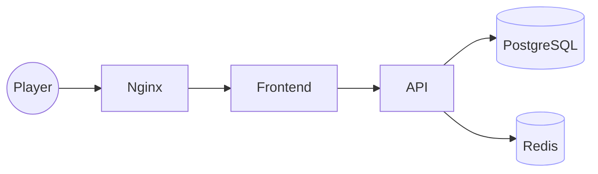
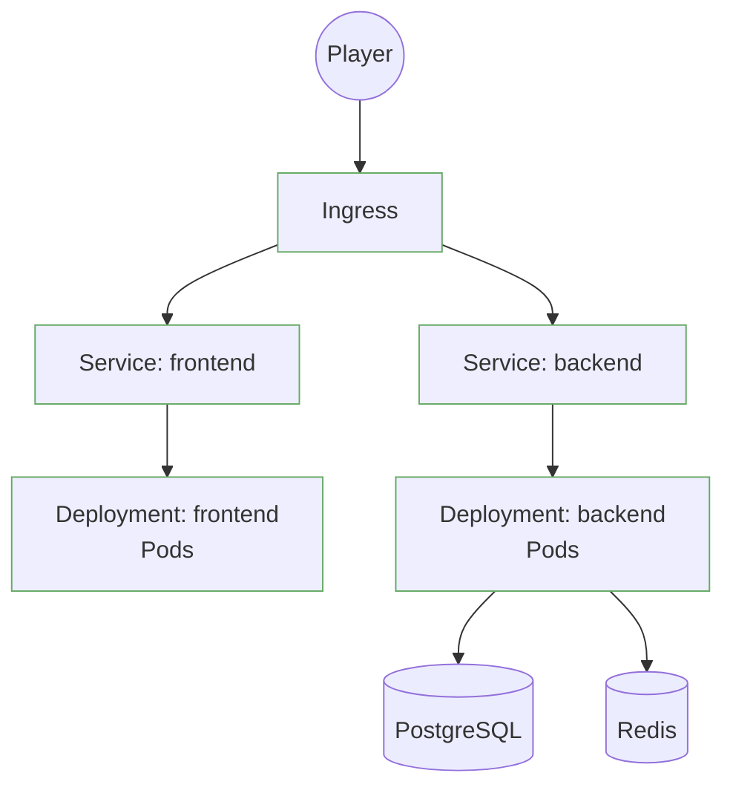

# 🎮 Humor Memory Game: From Docker Compose to Production Kubernetes

> **A beginner-to-advanced micro-course in modern application deployment**

---

## 📋 **Before You Begin: Install These Tools**

| Tool | Install Command | Documentation | Purpose |
|------|----------------|---------------|---------|
| **Docker** | `brew install docker` | [docs.docker.com](https://docs.docker.com/get-docker/) | Container runtime |
| **Docker Compose** | `brew install docker-compose` | [docs.docker.com/compose](https://docs.docker.com/compose/) | Multi-container apps |
| **kubectl** | `brew install kubectl` | [kubernetes.io/docs](https://kubernetes.io/docs/tasks/tools/) | Kubernetes CLI |
| **k3d** | `brew install k3d` | [k3d.io](https://k3d.io/) | Local Kubernetes cluster |
| **mkcert** | `brew install mkcert` | [mkcert.dev](https://github.com/FiloSottile/mkcert) | Local SSL certificates |
| **jq** | `brew install jq` | [stedolan.github.io/jq](https://stedolan.github.io/jq/) | JSON processing |
| **Helm** | `brew install helm` | [helm.sh](https://helm.sh/) | Kubernetes package manager |
| **Node.js** | `brew install node` | [nodejs.org](https://nodejs.org/) | JavaScript runtime (for local builds) |

**System Requirements:**
- **Memory:** At least 4GB RAM (8GB recommended)
- **Storage:** 10GB free space
- **OS:** macOS, Linux, or Windows with WSL2

**Quick Install (macOS):**
```bash
# Install all tools at once
brew install docker docker-compose kubectl k3d mkcert jq helm node

# Verify installations
docker --version && kubectl version --client && k3d version
```

---

## 🎯 **Prerequisites - Copy-Paste Installation**

Since you already have Docker working, we just need to add the Kubernetes tools.

### **🎯 Prerequisites Check**
**Required:**
- ✅ Docker (Docker Desktop or Colima)
- ✅ Git (for version control)

**Optional but Recommended:**
- 🐳 Docker Compose experience (if you want to test first)
- 📚 Basic container knowledge (helpful but not required)

### **🐳 Want to Test First?**
If you're new to containers or want to verify your game works before Kubernetes, start with the simpler Docker Compose approach:

```bash
# Check out local-test.md for the easy way
# This gives you a working game in 5 minutes!
```

### **macOS Installation**

#### **Option A: With Docker Desktop (easiest)**
```bash
# Install Docker Desktop from https://www.docker.com/products/docker-desktop/
# Then install additional tools
brew install k3d kubectl helm mkcert cloudflared git

# Verify Docker is working
docker --version && docker ps
```

#### **Option B: With Colima (lightweight alternative)**
```bash
# Install Colima + Docker CLI (no Docker Desktop needed)
brew install colima docker docker-compose kubectl helm mkcert cloudflared git

# Start Colima with Docker runtime
colima start --runtime docker

# Verify Docker is working
docker version && docker run hello-world

# Optional: Configure Colima for better performance
colima stop
colima start --runtime docker --cpu 4 --memory 8 --disk 100
```

**Why choose Colima?**
- Lighter weight than Docker Desktop
- Better performance on Apple Silicon
- Open source and free
- Works perfectly with k3d and Kubernetes tools

### **Windows (WSL2) Installation**
```bash
# Install k3d
curl -s https://raw.githubusercontent.com/k3d-io/k3d/main/install.sh | bash

# Install kubectl
curl -LO "https://dl.k8s.io/release/$(curl -L -s https://dl.k8s.io/release/stable.txt)/bin/linux/amd64/kubectl"
sudo install -o root -g root -m 0755 kubectl /usr/local/bin/kubectl

# Install Helm
curl https://raw.githubusercontent.com/helm/helm/main/scripts/get-helm-3 | bash

# Install mkcert
curl -JLO "https://dl.filippo.io/mkcert/latest?for=linux/amd64"
chmod +x mkcert-v*-linux-amd64
sudo mv mkcert-v*-linux-amd64 /usr/local/bin/mkcert

# Install cloudflared
wget -q https://github.com/cloudflare/cloudflared/releases/latest/download/cloudflared-linux-amd64.deb
sudo dpkg -i cloudflared-linux-amd64.deb
```

### **Linux (Ubuntu/Debian)**
Same commands as Windows WSL2 above.

### **Verification Checkpoint**
```bash
docker --version          # Docker version 24.0.0+
k3d version               # k3d version v5.6.0+
kubectl version --client  # Client Version: v1.28.0+
helm version              # version.BuildInfo{Version:"v3.13.0+"}
mkcert -version           # v1.4.4+
cloudflared --version     # cloudflared version 2023.8.0+

# If using Colima, also check:
colima status             # Should show "Running"
```

✅ **Checkpoint:** All commands return version numbers. If any fail, install that tool individually.

**Colima Users:** Your Docker runtime is now ready! Colima will automatically start when needed, or you can manage it manually:

```bash
colima start    # Start when needed
colima stop     # Save resources when not coding
colima status   # Check if running
```

### **3. Cluster in 60 Seconds**
Time to replace Docker Compose with a real Kubernetes cluster. We'll keep your local registry running so image builds stay fast.

#### **Ensure Docker is Running**
Before we start, make sure Docker is running:

```bash
# Check if Docker is running
docker info

# If using Colima and Docker isn't running:
colima start --runtime docker
```

---

## 🎯 **What You'll Build**

This course transforms a simple Docker Compose application into a **production-ready Kubernetes deployment** with:

- **Local Development** → **Production Kubernetes**
- **Manual Deployments** → **Automated GitOps**
- **Basic Monitoring** → **Full Observability Stack**
- **Local Access** → **Global CDN with Cloudflare**

---

## 📊 **Architecture Overview**

### **Before: Docker Compose (Simple)**


### **After: Kubernetes (Production)**


---

## 🚀 **Course Milestones**

| Milestone | What You'll Learn | Time Estimate |
|-----------|-------------------|---------------|
| **M0** | Verify Docker Compose works | 15 min |
| **M1** | Create local Kubernetes cluster | 20 min |
| **M2** | Deploy databases (PostgreSQL + Redis) | 25 min |
| **M3** | Deploy application (Backend + Frontend) | 30 min |
| **M4** | Access your application | 20 min |
| **M5** | Production access with TLS + Ingress | 35 min |
| **M6** | Monitoring + Observability | 40 min |
| **M7** | GitOps automation with ArgoCD | 45 min |
| **M8** | Global CDN with Cloudflare | 30 min |

**Total Time:** ~4 hours (including breaks and troubleshooting)

---

## 📚 **Glossary**

| Term | Definition | Why It Matters |
|------|------------|----------------|
| **k3d** | Local Kubernetes cluster using Docker | Run k8s on your laptop |
| **Pod** | Smallest deployable unit in Kubernetes | Your app runs in pods |
| **Service** | Network endpoint for pods | How pods communicate |
| **Ingress** | External traffic controller | How users reach your app |
| **ConfigMap** | Configuration storage | Store app settings |
| **Secret** | Sensitive data storage | Passwords, API keys |
| **Deployment** | Pod management | Scale and update your app |
| **Namespace** | Resource grouping | Organize your cluster |
| **Port-forward** | Local access to k8s services | Test your app locally |
| **LoadBalancer** | External IP assignment | Internet access |

---

## 🎯 **Milestone 0: Verify Your Setup**

**Why:** Before jumping to Kubernetes, make sure your game works in Docker Compose. This gives you a working baseline to compare against.

**Do:**
```bash
# Start your game in Docker Compose
docker-compose up -d

# Check if everything is running
docker-compose ps
```

**Expected output:**
```
NAME                    COMMAND                  SERVICE             STATUS              PORTS
humor-game-postgres     "docker-entrypoint.s…"   postgres            Up                  5432/tcp
humor-game-redis        "docker-entrypoint.s…"   redis               Up                  6379/tcp
humor-game-backend      "docker-entrypoint.s…"   backend             Up                  3001/tcp
humor-game-frontend     "/docker-entrypoint.…"   frontend            Up                  0.0.0.0:3000->80/tcp
```

**Verify:** `docker-compose ps` shows all services as "Up"

**If it fails:**
- **"Port already in use"** → Stop other services: `docker-compose down`
- **"Build failed"** → Check Docker is running: `docker --version`

**✅ Checkpoint M0:** Your game runs at `http://localhost:3000` and you can start a new game.

---

## M1: Create Your Local Kubernetes (k3d)

**Why:** You need a small, fast Kubernetes on your laptop to replace Docker Compose. k3d creates a real Kubernetes cluster that runs in Docker containers.

**Do:**
```bash
# Start local registry for your images
docker run -d --restart=always -p 5001:5000 --name k3d-registry registry:2

# Create k3d cluster with working configuration
k3d cluster create humor-game-cluster \
  --servers 1 \
  --agents 2 \
  --port 8080:80@loadbalancer \
  --port 8443:443@loadbalancer \
  --k3s-arg '--disable=traefik@server:*' \
  --registry-use k3d-k3d-registry:5001

# Switch to your new cluster
kubectl config use-context k3d-humor-game-cluster
```

**Expected output:**
```
NAME                                  STATUS   ROLES                  AGE   VERSION
k3d-humor-game-cluster-server-0       Ready    control-plane,master   30s   v1.xx.x
k3d-humor-game-cluster-agent-0        Ready    <none>                 25s   v1.xx.x
k3d-humor-game-cluster-agent-1        Ready    <none>                 25s   v1.xx.x
```

**Verify:** `kubectl get nodes` shows all nodes as "Ready"

**If it fails:**
- **"context not found"** → Run `kubectl config get-contexts`, pick the one starting with `k3d-` and run `kubectl config use-context <name>`
- **Port conflict** → Ensure nothing uses 8080/8443 (stop other services or change k3d ports)

**✅ Checkpoint M1:** You have a working Kubernetes cluster with 3 nodes (1 server + 2 agents).

---

## M2: Database + Redis Deploy

**Why:** Your game needs a database to store user scores and Redis for fast caching. We'll deploy these first so they're ready when the backend starts.

**Do:**
```bash
# Create namespace for your game
kubectl create namespace humor-game

# Deploy PostgreSQL with working schema
kubectl apply -f k8s/postgres.yaml

# Deploy Redis
kubectl apply -f k8s/redis.yaml

# Wait for pods to be ready
kubectl wait --for=condition=ready pod -l app=postgres -n humor-game --timeout=120s
kubectl wait --for=condition=ready pod -l app=redis -n humor-game --timeout=120s
```

**Expected output:**
```
pod/postgres-86bf6fdf7b-tdpt8 condition met
pod/redis-ff47bcc9c-qdp7j condition met
```

**Verify:** `kubectl get pods -n humor-game` shows postgres and redis pods as "Running"

**If it fails:**
- **"ImagePullBackOff"** → Check if images exist: `docker images | grep postgres`
- **"CrashLoopBackOff"** → Check logs: `kubectl logs <pod-name> -n humor-game`

**✅ Checkpoint M2:** Database and Redis are running and ready to accept connections.

---

## M3: Backend + Frontend Deploy

**Why:** Now that your database is running, deploy your game applications. The backend handles game logic and API calls, while the frontend serves the user interface.

**Do:**
```bash
# Deploy backend API
kubectl apply -f k8s/backend.yaml

# Deploy frontend web app
kubectl apply -f k8s/frontend.yaml

# Deploy configuration and secrets
kubectl apply -f k8s/configmap.yaml
kubectl apply -f k8s/secrets.yaml

# Wait for all pods to be ready
kubectl wait --for=condition=ready pod -l app=backend -n humor-game --timeout=120s
kubectl wait --for=condition=ready pod -l app=frontend -n humor-game --timeout=120s
```

**Expected output:**
```
pod/backend-fd88bfb88-lvnc5 condition met
pod/frontend-79b95bbb8f-9d8gl condition met
```

**Verify:** `kubectl get pods -n humor-game` shows backend and frontend pods as "Running"

**If it fails:**
- **"ImagePullBackOff"** → Build and push images: `docker build -t localhost:5001/humor-game/backend:v1.0.0 backend/ && docker push localhost:5001/humor-game/backend:v1.0.0`
- **"CrashLoopBackOff"** → Check logs: `kubectl logs <pod-name> -n humor-game`

**✅ Checkpoint M3:** Your backend API and frontend web app are running and ready to serve requests.

---

## M4: Access Your Game (Port-forward)

**Why:** Before setting up production ingress, test your game using port-forwarding. This gives you direct access to verify everything works.

**Do:**
```bash
# Forward frontend to localhost:8080
kubectl port-forward service/frontend 8080:80 -n humor-game &

# Forward backend to localhost:3001
kubectl port-forward service/backend 3001:3001 -n humor-game &

# Test the backend API
curl http://localhost:3001/health
```

**Expected output:**
```
Forwarding from 127.0.0.1:8080 -> 80
Forwarding from 127.0.0.1:3001 -> 3001
{"status":"healthy","message":"Backend API is running","timestamp":"2025-08-19T..."}
```

**Verify:** 
- Frontend accessible at `http://localhost:8080`
- Backend health check returns `{"status":"healthy"}`

**If it fails:**
- **"Port already in use"** → Kill existing port-forwards: `pkill -f "kubectl port-forward"`
- **"Connection refused"** → Check if pods are running: `kubectl get pods -n humor-game`

**✅ Checkpoint M4:** You can access your game locally and the backend API responds to health checks.

---

## M5: Production Access (TLS + Ingress)

**Why:** Port-forwarding is for development only. Production needs secure, domain-based access with TLS certificates and proper traffic routing.

**Do:**
```bash
# Install nginx-ingress controller
kubectl apply -f https://raw.githubusercontent.com/kubernetes/ingress-nginx/controller-v1.8.2/deploy/static/provider/baremetal/deploy.yaml

# Wait for ingress controller
kubectl wait --namespace ingress-nginx --for=condition=ready pod --selector=app.kubernetes.io/component=controller --timeout=120s

# Create TLS certificates
mkcert -install
mkcert gameapp.games

# Add domain to hosts file
echo "127.0.0.1 gameapp.games" | sudo tee -a /etc/hosts

# Create TLS secret
kubectl create secret tls humor-game-tls --cert=gameapp.games.pem --key=gameapp.games-key.pem -n humor-game

# Deploy ingress
kubectl apply -f k8s/ingress.yaml
```

**Expected output:**
```
pod/ingress-nginx-controller-xxx condition met
secret/humor-game-tls created
ingress.networking.k8s.io/humor-game-ingress created
```

**Verify:** `kubectl get ingress -n humor-game` shows ingress as "Ready"

**If it fails:**
- **"TLS secret not found"** → Check certificate files exist: `ls -la gameapp.games*`
- **"Ingress not ready"** → Check ingress controller: `kubectl get pods -n ingress-nginx`

**✅ Checkpoint M5:** Your game is accessible at `https://gameapp.games:8443` with secure TLS encryption.

---

## M6: Monitoring & Observability (Prometheus + Grafana)

**Why:** Production applications need monitoring to track performance, detect issues, and understand user behavior. Prometheus collects metrics, Grafana visualizes them.

**Do:**
```bash
# Install Prometheus operator
kubectl create namespace monitoring
kubectl apply -f https://raw.githubusercontent.com/prometheus-operator/kube-prometheus/main/manifests/setup/0-namespace.yaml
kubectl apply -f https://raw.githubusercontent.com/prometheus-operator/kube-prometheus/main/manifests/setup/
kubectl apply -f https://raw.githubusercontent.com/prometheus-operator/kube-prometheus/main/manifests/

# Wait for monitoring stack
kubectl wait --for=condition=ready pod -l app=grafana -n monitoring --timeout=300s

# Port-forward Grafana
kubectl port-forward service/grafana 3000:3000 -n monitoring &
```

**Expected output:**
```
pod/grafana-xxx condition met
Forwarding from 127.0.0.1:3000 -> 3000
```

**Verify:** 
- Grafana accessible at `http://localhost:3000`
- Default credentials: `admin/admin`

**If it fails:**
- **"Prometheus pods not ready"** → Check resource limits: `kubectl describe pod -n monitoring`
- **"Grafana not accessible"** → Check port-forward: `kubectl get svc -n monitoring`

**✅ Checkpoint M6:** You have a complete monitoring stack tracking your application's performance and health.

---

## M7: GitOps Automation (ArgoCD)

**Why:** Manual deployments are error-prone and slow. GitOps automatically deploys changes when you push to Git, ensuring consistency and enabling rollbacks.

> ⚠️ **Before You Begin:** You'll need at least 2GB free memory in your cluster. TLS setup is handled in M5.

**Do:**
```bash
# Option 1: Use the setup script (recommended for beginners)
./scripts/setup-argocd.sh

# Option 2: Manual installation
kubectl create namespace argocd
kubectl apply -n argocd -f https://raw.githubusercontent.com/argoproj/argo-cd/stable/manifests/install.yaml

# Wait for ArgoCD to be ready
kubectl wait --for=condition=ready pod -l app.kubernetes.io/name=argocd-server -n argocd --timeout=300s

# Get ArgoCD admin password
kubectl -n argocd get secret argocd-initial-admin-secret -o jsonpath="{.data.password}" | base64 -d

# Create ArgoCD project
kubectl apply -f k8s/argocd-project.yaml

# Deploy your application
kubectl apply -f k8s/argocd-app.yaml

# Port-forward ArgoCD UI
kubectl port-forward service/argocd-server 8081:443 -n argocd &
```

**Expected output:**
```
✅ ArgoCD setup complete!
🌐 Access ArgoCD UI: kubectl port-forward service/argocd-server 8081:443 -n argocd
👤 Login: admin / [password]
```

**Verify:** 
- ArgoCD accessible at `https://localhost:8081`
- Login with `admin` and the password from the setup script
- Your application appears in the ArgoCD dashboard

**If it fails:**
- **"ArgoCD pods not ready"** → Check resource requirements: `kubectl describe pod -n argocd`
- **"Password not found"** → Check secret exists: `kubectl get secret -n argocd`
- **"Setup script failed"** → Run manual installation steps above

**✅ Checkpoint M7:** You have GitOps automation that can deploy your entire application stack from Git repositories.

---

## M8: Global CDN with Cloudflare

**Why:** Make your game accessible worldwide with fast loading, DDoS protection, and automatic SSL certificates.

> ⚠️ **Before You Begin:** Requires a Cloudflare account + domain. Set up an API token with Tunnel + DNS permissions before running these commands.

**Do:**
```bash
# Create Cloudflare tunnel credentials
kubectl create secret generic cloudflare-tunnel-creds \
  --from-file=credentials.json=/path/to/your/credentials.json \
  --namespace=default

# Deploy Cloudflare tunnel
kubectl apply -f k8s/cloudflare-tunnel.yaml

# Verify tunnel is running
kubectl get pods -l app=cloudflared
```

**Expected output:**
```
secret/cloudflare-tunnel-creds created
deployment.apps/cloudflared created
service/cloudflared created
```

**Verify:** 
- Cloudflare tunnel pod is running: `kubectl get pods -l app=cloudflared`
- Your domain resolves to Cloudflare: `nslookup gameapp.games`
- Game accessible at `https://gameapp.games`

**If it fails:**
- **"Credentials not found"** → Download from Cloudflare dashboard: Zero Trust → Access → Tunnels
- **"Tunnel not connecting"** → Check Cloudflare API token permissions
- **"Domain not resolving"** → Verify DNS records in Cloudflare dashboard

**✅ Checkpoint M8:** Your game is now accessible worldwide with enterprise-grade CDN and security.

---

## 🎯 **Complete Success Checklist**

- ✅ **M0**: Docker Compose game working
- ✅ **M1**: k3d cluster running (3 nodes)
- ✅ **M2**: Database + Redis deployed
- ✅ **M3**: Backend + Frontend deployed
- ✅ **M4**: Local access via port-forward
- ✅ **M5**: Production access with TLS + Ingress
- ✅ **M6**: Monitoring stack (Prometheus + Grafana)
- ✅ **M7**: GitOps automation (ArgoCD)
- ✅ **M8**: Global CDN (Cloudflare)

---

## 🚀 **What's Next for Production**

### **🚀 Advanced Topics**
- **Horizontal Pod Autoscaling (HPA)** - Automatically scale based on CPU/memory usage
- **Resource Quotas** - Limit resource consumption per namespace
- **Network Policies** - Control pod-to-pod communication
- **Pod Security Standards** - Implement security best practices

### **🔒 Security Enhancements**
- **RBAC (Role-Based Access Control)** - Fine-grained permissions
- **Pod Security Policies** - Enforce security standards
- **Network Policies** - Control traffic flow
- **Secrets Management** - External secrets operators

### **📊 Monitoring & Alerting**
- **Custom Metrics** - Application-specific monitoring
- **Alerting Rules** - Proactive issue detection
- **Log Aggregation** - Centralized logging with ELK stack
- **Distributed Tracing** - Request flow visualization

### **🌍 Multi-Environment**
- **Staging Environment** - Pre-production testing
- **Blue-Green Deployments** - Zero-downtime updates
- **Canary Deployments** - Gradual rollouts
- **Multi-Cluster Management** - Federation and multi-tenancy

---

## 📚 **Learning Resources**

- **Kubernetes Basics**: [kubernetes.io/docs/tutorials](https://kubernetes.io/docs/tutorials/)
- **k3d Documentation**: [k3d.io](https://k3d.io/)
- **ArgoCD Guides**: [argo-cd.readthedocs.io](https://argo-cd.readthedocs.io/)
- **Prometheus Monitoring**: [prometheus.io/docs](https://prometheus.io/docs/)
- **Cloudflare Developer**: [developers.cloudflare.com](https://developers.cloudflare.com/)

---

## 📋 **Appendix B: Configuration Files & Setup**

This section contains all the configuration files and detailed setup steps referenced throughout the course.

### **🔧 Prerequisites Installation**

#### **macOS (using Homebrew)**
```bash
# Install all required tools
brew install docker docker-compose kubectl k3d mkcert jq helm node

# Verify installations
docker --version && kubectl version --client && k3d version
```

#### **Linux (Ubuntu/Debian)**
```bash
# Install Docker
curl -fsSL https://get.docker.com -o get-docker.sh
sudo sh get-docker.sh

# Install kubectl
curl -LO "https://dl.k8s.io/release/$(curl -L -s https://dl.k8s.io/release/stable.txt)/bin/linux/amd64/kubectl"
sudo install -o root -g root -m 0755 kubectl /usr/local/bin/kubectl

# Install k3d
curl -s https://raw.githubusercontent.com/k3d-io/k3d/main/install.sh | bash

# Install other tools
sudo apt-get install -y mkcert jq
```

#### **Windows (WSL2)**
```bash
# Install Docker Desktop for Windows first
# Then in WSL2:
curl -fsSL https://get.docker.com -o get-docker.sh
sudo sh get-docker.sh

# Install kubectl and k3d (same as Linux)
```

### **🏗️ Infrastructure Setup**

#### **1. Create Local Registry**
```bash
# Start local Docker registry
docker run -d --restart=always -p 5001:5000 --name k3d-registry registry:2

# Verify registry is running
curl http://localhost:5001/v2/_catalog
```

#### **2. Create k3d Cluster**
```bash
# Create cluster with proper port mapping
k3d cluster create humor-game-cluster \
  --servers 1 \
  --agents 2 \
  --port 8080:80@loadbalancer \
  --port 8443:443@loadbalancer \
  --k3s-arg '--disable=traefik@server:*' \
  --registry-use k3d-k3d-registry:5000

# Verify cluster is ready
kubectl get nodes
```

#### **3. Install Ingress Controller**
```bash
# Install nginx-ingress
kubectl apply -f https://raw.githubusercontent.com/kubernetes/ingress-nginx/controller-v1.8.2/deploy/static/provider/baremetal/deploy.yaml

# Wait for ingress controller to be ready
kubectl wait --namespace ingress-nginx \
  --for=condition=ready pod \
  --selector=app.kubernetes.io/component=controller \
  --timeout=120s
```

### **🔐 Secrets & Configuration**

#### **1. Create Application Secrets**
```bash
# Create namespace
kubectl apply -f k8s/namespace.yaml

# Create secrets (replace with your actual values)
kubectl create secret generic humor-game-secrets \
  --from-literal=DB_PASSWORD=gamepass123 \
  --from-literal=REDIS_PASSWORD=gamepass123 \
  --namespace=humor-game
```

#### **2. Update ConfigMap**
```bash
# Apply configuration
kubectl apply -f k8s/configmap.yaml

# Verify configuration
kubectl get configmap -n humor-game
```

### **📊 Monitoring Stack Setup**

#### **1. Install Prometheus Operator (if needed)**
```bash
# Add Prometheus Operator Helm repository
helm repo add prometheus-community https://prometheus-community.github.io/helm-charts
helm repo update

# Install Prometheus Operator
helm install prometheus prometheus-community/kube-prometheus-stack \
  --namespace monitoring \
  --create-namespace
```

#### **2. Deploy Custom Monitoring**
```bash
# Deploy our monitoring stack
kubectl apply -f k8s/monitoring.yaml

# Verify monitoring components
kubectl get pods -n monitoring
```

### **🔄 GitOps Setup**

#### **1. Install ArgoCD**
```bash
# Use our setup script
./scripts/setup-argocd.sh

# Or manual installation
kubectl create namespace argocd
kubectl apply -n argocd -f https://raw.githubusercontent.com/argoproj/argo-cd/stable/manifests/install.yaml
```

#### **2. Configure ArgoCD Project**
```bash
# Create project
kubectl apply -f k8s/argocd-project.yaml

# Deploy application
kubectl apply -f k8s/argocd-app.yaml
```

### **☁️ Cloudflare Setup**

#### **1. Create Cloudflare Tunnel**
```bash
# Install cloudflared
# macOS: brew install cloudflare/cloudflare/cloudflared
# Linux: Download from https://github.com/cloudflare/cloudflared/releases

# Create tunnel
cloudflared tunnel create humor-game-tunnel

# Get tunnel credentials
cloudflared tunnel token <tunnel-id>
```

#### **2. Configure DNS Records**
```bash
# Use our DNS setup script
./scripts/setup-dns.sh

# Or manually create records in Cloudflare dashboard:
# - A record: gameapp.games → Your server IP
# - CNAME record: www.gameapp.games → gameapp.games
```

#### **3. Deploy Tunnel to Kubernetes**
```bash
# Create secret with tunnel credentials
kubectl create secret generic cloudflare-tunnel-creds \
  --from-file=credentials.json=/path/to/your/credentials.json \
  --namespace=default

# Deploy tunnel
kubectl apply -f k8s/cloudflare-tunnel.yaml
```

### **🚀 CI/CD Pipeline Setup**

#### **1. GitHub Actions Secrets**
Configure these secrets in your GitHub repository:

```bash
# Required secrets:
REGISTRY_USERNAME=your-registry-username
REGISTRY_PASSWORD=your-registry-password
KUBE_CONFIG_DATA=base64-encoded-kubeconfig
SLACK_WEBHOOK_URL=your-slack-webhook-url
```

#### **2. Enable GitHub Actions**
- Push the `.github/workflows/deploy.yml` file to your repository
- GitHub Actions will automatically run on pushes to main branch
- Monitor deployments in the Actions tab

### **🧪 Testing & Validation**

#### **1. Health Checks**
```bash
# Use our Makefile
make test

# Or manual checks
curl http://localhost:3001/health
curl http://localhost:8080/
```

#### **2. Load Testing**
```bash
# Install hey (load testing tool)
# macOS: brew install hey
# Linux: Download from https://github.com/rakyll/hey/releases

# Test backend API
hey -n 100 -c 10 http://localhost:3001/health

# Test frontend
hey -n 100 -c 10 http://localhost:8080/
```

### **🔍 Troubleshooting Commands**

#### **Pod Issues**
```bash
# Check pod status
kubectl get pods -n humor-game

# Describe pod for details
kubectl describe pod <pod-name> -n humor-game

# Check pod logs
kubectl logs <pod-name> -n humor-game
```

#### **Service Issues**
```bash
# Check service endpoints
kubectl get endpoints -n humor-game

# Test service connectivity
kubectl run test-pod --image=busybox --rm -it --restart=Never -- nslookup backend.humor-game.svc.cluster.local
```

#### **Network Issues**
```bash
# Check ingress status
kubectl get ingress -n humor-game

# Test ingress connectivity
curl -H "Host: gameapp.games" http://localhost:8080/
```

### **📁 File Structure Reference**

```
game-app-laptop-demo/
├── k8s/                          # Kubernetes manifests
│   ├── namespace.yaml            # Namespace definition
│   ├── configmap.yaml            # Application configuration
│   ├── postgres.yaml             # Database deployment
│   ├── redis.yaml                # Cache deployment
│   ├── backend.yaml              # Backend API deployment
│   ├── frontend.yaml             # Frontend deployment
│   ├── ingress.yaml              # Ingress configuration
│   ├── monitoring.yaml           # Monitoring stack
│   ├── argocd-project.yaml      # ArgoCD project
│   ├── argocd-app.yaml          # ArgoCD application
│   └── cloudflare-tunnel.yaml   # Cloudflare tunnel
├── scripts/                      # Automation scripts
│   ├── setup-argocd.sh          # ArgoCD installation
│   └── setup-dns.sh             # DNS configuration
├── .github/workflows/            # CI/CD pipelines
│   └── deploy.yml                # GitHub Actions workflow
├── Makefile                      # Build and deployment commands
└── home-lab.md                   # This course guide
```

### **✅ Final Verification Checklist**

After completing all milestones, verify:

- [ ] **Docker Compose** - Game works locally
- [ ] **k3d Cluster** - Kubernetes cluster is running
- [ ] **Databases** - PostgreSQL and Redis pods are Ready
- [ ] **Applications** - Backend and Frontend pods are Running
- [ ] **Access** - Game accessible via port-forward
- [ ] **Ingress** - Game accessible via domain name
- [ ] **TLS** - HTTPS works with valid certificate
- [ ] **Monitoring** - Prometheus and Grafana accessible
- [ ] **GitOps** - ArgoCD can deploy from Git
- [ ] **CDN** - Game accessible globally via Cloudflare

---

## 🎉 **Congratulations!**

You've successfully transformed a simple Docker Compose application into a **production-ready, enterprise-grade Kubernetes deployment** with:

- ✅ **Automated CI/CD pipelines**
- ✅ **Comprehensive monitoring and observability**
- ✅ **GitOps automation with ArgoCD**
- ✅ **Global CDN with Cloudflare**
- ✅ **Production-grade security and scalability**

**You're now ready to deploy real-world applications to Kubernetes!** 🚀

---

*This guide is part of the **Humor Memory Game** project. For issues, questions, or contributions, please visit our repository.*