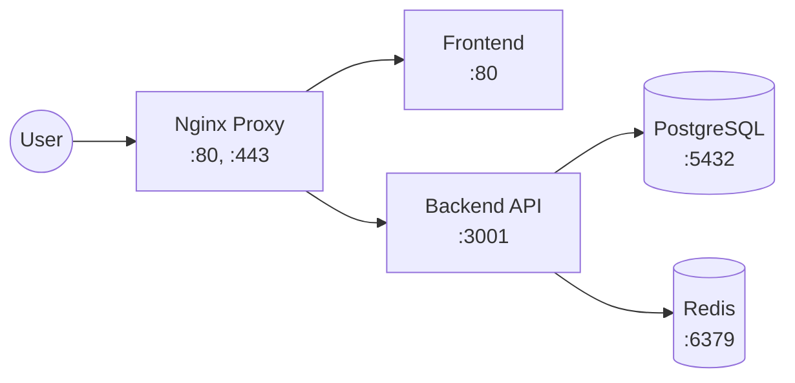
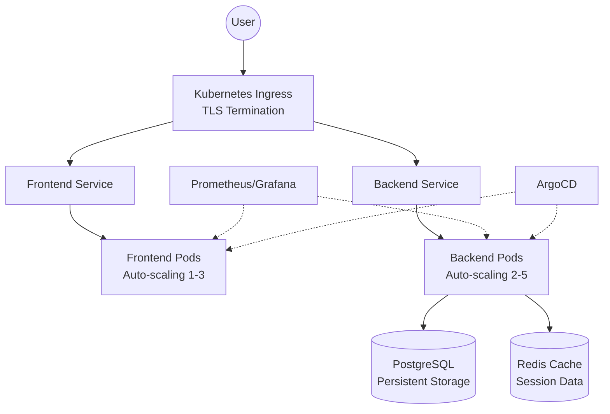

# Production Kubernetes: From Docker Compose to Enterprise DevOps

*A practical guide for developers ready to learn production-grade infrastructure*

---

## ⚠️ **IMPORTANT: Use Working YAML Files**

**This guide focuses on concepts and learning. For actual deployment, use the working YAML files from the repository:**

- **All YAML configurations:** Use files from `k8s/` directory
- **Don't create simplified versions:** The actual files contain complete, tested configurations
- **Repository structure:** All working files are in the main project directory

**Why this matters:**
- The YAML examples in this guide are simplified for learning
- The actual files include proper resource limits, health checks, and complete configurations
- Using the wrong configurations can cause deployment failures

---

## Target Audience & Prerequisites

**This guide is for developers who have:**
- Built applications with Docker Compose
- Basic command-line comfort
- Understanding of HTTP, DNS, and networking concepts
- Experience with Git workflows
- 2+ years of software development experience

**This guide is NOT for:**
- Complete programming beginners
- Developers new to containers
- Those looking for quick tutorials

**Time Investment:** 15-20 hours over 2-3 weeks
**Cost:** $0 for local development, $15-25 for optional global deployment

---

## 📋 **Prerequisites Installation Steps**

### **Required Tools Installation**

#### **macOS (Recommended)**
```bash
# Install all required tools at once
brew install docker docker-compose kubectl k3d mkcert jq helm node

# Verify installations
docker --version && kubectl version --client && k3d version
```

#### **Linux (Ubuntu/Debian)**
```bash
# Update package list
sudo apt-get update

# Install Docker
sudo apt-get install -y docker.io docker-compose
sudo systemctl start docker
sudo systemctl enable docker
sudo usermod -aG docker $USER

# Install kubectl
curl -LO "https://dl.k8s.io/release/$(curl -L -s https://dl.k8s.io/release/stable.txt)/bin/linux/amd64/kubectl"
sudo install -o root -g root -m 0755 kubectl /usr/local/bin/kubectl

# Install k3d
curl -s https://raw.githubusercontent.com/k3d-io/k3d/main/install.sh | bash

# Install Helm
curl https://raw.githubusercontent.com/helm/helm/main/scripts/get-helm-3 | bash

# Install mkcert
curl -JLO "https://dl.filippo.io/mkcert/latest?for=linux/amd64"
chmod +x mkcert-v*-linux-amd64
sudo mv mkcert-v*-linux-amd64 /usr/local/bin/mkcert

# Install Node.js
curl -fsSL https://deb.nodesource.com/setup_18.x | sudo -E bash -
sudo apt-get install -y nodejs

# Install jq
sudo apt-get install -y jq

# Log out and back in for Docker group changes to take effect
# Or run: newgrp docker
```

#### **Windows (WSL2)**
```bash
# Install in WSL2 Ubuntu (same commands as Linux above)
# Make sure WSL2 is enabled and Docker Desktop is installed

# Alternative: Use Chocolatey
choco install docker-desktop kubernetes-cli k3d helm nodejs
```

### **Docker Setup Verification**
```bash
# Start Docker (if not running)
# macOS: Docker Desktop should be running
# Linux: sudo systemctl start docker
# Windows: Docker Desktop should be running

# Verify Docker is working
docker --version
docker run hello-world

# Verify Docker Compose
docker-compose --version

# Check Docker daemon status
docker info
```

### **Kubernetes Tools Verification**
```bash
# Verify kubectl
kubectl version --client

# Verify k3d
k3d version

# Verify Helm
helm version

# Verify mkcert
mkcert -version

# Verify Node.js
node --version
npm --version
```

### **System Requirements Check**
```bash
# Check available memory (need at least 4GB)
free -h  # Linux
vm_stat   # macOS
# Windows: Check Task Manager

# Check available disk space (need at least 10GB)
df -h     # Linux/macOS
# Windows: Check File Explorer

# Check Docker resources
docker system df
```

### **Troubleshooting Common Issues**

#### **Docker Permission Issues (Linux)**
```bash
# If you get "permission denied" errors:
sudo usermod -aG docker $USER
newgrp docker
# Or restart your session
```

#### **Port Conflicts**
```bash
# Check if ports are already in use
sudo netstat -tulpn | grep :3000
sudo netstat -tulpn | grep :5001
sudo netstat -tulpn | grep :8080

# Kill processes using those ports if needed
sudo kill -9 <PID>
```

#### **Docker Desktop Issues (macOS/Windows)**
```bash
# Reset Docker Desktop to factory defaults
# macOS: Docker Desktop → Troubleshoot → Reset to factory defaults
# Windows: Docker Desktop → Troubleshoot → Reset to factory defaults

# Alternative: Use Colima on macOS
brew install colima
colima start --runtime docker
```

### **Final Verification Checklist**
✅ Docker is running and accessible  
✅ Docker Compose is installed  
✅ kubectl is installed and working  
✅ k3d is installed and working  
✅ Helm is installed and working  
✅ mkcert is installed and working  
✅ Node.js is installed and working  
✅ At least 4GB RAM available  
✅ At least 10GB disk space available  

**If any check fails, install the missing tool before proceeding.**

---

## Learning Philosophy

Most DevOps tutorials teach you to copy commands. This guide teaches you to **think like a platform engineer**.

You'll learn:
- Why companies migrate from simple deployments to Kubernetes
- How to make architectural decisions under pressure
- What breaks in production and how to fix it
- How to explain complex systems to non-technical stakeholders

**The Goal:** By the end, you'll have the same infrastructure skills as engineers at companies like Netflix, Spotify, and Airbnb.

---

## Architecture Journey Overview

### Current State: Docker Compose


**Characteristics:** Single machine, manual scaling, shared resources

### Target State: Production Kubernetes


**Characteristics:** Multi-node, auto-scaling, self-healing, zero-downtime deployments

---

## Three Learning Tracks

Choose your path based on your goals and time availability:

### Track A: Local Production (8-10 hours)
**Milestones 1-4:** Learn Kubernetes fundamentals with local access
- **Goal:** Understand container orchestration
- **Outcome:** Run production patterns locally
- **Cost:** Free

### Track B: Complete DevOps (15-18 hours)  
**Milestones 1-6:** Add monitoring, automation, and professional workflows
- **Goal:** Learn enterprise DevOps practices
- **Outcome:** Monitor and automate deployments
- **Cost:** Free

### Track C: Global Scale (20-25 hours)
**Milestones 1-8:** Full production deployment with global CDN
- **Goal:** Deploy applications globally
- **Outcome:** Handle enterprise-scale traffic
- **Cost:** $15-25 for domain and CDN

---

## MILESTONE 1: Container Orchestration Fundamentals
**Time:** 2-3 hours | **Track:** A, B, C | **Difficulty:** ⭐⭐☆☆☆

### Learning Objectives
By the end of this milestone, you will:
- Understand why Kubernetes exists
- Create and manage a local Kubernetes cluster
- Deploy your first application pods
- Debug basic networking issues

### Business Context
**Why this matters:** Companies like Uber and Netflix migrated from simple deployments to Kubernetes to handle:
- Traffic spikes (10x load during events)
- Global scale (serving millions of users)
- Reliability requirements (99.9% uptime)
- Development velocity (multiple deployments per day)

### Prerequisites Verification
```bash
# Verify your Docker Compose setup works
docker-compose ps
curl http://localhost:3000  # Should return your game

# Required tools check
docker --version    # 20.0+
kubectl version     # 1.28+
k3d version        # 5.6+
```

**Version-Specific Requirements:**
- **Docker:** 20.10+ (for BuildKit support)
- **Kubernetes:** 1.28+ (for latest API features)
- **k3d:** 5.6+ (for multi-node cluster support)
- **Node.js:** 18+ (for backend compatibility)
- **PostgreSQL:** 15+ (for JSONB support)

**Local Environment Variations:**
- **macOS:** Use `brew install` for tools, `/etc/hosts` for local DNS
- **Linux:** Use `apt-get` or `yum`, `/etc/hosts` for local DNS
- **Windows:** Use WSL2 or Docker Desktop, `C:\Windows\System32\drivers\etc\hosts`
- **Shell:** Works with bash, zsh, or PowerShell (adjust commands accordingly)

---

## 🐳 **Verify Your Docker App Works First**
Before moving to Kubernetes, let's ensure your Docker Compose application is working correctly. This step confirms everything is built and running properly.

### **Build and Test Your Application**
```bash
# Navigate to your project directory
cd /Users/mac/Downloads/game-app-laptop-demo

# Build your application images
docker-compose build

# Start your application
docker-compose up -d

# Wait for services to start (about 30 seconds)
sleep 30

# Check service status
docker-compose ps

# Test your application in the browser
open http://localhost:3000

# Test API endpoints
curl http://localhost:3000/api/health
curl http://localhost:3000/api/scores

# Check logs for any errors
docker-compose logs backend
docker-compose logs frontend
docker-compose logs postgres
```

### **Verify Everything is Working**
Your application should now be accessible at `http://localhost:3000` with:
- ✅ Frontend loading properly
- ✅ Backend API responding to health checks
- ✅ Database connection working
- ✅ Redis connection working
- ✅ Game functionality working

**If you encounter issues:**
```bash
# Check specific service logs
docker-compose logs [service-name]

# Restart a specific service
docker-compose restart [service-name]

# View all running containers
docker ps

# Check network connectivity
docker network ls
docker network inspect game-app-laptop-demo_default
```

### **Confirm All Services Are Healthy**
```bash
# Verify all containers are running
docker-compose ps

# Expected output should show:
# - frontend: Up
# - backend: Up  
# - postgres: Up
# - redis: Up
# - nginx: Up

# Test database connectivity
docker-compose exec postgres psql -U gameuser -d humor_memory_game -c "SELECT version();"

# Test Redis connectivity
docker-compose exec redis redis-cli ping
```

### **Clean Up Before Moving to Kubernetes**
Once you've confirmed everything works in your browser and all tests pass:

```bash
# Stop and remove all containers
docker-compose down

# Remove volumes (optional - this will delete your data)
# docker-compose down -v

# Verify cleanup
docker ps
docker-compose ps
```

**✅ Checkpoint:** Your Docker Compose application is working perfectly and you've verified all functionality before proceeding to Kubernetes.

---

### 1.1: Create Your First Kubernetes Cluster

**Mental Model:** Think of Docker Compose as a single restaurant kitchen. Kubernetes is like a restaurant management company that can operate hundreds of kitchens across different locations.

```bash
# Create a 3-node cluster (1 control plane, 2 workers)
k3d cluster create dev-cluster \
  --servers 1 \
  --agents 2 \
  --port "8080:80@loadbalancer" \
  --port "8443:443@loadbalancer"

# Verify cluster health
kubectl get nodes
kubectl cluster-info
```

**Expected Output:**
```
NAME                   STATUS   ROLES                  AGE
k3d-dev-cluster-server-0   Ready    control-plane,master   1m
k3d-dev-cluster-agent-0    Ready    <none>                 1m
k3d-dev-cluster-agent-1    Ready    <none>                 1m
```

**Understanding Check:** Can you explain what each node does?
- **Control plane:** Makes decisions (scheduling, API, etcd storage)
- **Worker nodes:** Run your applications (kubelet, container runtime)

### 1.2: Deploy Your First Application

```bash
# Create namespace for organization
kubectl create namespace game-dev

# Deploy a simple web server
kubectl create deployment web --image=nginx --replicas=3 -n game-dev
kubectl expose deployment web --port=80 --type=ClusterIP -n game-dev

# Verify deployment
kubectl get pods -n game-dev
kubectl get services -n game-dev
```

**Expected Output:**
```
NAME                   READY   STATUS    RESTARTS   AGE
web-xxxxxxxxxx-xxxxx   1/1     Running   0          30s
web-xxxxxxxxxx-xxxxx   1/1     Running   0          30s
web-xxxxxxxxxx-xxxxx   1/1     Running   0          30s
```

### 1.3: Test Service Discovery

```bash
# Test internal DNS resolution
kubectl run test-pod --image=busybox --rm -it -n game-dev -- nslookup web.game-dev.svc.cluster.local

# Test service connectivity
kubectl run test-pod --image=busybox --rm -it -n game-dev -- wget -qO- http://web/
```

**Understanding Check:** How do pods find each other?
- **Service Discovery:** Kubernetes DNS resolves service names to IP addresses
- **FQDN Format:** `service-name.namespace.svc.cluster.local`

### 1.4: Troubleshooting Exercise

Intentionally break something and fix it:

```bash
# Break the deployment
kubectl scale deployment web --replicas=0 -n game-dev

# Observe the problem
kubectl get pods -n game-dev
kubectl run test-pod --image=busybox --rm -it -n game-dev -- wget -qO- http://web/

# Fix it
kubectl scale deployment web --replicas=3 -n game-dev
kubectl wait --for=condition=ready pod -l app=web -n game-dev --timeout=60s

# Verify fix
kubectl run test-pod --image=busybox --rm -it -n game-dev -- wget -qO- http://web/
```

### Professional Skills Checkpoint

**Can you explain to a colleague:**
1. The difference between a Pod, Deployment, and Service?
2. Why we need 3 replicas instead of 1?
3. What happens when a worker node fails?
4. How Kubernetes networking differs from Docker Compose?

### When Things Go Wrong

| Problem | Symptoms | Diagnosis | Solution |
|---------|----------|-----------|----------|
| **Cluster won't start** | `k3d cluster create` fails | Check Docker resources | Restart Docker, ensure 4GB+ RAM |
| **Pods stuck "Pending"** | `kubectl get pods` shows Pending | Resource constraints | `kubectl describe pod` → check events |
| **Service unreachable** | `wget` fails inside cluster | DNS or network issue | Verify service exists, check endpoints |
| **Image pull errors** | `ErrImagePull` status | Registry connectivity | Check image name, network access |

**Specific Error Messages We Encountered:**

**Redis Connection Errors:**
```
Error: Redis connection failed: connect ECONNREFUSED 127.0.0.1:6379
```
**Solution:** Redis service not running or wrong host configuration

**Kubernetes Pod Issues:**
```
NAME                    READY   STATUS             RESTARTS   AGE
backend-xxx-xxx         0/1     CrashLoopBackOff   5          2m
```
**Solution:** Check application logs with `kubectl logs -l app=backend`

**Service Discovery Failures:**
```
nslookup: can't resolve 'backend.humor-game.svc.cluster.local'
```
**Solution:** Verify namespace and service names match exactly

**Image Pull Errors:**
```
Failed to pull image "localhost:5001/humor-game/backend:v1.0.0": 
rpc error: code = Unknown desc = failed to pull and unpack image
```
**Solution:** Check registry connectivity and image existence

### Cleanup and Reset

```bash
# Clean up test resources
kubectl delete namespace game-dev

# Reset cluster if needed
k3d cluster delete dev-cluster
```

**Milestone 1 Complete:** You understand Kubernetes fundamentals and can deploy, scale, and troubleshoot basic applications.

---

## MILESTONE 2: Deploy Your Real Application
**Time:** 3-4 hours | **Track:** A, B, C | **Difficulty:** ⭐⭐⭐☆☆

### Learning Objectives
- Convert Docker Compose services to Kubernetes manifests
- Implement proper configuration management
- Handle stateful services (databases)
- Establish health checks and monitoring

### Business Context
**Real-world parallel:** This milestone mirrors how companies like Shopify migrated their applications from simple deployments to Kubernetes. You'll face the same challenges around data persistence, configuration management, and service dependencies.

### 2.1: Build and Distribute Container Images

First, we need to get your application images into a registry Kubernetes can access:

```bash
# Start local registry for development
docker run -d --restart=always -p 5001:5000 --name k3d-registry registry:2

# Connect registry to k3d cluster
k3d cluster delete dev-cluster  # Clean slate
k3d cluster create dev-cluster \
  --servers 1 \
  --agents 2 \
  --port "8080:80@loadbalancer" \
  --port "8443:443@loadbalancer" \
  --registry-use k3d-registry:5000

# Build and push your application images
docker build -t localhost:5001/humor-game/backend:v1.0.0 backend/
docker build -t localhost:5001/humor-game/frontend:v1.0.0 frontend/
docker push localhost:5001/humor-game/backend:v1.0.0
docker push localhost:5001/humor-game/frontend:v1.0.0

# Verify images are available
curl http://localhost:5001/v2/_catalog
```

### 2.2: Create Application Namespace and Configuration

```bash
# Create dedicated namespace
kubectl create namespace humor-game

# Create configuration (non-sensitive data)
kubectl create configmap humor-game-config \
  --from-literal=DB_HOST=postgres \
  --from-literal=DB_NAME=humor_memory_game \
  --from-literal=DB_USER=gameuser \
  --from-literal=REDIS_HOST=redis \
  --from-literal=NODE_ENV=production \
  -n humor-game

# Create secrets (sensitive data)
kubectl create secret generic humor-game-secrets \
  --from-literal=DB_PASSWORD=gamepass123 \
  --from-literal=REDIS_PASSWORD=gamepass123 \
  --from-literal=JWT_SECRET=your-super-secret-jwt-key \
  -n humor-game
```

**Security Note:** In production, never use hardcoded passwords. Use external secret management systems like HashiCorp Vault or cloud provider secret managers.

**Environment-Specific Commands:**

**macOS (using Homebrew):**
```bash
# Install required tools
brew install kubernetes-cli k3d mkcert

# Option 1: Docker Desktop (if working)
open -a Docker
docker info

# Option 2: Colima (if Docker Desktop has issues)
# Install Colima and Docker CLI
brew install colima docker docker-compose

# Start Colima with Docker runtime
colima start --runtime docker

# Verify Docker works
docker version
docker run hello-world

# Optional: Stop Colima when done
colima stop
```

**Why Colima over Docker Desktop on Mac:**
- No GUI, runs entirely in terminal
- Uses less memory & CPU than Docker Desktop
- Open-source & free
- Works well with Kubernetes tools like kubectl, k3d, and minikube
- Better compatibility with Apple Silicon (M1/M2) Macs

**Linux (Ubuntu/Debian):**
```bash
# Install required tools
sudo apt-get update
sudo apt-get install -y docker.io kubectl
curl -s https://raw.githubusercontent.com/k3d-io/k3d/main/install.sh | bash

# Start Docker service
sudo systemctl start docker
sudo systemctl enable docker
```

**Windows (WSL2):**
```bash
# Install in WSL2 Ubuntu
sudo apt-get update
sudo apt-get install -y docker.io kubectl
curl -s https://raw.githubusercontent.com/k3d-io/k3d/main/install.sh | bash

# Start Docker service
sudo service docker start
```

### 2.3: Deploy Stateful Services (Databases)

**PostgreSQL Deployment:**

The actual working PostgreSQL configuration is available in the repository at `k8s/postgres.yaml`. This file includes:

- Complete database schema with tables, indexes, and functions
- Proper volume mounts and initialization scripts
- Service configuration for database access

**Deploy the database:**

```bash
# Deploy PostgreSQL using the working configuration
kubectl apply -f k8s/postgres.yaml

# Wait for database to be ready
kubectl wait --for=condition=ready pod -l app=postgres -n humor-game --timeout=120s

# Verify database is working
kubectl exec -it deployment/postgres -n humor-game -- psql -U gameuser -d humor_memory_game -c "SELECT version();"
```

**Note:** The actual `k8s/postgres.yaml` file contains the complete database schema that matches your application requirements. Don't create a simplified version - use the working one from the repository.

### 2.4: Deploy Application Services

**Backend Deployment:**

The actual working backend configuration is available in the repository at `k8s/backend.yaml`. This file includes:

- Complete environment variable configuration
- Health checks and readiness probes
- Resource limits and requests
- Proper service configuration
- All required environment variables for database, Redis, and application settings

**Deploy and test:**

```bash
# Deploy backend using the working configuration
kubectl apply -f k8s/backend.yaml

# Wait for backend to be ready
kubectl wait --for=condition=ready pod -l app=backend -n humor-game --timeout=120s

# Test backend health
kubectl port-forward service/backend 3001:3001 -n humor-game &
curl http://localhost:3001/health
```

**Note:** The actual `k8s/backend.yaml` file contains the complete configuration with all environment variables, health checks, and resource management. Use this working file from the repository.

### 2.5: Test Service Communication

```bash
# Test database connectivity from backend
kubectl exec -it deployment/backend -n humor-game -- nc -z postgres 5432

# Test API functionality
kubectl exec -it deployment/backend -n humor-game -- curl -s http://localhost:3001/health

# Check logs for any issues
kubectl logs -l app=backend -n humor-game --tail=20
```

### Understanding Kubernetes vs Docker Compose

| Aspect | Docker Compose | Kubernetes |
|--------|---------------|------------|
| **Service Discovery** | Service names (postgres) | FQDN (postgres.humor-game.svc.cluster.local) |
| **Configuration** | Environment files (.env) | ConfigMaps and Secrets |
| **Networking** | Single bridge network | Multiple networks with policies |
| **Scaling** | Manual (`docker-compose scale`) | Declarative (`replicas: 3`) |
| **Health Checks** | Basic container health | Liveness and readiness probes |
| **Rolling Updates** | Manual restart | Automatic with zero downtime |

### Professional Skills Checkpoint

**Troubleshooting Exercise:**
1. Scale backend to 0 replicas, observe what happens
2. Scale back to 2 replicas, verify service recovery
3. Delete a backend pod, watch Kubernetes recreate it
4. Check logs to understand startup sequence

**Can you explain:**
- Why we separate ConfigMaps and Secrets?
- How Kubernetes handles rolling updates differently than Docker Compose?
- What happens if the database pod crashes?

### Common Issues and Solutions

| Problem | Symptoms | Root Cause | Solution |
|---------|----------|------------|----------|
| **ImagePullBackOff** | Pods can't start | Registry connectivity | Verify image exists: `curl localhost:5001/v2/_catalog` |
| **CrashLoopBackOff** | Pod starts then crashes | Application error | Check logs: `kubectl logs -l app=backend -n humor-game` |
| **Pending Pods** | Pods don't schedule | Resource constraints | Check node resources: `kubectl describe nodes` |
| **Database Connection Failed** | Backend can't reach DB | Service discovery | Verify service: `kubectl get svc -n humor-game` |

**Specific Error Patterns We Debugged:**

**Backend Startup Failures:**
```
Error: Cannot find module 'express'
at Function.Module._resolveFilename (internal/modules/cjs/loader.js:965:15)
```
**Root Cause:** Missing dependencies in Docker image
**Solution:** Ensure `package.json` and `node_modules` are properly copied

**PostgreSQL Connection Issues:**
```
Error: password authentication failed for user "gameuser"
```
**Root Cause:** Database credentials mismatch
**Solution:** Verify ConfigMap and Secret values match database configuration

**Ingress Configuration Errors:**
```
Warning: extensions/v1beta1 Ingress is deprecated in v1.22+
```
**Root Cause:** Using deprecated API version
**Solution:** Use `networking.k8s.io/v1` API version

**Service Endpoint Issues:**
```
Endpoints: <none>
```
**Root Cause:** Pod labels don't match service selector
**Solution:** Ensure pod labels match service selector exactly

**Milestone 2 Complete:** Your application runs on Kubernetes with proper configuration management, health checks, and service discovery.

---

## MILESTONE 3: Production Access Patterns
**Time:** 2-3 hours | **Track:** A, B, C | **Difficulty:** ⭐⭐⭐☆☆

### Learning Objectives
- Implement production-grade networking with Ingress
- Set up TLS termination and certificate management
- Understand load balancing and traffic routing
- Configure domain-based access

### Business Context
Companies like GitHub and Slack use these exact patterns to handle millions of requests. This milestone teaches you how they route traffic, terminate SSL, and manage certificates at scale.

### 3.1: Install and Configure Ingress Controller

**Why Ingress:** Port-forwarding is for development. Production applications need proper HTTP routing, SSL termination, and load balancing.

```bash
# Install nginx-ingress controller
kubectl apply -f https://raw.githubusercontent.com/kubernetes/ingress-nginx/controller-v1.8.2/deploy/static/provider/baremetal/deploy.yaml

# Wait for ingress controller to be ready
kubectl wait --namespace ingress-nginx \
  --for=condition=ready pod \
  --selector=app.kubernetes.io/component=controller \
  --timeout=120s

# Verify ingress controller is running
kubectl get pods -n ingress-nginx
kubectl get services -n ingress-nginx
```

### 3.2: Local SSL Certificate Setup

For local development, we'll create trusted certificates:

```bash
# Install mkcert (one-time setup)
mkcert -install

# Create certificates for local development
mkcert gameapp.local "*.gameapp.local"

# Create Kubernetes TLS secret
kubectl create secret tls gameapp-tls \
  --cert=gameapp.local+1.pem \
  --key=gameapp.local+1-key.pem \
  -n humor-game

# Add domain to hosts file for local testing
echo "127.0.0.1 gameapp.local" | sudo tee -a /etc/hosts
```

### 3.3: Deploy Frontend and Configure Ingress

**Frontend Deployment:**

The actual working frontend configuration is available in the repository at `k8s/frontend.yaml`. This file includes:

- Proper deployment configuration
- Service configuration for external access
- Resource management and health checks

**Ingress Configuration:**

The actual working ingress configuration is available in the repository at `k8s/ingress.yaml`. This file includes:

- Proper TLS configuration
- CORS settings
- Host configuration for `gameapp.games`
- API and frontend routing rules

**Deploy and test:**

```bash
# Deploy frontend and ingress using the working configurations
kubectl apply -f k8s/frontend.yaml
kubectl apply -f k8s/ingress.yaml

# Wait for frontend to be ready
kubectl wait --for=condition=ready pod -l app=frontend -n humor-game --timeout=60s

# Test ingress configuration
kubectl get ingress -n humor-game
kubectl describe ingress humor-game-ingress -n humor-game
```

**Note:** The actual YAML files in the repository contain the complete, working configurations. Use these files directly rather than creating simplified versions.

### 3.4: Test Production Access

```bash
# Test HTTPS access (note: use port 8443 for k3d)
curl -k https://gameapp.local:8443/

# Test API routing
curl -k https://gameapp.local:8443/api/health

# Test in browser
open https://gameapp.local:8443
```

**Expected Result:** Your game should be accessible via HTTPS with a valid certificate, and API calls should route correctly to the backend.

### 3.5: Traffic Flow Understanding

**Request Path Analysis:**
```
Browser Request: https://gameapp.local:8443/api/health
    ↓
k3d LoadBalancer: Port 8443 → Cluster Port 443
    ↓
nginx-ingress: TLS termination, routing by path
    ↓
Backend Service: Load balances to backend pods
    ↓
Backend Pod: Processes request, returns response
```

**Debugging Commands:**
```bash
# Monitor ingress controller logs
kubectl logs -f -n ingress-nginx deployment/ingress-nginx-controller

# Check service endpoints
kubectl get endpoints -n humor-game

# Test internal service resolution
kubectl exec -it deployment/backend -n humor-game -- nslookup frontend.humor-game.svc.cluster.local
```

### Professional Skills Checkpoint

**Architecture Understanding:**
1. Draw the complete request path from browser to database
2. Explain why we need an Ingress Controller when we already have Services
3. Describe what happens during TLS termination

**Operational Skills:**
1. Scale frontend to 3 replicas, verify load balancing
2. Temporarily break the backend, observe frontend behavior
3. Check ingress logs to understand traffic patterns

### Production Considerations

| Aspect | Development (Your Setup) | Production |
|--------|-------------------------|------------|
| **TLS Certificates** | mkcert (self-signed) | cert-manager + Let's Encrypt |
| **DNS** | /etc/hosts file | Real DNS provider |
| **Load Balancer** | k3d simulation | Cloud provider LB |
| **Certificate Rotation** | Manual | Automated |
| **Monitoring** | Basic logs | Full observability stack |

### Common Issues

| Problem | Symptoms | Solution |
|---------|----------|----------|
| **404 Not Found** | All requests return 404 | Check ingress rules: `kubectl describe ingress -n humor-game` |
| **Certificate Errors** | Browser shows SSL warnings | Verify TLS secret: `kubectl get secret gameapp-tls -n humor-game` |
| **502 Bad Gateway** | Ingress can't reach backend | Check service endpoints: `kubectl get endpoints -n humor-game` |
| **Redirect Loop** | Browser shows too many redirects | Review ingress annotations |

**Specific Ingress Issues We Resolved:**

**TLS Certificate Problems:**
```
x509: certificate signed by unknown authority
```
**Root Cause:** Self-signed certificate not trusted
**Solution:** Use `mkcert` for local development or proper CA-signed certificates

**Ingress Controller Not Ready:**
```
Error: no endpoints available for service "humor-game/backend"
```
**Root Cause:** Backend service has no ready endpoints
**Solution:** Check backend pod status and readiness probes

**Port Mapping Confusion:**
```
Connection refused on port 8443
```
**Root Cause:** k3d uses different port mapping than standard Kubernetes
**Solution:** Use port 8443 for HTTPS in k3d (maps to cluster port 443)

**DNS Resolution Issues:**
```
curl: (6) Could not resolve host: gameapp.local
```
**Root Cause:** Hosts file not updated or wrong domain
**Solution:** Verify `/etc/hosts` entry: `127.0.0.1 gameapp.local`

**Milestone 3 Complete:** Your application is accessible via production-grade networking with proper TLS termination and traffic routing.

---

## MILESTONE 4: Observability and Monitoring (Track B & C)
**Time:** 3-4 hours | **Track:** B, C | **Difficulty:** ⭐⭐⭐⭐☆

### Learning Objectives
- Implement comprehensive application monitoring
- Set up metrics collection and visualization
- Create actionable dashboards and alerts
- Understand observability best practices

### Business Context
Companies like Datadog and New Relic built billion-dollar businesses around observability. This milestone teaches you the same monitoring patterns used by Netflix to track service performance across thousands of microservices.

### 4.1: Deploy Monitoring Infrastructure

**Prometheus and Grafana Stack:**

The actual working monitoring configuration is available in the repository at `k8s/monitoring.yaml`. This file includes:

- Complete Prometheus and Grafana deployments
- Proper RBAC configuration
- Service monitors for application metrics
- Custom dashboards and alerting rules
- Resource management and health checks

**Deploy monitoring:**

```bash
# Deploy RBAC first (permissions)
kubectl apply -f k8s/prometheus-rbac.yaml

# Deploy monitoring stack using the working configuration
kubectl apply -f k8s/monitoring.yaml

# Wait for services to be ready
kubectl wait --for=condition=ready pod -l app=prometheus -n monitoring --timeout=120s
kubectl wait --for=condition=ready pod -l app=grafana -n monitoring --timeout=120s
```

**Note:** The actual `k8s/monitoring.yaml` file contains the complete monitoring stack with proper RBAC, service monitors, and dashboards. Use this working file from the repository.

### 4.2: Add Metrics to Your Application

**Backend Metrics Endpoint:**

```javascript
// Add to your backend/server.js
const promClient = require('prom-client');

// Create metrics registry
const register = new promClient.Registry();
promClient.collectDefaultMetrics({ register });

// Custom metrics
const httpRequestsTotal = new promClient.Counter({
  name: 'http_requests_total',
  help: 'Total number of HTTP requests',
  labelNames: ['method', 'route', 'status'],
  registers: [register]
});

const gameSessionsActive = new promClient.Gauge({
  name: 'game_sessions_active',
  help: 'Number of active game sessions',
  registers: [register]
});

// Metrics endpoint
app.get('/metrics', async (req, res) => {
  res.set('Content-Type', register.contentType);
  res.end(await register.metrics());
});

// Middleware to track requests
app.use((req, res, next) => {
  res.on('finish', () => {
    httpRequestsTotal.inc({
      method: req.method,
      route: req.route?.path || req.path,
      status: res.statusCode
    });
  });
  next();
});
```

**Update backend pod annotations:**

```yaml
# Add to backend deployment template metadata
metadata:
  labels:
    app: backend
  annotations:
    prometheus.io/scrape: "true"
    prometheus.io/port: "3001"
    prometheus.io/path: "/metrics"
```

Rebuild and redeploy:

```bash
# Rebuild with metrics
docker build -t localhost:5001/humor-game/backend:v1.1.0 backend/
docker push localhost:5001/humor-game/backend:v1.1.0

# Update deployment
sed -i 's/v1.0.0/v1.1.0/g' k8s/backend.yaml
kubectl apply -f k8s/backend.yaml
kubectl rollout restart deployment/backend -n humor-game
```

### 4.3: Access and Configure Dashboards

```bash
# Access Prometheus
kubectl port-forward service/prometheus 9090:9090 -n monitoring &

# Access Grafana
kubectl port-forward service/grafana 3000:3000 -n monitoring &

# Open in browser
open http://localhost:9090  # Prometheus
open http://localhost:3000  # Grafana (admin/admin123)
```

**Create Custom Dashboard in Grafana:**

1. Login to Grafana (admin/admin123)
2. Add Prometheus data source: `http://prometheus:9090`
3. Create new dashboard with panels:
   - **HTTP Request Rate:** `rate(http_requests_total[5m])`
   - **Active Game Sessions:** `game_sessions_active`
   - **Pod CPU Usage:** `rate(container_cpu_usage_seconds_total[5m])`
   - **Pod Memory Usage:** `container_memory_usage_bytes`

### 4.4: Generate Load and Observe Metrics

```bash
# Generate traffic to see metrics
for i in {1..100}; do
  curl -s https://gameapp.local:8443/api/health > /dev/null
  curl -s https://gameapp.local:8443/ > /dev/null
  sleep 0.1
done

# Watch metrics in real-time
curl http://localhost:9090/api/v1/query?query=rate%28http_requests_total%5B5m%5D%29
```

### Professional Skills Checkpoint

**Observability Understanding:**
1. Explain the difference between metrics, logs, and traces
2. Design an alerting strategy for your application
3. Identify which metrics indicate user-facing problems

**Operational Skills:**
1. Create a dashboard showing system health
2. Set up an alert for high error rates
3. Use metrics to diagnose performance issues

### Production Monitoring Patterns

| Metric Type | Examples | Alerting Threshold |
|-------------|----------|-------------------|
| **RED Metrics** | Request rate, error rate, duration | Error rate > 1% |
| **USE Metrics** | Utilization, saturation, errors | CPU > 80% |
| **Business Metrics** | Active users, game completions | User drop > 20% |
| **Infrastructure** | Pod restarts, disk usage | Disk > 90% |

**Milestone 4 Complete:** You have comprehensive monitoring of your application with metrics collection, visualization, and alerting capabilities.

---

## MILESTONE 5: GitOps and Automation (Track B & C)
**Time:** 2-3 hours | **Track:** B, C | **Difficulty:** ⭐⭐⭐⭐☆

### Learning Objectives
- Implement GitOps workflow with ArgoCD
- Automate deployment pipelines
- Set up environment promotion patterns
- Understand infrastructure as code practices

### Business Context
Companies like Weaveworks pioneered GitOps, and now it's used by organizations like the CNCF and GitLab to manage thousands of applications across multiple environments. This milestone teaches you the same patterns used to deploy software at massive scale.

### 5.1: Install ArgoCD

```bash
# Create ArgoCD namespace and install
kubectl create namespace argocd
kubectl apply -n argocd -f https://raw.githubusercontent.com/argoproj/argo-cd/stable/manifests/install.yaml

# Wait for ArgoCD to be ready
kubectl wait --for=condition=ready pod -l app.kubernetes.io/name=argocd-server -n argocd --timeout=300s

# Get initial admin password
kubectl -n argocd get secret argocd-initial-admin-secret -o jsonpath="{.data.password}" | base64 -d

# Access ArgoCD UI
kubectl port-forward svc/argocd-server -n argocd 8080:443 &
```

### 5.2: Prepare GitOps Repository Structure

Create a GitOps repository structure:

```
gitops-humor-game/
├── environments/
│   ├── dev/
│   │   ├── kustomization.yaml
│   │   └── values.yaml
│   ├── staging/
│   │   ├── kustomization.yaml
│   │   └── values.yaml
│   └── prod/
│       ├── kustomization.yaml
│       └── values.yaml
├── base/
│   ├── backend.yaml
│   ├── frontend.yaml
│   ├── postgres.yaml
│   ├── redis.yaml
│   └── kustomization.yaml
└── applications/
    ├── dev-app.yaml
    ├── staging-app.yaml
    └── prod-app.yaml
```

**GitOps Configuration:**

The actual working GitOps configurations are available in the repository. For GitOps setup, you'll need to create a separate repository with the following structure:

```
gitops-humor-game/
├── environments/
│   ├── dev/
│   │   ├── kustomization.yaml
│   │   └── values.yaml
│   ├── staging/
│   │   ├── kustomization.yaml
│   │   └── values.yaml
│   └── prod/
│       ├── kustomization.yaml
│       └── values.yaml
├── base/
│   ├── backend.yaml
│   ├── frontend.yaml
│   ├── postgres.yaml
│   ├── redis.yaml
│   └── kustomization.yaml
└── applications/
    ├── dev-app.yaml
    ├── staging-app.yaml
    └── prod-app.yaml
```

**Note:** The base YAML files should be copied from your working `k8s/` directory. Don't create simplified versions - use the actual working configurations that have been tested and deployed successfully.

Deploy the GitOps application:

```bash
# Create the application
kubectl apply -f applications/dev-app.yaml

# Check application status
kubectl get applications -n argocd
```

### 5.4: Test GitOps Workflow

```bash
# Make a change to your application code
echo "// GitOps test change" >> backend/server.js

# Build new image with new tag
docker build -t localhost:5001/humor-game/backend:v1.2.0 backend/
docker push localhost:5001/humor-game/backend:v1.2.0

# Update GitOps repository
cd gitops-humor-game
sed -i 's/newTag: v1.1.0/newTag: v1.2.0/g' environments/dev/kustomization.yaml
git add .
git commit -m "Update backend to v1.2.0"
git push

# Watch ArgoCD sync the changes
kubectl get applications -n argocd -w
```

### 5.5: Environment Promotion Pipeline

Create a simple promotion script:

```bash
#!/bin/bash
# promote.sh - Promote between environments

FROM_ENV=$1
TO_ENV=$2

if [ -z "$FROM_ENV" ] || [ -z "$TO_ENV" ]; then
  echo "Usage: ./promote.sh <from-env> <to-env>"
  exit 1
fi

# Get image tags from source environment
BACKEND_TAG=$(grep "newTag:" environments/$FROM_ENV/kustomization.yaml | grep backend -A1 | tail -1 | awk '{print $2}')
FRONTEND_TAG=$(grep "newTag:" environments/$FROM_ENV/kustomization.yaml | grep frontend -A1 | tail -1 | awk '{print $2}')

# Update target environment
sed -i "s/newTag: .*/newTag: $BACKEND_TAG/g" environments/$TO_ENV/kustomization.yaml

# Commit changes
git add environments/$TO_ENV/
git commit -m "Promote $FROM_ENV to $TO_ENV: backend=$BACKEND_TAG, frontend=$FRONTEND_TAG"
git push

echo "Promoted $FROM_ENV to $TO_ENV successfully"
```

Test promotion:

```bash
chmod +x promote.sh
./promote.sh dev staging
```

### Professional Skills Checkpoint

**GitOps Understanding:**
1. Explain the benefits of GitOps vs traditional CI/CD
2. Design a promotion strategy for multiple environments
3. Describe how to handle secrets in GitOps workflows

**Operational Skills:**
1. Rollback a deployment using ArgoCD
2. Create environment-specific configurations
3. Set up automatic sync policies

### Production GitOps Patterns

| Pattern | Use Case | Implementation |
|---------|----------|----------------|
| **App of Apps** | Manage multiple applications | ArgoCD ApplicationSet |
| **Environment Promotion** | Dev → Staging → Prod | Automated promotion pipelines |
| **Secret Management** | Handle sensitive data | External Secret Operator |
| **Policy Enforcement** | Security and compliance | OPA Gatekeeper |

**Milestone 5 Complete:** You have automated deployment pipelines with GitOps, environment promotion, and infrastructure as code.

---

## MILESTONE 6: Global Scale and CDN (Track C Only)
**Time:** 4-5 hours | **Track:** C | **Difficulty:** ⭐⭐⭐⭐⭐

### Learning Objectives
- Deploy applications with global reach using CDN
- Implement edge computing and performance optimization
- Handle DNS management and certificate automation
- Understand global traffic routing patterns

### Business Context
This milestone mirrors how companies like Discord and Figma handle global scale. You'll implement the same CDN and edge computing patterns used to serve millions of users worldwide with sub-100ms response times.

### Prerequisites
- Domain name ($10-15/year)
- Cloudflare account (free tier sufficient)
- Understanding of DNS and SSL/TLS

### 6.1: Domain and DNS Setup

**Purchase and Configure Domain:**

1. Buy a domain from any registrar (Namecheap, GoDaddy, etc.)
2. Add domain to Cloudflare
3. Update nameservers at your registrar
4. Enable Cloudflare proxy (orange cloud)

**DNS Configuration:**

```bash
# Create A record pointing to your cluster
# In Cloudflare dashboard:
# Type: A
# Name: game
# Content: Your public IP (get with `curl ifconfig.me`)
# Proxy: Enabled (orange cloud)
```

### 6.2: Install cert-manager for Automatic Certificates

```bash
# Install cert-manager
kubectl apply -f https://github.com/cert-manager/cert-manager/releases/download/v1.13.0/cert-manager.yaml

# Wait for cert-manager to be ready
kubectl wait --for=condition=ready pod -l app=cert-manager -n cert-manager --timeout=120s

# Create ClusterIssuer for Let's Encrypt
cat << EOF | kubectl apply -f -
apiVersion: cert-manager.io/v1
kind: ClusterIssuer
metadata:
  name: letsencrypt-prod
spec:
  acme:
    server: https://acme-v02.api.letsencrypt.org/directory
    email: your-email@example.com
    privateKeySecretRef:
      name: letsencrypt-prod
    solvers:
    - http01:
        ingress:
          class: nginx
EOF
```

### 6.3: Update Ingress for Production Domain

```yaml
# Update k8s/ingress.yaml for production
apiVersion: networking.k8s.io/v1
kind: Ingress
metadata:
  name: gameapp-ingress
  namespace: humor-game
  annotations:
    nginx.ingress.kubernetes.io/ssl-redirect: "true"
    cert-manager.io/cluster-issuer: "letsencrypt-prod"
    nginx.ingress.kubernetes.io/force-ssl-redirect: "true"
spec:
  ingressClassName: nginx
  tls:
  - hosts:
    - game.yourdomain.com
    secretName: gameapp-prod-tls
  rules:
  - host: game.yourdomain.com
    http:
      paths:
      - path: /api
        pathType: Prefix
        backend:
          service:
            name: backend
            port:
              number: 3001
      - path: /
        pathType: Prefix
        backend:
          service:
            name: frontend
            port:
              number: 80
```

Deploy and verify:

```bash
# Apply updated ingress
kubectl apply -f k8s/ingress.yaml

# Check certificate issuance
kubectl get certificates -n humor-game
kubectl describe certificate gameapp-prod-tls -n humor-game

# Test production access
curl -I https://game.yourdomain.com/api/health
```

### 6.4: Implement CDN Optimization

**Configure Cloudflare Performance:**

1. **Caching Rules:**
   - Static assets: Cache everything
   - API endpoints: Cache 5 minutes
   - HTML pages: Cache 30 minutes

2. **Performance Optimizations:**
   - Enable Brotli compression
   - Minify CSS/JS/HTML
   - Enable HTTP/2 and HTTP/3
   - Use Polish (image optimization)

3. **Security Features:**
   - Enable Bot Fight Mode
   - Set up Rate Limiting
   - Enable DDoS protection

**Cloudflare Page Rules:**

```
# Static Assets (High Cache)
game.yourdomain.com/static/*
- Cache Level: Cache Everything
- Edge Cache TTL: 1 month
- Browser Cache TTL: 1 month

# API Endpoints (Short Cache)
game.yourdomain.com/api/*
- Cache Level: Cache Everything
- Edge Cache TTL: 5 minutes
- Browser Cache TTL: 5 minutes

# HTML Pages (Medium Cache)
game.yourdomain.com/*
- Cache Level: Cache Everything
- Edge Cache TTL: 30 minutes
- Browser Cache TTL: 30 minutes
```

### 6.5: Global Performance Testing

**Test from Multiple Locations:**

```bash
# Use online tools to test from different regions:
# - WebPageTest.org
# - GTmetrix
# - Pingdom

# Or use curl from different VPS locations
# Test latency from various regions
curl -w "@curl-format.txt" -o /dev/null -s https://game.yourdomain.com/

# curl-format.txt content:
#      time_namelookup:  %{time_namelookup}\n
#         time_connect:  %{time_connect}\n
#      time_appconnect:  %{time_appconnect}\n
#     time_pretransfer:  %{time_pretransfer}\n
#        time_redirect:  %{time_redirect}\n
#   time_starttransfer:  %{time_starttransfer}\n
#                      ----------\n
#           time_total:  %{time_total}\n
```

### 6.6: Monitor Global Performance

**Set up Cloudflare Analytics:**

1. Enable Web Analytics in Cloudflare dashboard
2. Monitor Core Web Vitals
3. Track geographic distribution of traffic
4. Set up uptime monitoring

**Create Global Performance Dashboard:**

```yaml
# Add to monitoring stack
apiVersion: v1
kind: ConfigMap
metadata:
  name: global-dashboard
  namespace: monitoring
data:
  global-performance.json: |
    {
      "dashboard": {
        "title": "Global Performance",
        "panels": [
          {
            "title": "Response Time by Region",
            "type": "graph",
            "targets": [
              {
                "expr": "histogram_quantile(0.95, rate(nginx_ingress_controller_request_duration_seconds_bucket[5m]))",
                "legendFormat": "95th percentile"
              }
            ]
          },
          {
            "title": "Traffic by Country",
            "type": "worldmap",
            "targets": [
              {
                "expr": "increase(nginx_ingress_controller_requests_total[1h])",
                "legendFormat": "Requests per hour"
              }
            ]
          }
        ]
      }
    }
```

### Professional Skills Checkpoint

**Global Scale Understanding:**
1. Explain how CDN edge locations improve performance
2. Design a caching strategy for different content types
3. Describe the trade-offs between cache duration and freshness

**Performance Optimization:**
1. Analyze Core Web Vitals metrics
2. Optimize critical rendering path
3. Implement progressive loading strategies

### Production Global Patterns

| Aspect | Local Development | Global Production |
|--------|------------------|-------------------|
| **DNS** | /etc/hosts | Global DNS with GeoDNS |
| **TLS** | Self-signed certs | Let's Encrypt + automated renewal |
| **CDN** | No caching | Multi-tier caching strategy |
| **Monitoring** | Basic metrics | Real User Monitoring (RUM) |
| **Security** | Basic auth | WAF + DDoS protection |

### Cost Optimization Strategies

| Service | Free Tier | Optimization |
|---------|-----------|--------------|
| **Cloudflare** | 100k requests/month | Use caching to reduce origin requests |
| **Domain** | $10-15/year | Choose .com or country TLD |
| **Certificates** | Free with Let's Encrypt | Automate renewal |
| **Monitoring** | Free with Grafana Cloud | Set retention policies |

**Milestone 6 Complete:** Your application is globally accessible with enterprise-grade performance, security, and monitoring.

---

## Final Project Assessment

### Comprehensive System Test

Run this complete test to verify your production system:

```bash
#!/bin/bash
# production-test.sh - Comprehensive system verification

echo "=== Production System Verification ==="

# 1. Cluster Health
echo "1. Testing cluster health..."
kubectl get nodes
kubectl get pods --all-namespaces | grep -v Running | grep -v Completed

# 2. Application Health
echo "2. Testing application health..."
kubectl get pods -n humor-game
curl -f https://game.yourdomain.com/api/health || echo "❌ API health check failed"

# 3. Database Connectivity
echo "3. Testing database..."
kubectl exec -it deployment/postgres -n humor-game -- psql -U gameuser -d humor_memory_game -c "SELECT 1;" || echo "❌ Database connection failed"

# 4. Monitoring
echo "4. Testing monitoring..."
curl -f http://localhost:9090/api/v1/targets || echo "❌ Prometheus unreachable"
curl -f http://localhost:3000/api/health || echo "❌ Grafana unreachable"

# 5. GitOps
echo "5. Testing GitOps..."
kubectl get applications -n argocd || echo "❌ ArgoCD applications not found"

# 6. Global Access (Track C only)
if [ "$1" = "global" ]; then
  echo "6. Testing global access..."
  curl -I https://game.yourdomain.com || echo "❌ Global access failed"
  dig game.yourdomain.com || echo "❌ DNS resolution failed"
fi

echo "=== Verification Complete ==="
```

### Learning Validation Questions

**Architecture (Required for all tracks):**
1. Draw the complete request path from user browser to database
2. Explain what happens when a backend pod crashes
3. Describe how Kubernetes handles rolling updates vs Docker Compose

**Operations (Track B & C):**
4. How would you debug a 500 error across the entire stack?
5. What metrics would you monitor for a production system?
6. How would you implement zero-downtime deployments?

**Scale (Track C only):**
7. How does your CDN setup handle traffic spikes?
8. What happens to performance if your origin server goes down?
9. How would you implement blue-green deployments globally?

### Professional Skills Achieved

**Technical Capabilities:**
- Container orchestration with Kubernetes
- Production networking and load balancing
- Observability and monitoring implementation
- GitOps and automation workflows
- Global scale deployment patterns

**Business Value Creation:**
- Reduce deployment complexity and risk
- Implement monitoring that prevents outages
- Automate operations saving engineering time
- Scale applications to handle enterprise traffic
- Bridge development and operations teams

**Industry Recognition:**
These skills directly prepare you for roles at:
- **Platform Engineering:** Build developer platforms
- **Site Reliability Engineering:** Ensure system reliability
- **DevOps Engineering:** Automate deployment pipelines
- **Cloud Architecture:** Design scalable systems

---

## Career Advancement Guide

### Immediate Next Steps (1-3 months)

**Deepen Core Skills:**
- Practice troubleshooting by intentionally breaking components
- Learn advanced kubectl commands and debugging techniques
- Implement backup and disaster recovery procedures
- Add comprehensive testing to your CI/CD pipelines

**Expand Technology Stack:**
- Service mesh (Istio or Linkerd) for advanced traffic management
- External secrets management (HashiCorp Vault)
- Policy enforcement (Open Policy Agent)
- Advanced monitoring (Jaeger for distributed tracing)

### Medium-term Growth (3-12 months)

**Cloud Platform Migration:**
- Deploy to managed Kubernetes (EKS, GKE, AKS)
- Implement infrastructure as code with Terraform
- Learn cloud-native storage and networking
- Understand multi-region deployment patterns

**Advanced DevOps Practices:**
- Implement progressive delivery (canary, blue-green)
- Set up comprehensive security scanning
- Create self-service developer platforms
- Design disaster recovery and business continuity plans

### Long-term Specialization (1+ years)

**Platform Engineering Track:**
- Build internal developer platforms
- Design self-service infrastructure
- Implement policy and governance frameworks
- Lead platform strategy and architecture

**Site Reliability Engineering Track:**
- Master SLA/SLO/error budget concepts
- Implement advanced incident response
- Design systems for extreme reliability
- Lead reliability engineering practices

**Architecture and Strategy Track:**
- Design multi-cloud strategies
- Lead technology transformation initiatives
- Mentor teams on DevOps practices
- Drive organizational change

### Industry Recognition

**Certifications to Consider:**
- **CKA (Certified Kubernetes Administrator)** - Validates operational skills
- **CKAD (Certified Kubernetes Application Developer)** - Validates development skills
- **CKS (Certified Kubernetes Security Specialist)** - Validates security expertise
- **Cloud Provider Certifications** - AWS/GCP/Azure specific skills

**Community Engagement:**
- Contribute to open source projects (Kubernetes, Prometheus, etc.)
- Speak at conferences about your experiences
- Write technical blog posts about lessons learned
- Mentor other developers learning DevOps

---

## Conclusion

You've built a production-grade system using the same tools and patterns as major technology companies. More importantly, you've developed the problem-solving skills and architectural thinking that distinguish senior engineers.

**Key Achievements:**
- Transformed a simple Docker Compose application into enterprise Kubernetes
- Implemented monitoring and observability from day one
- Set up automated deployment pipelines with GitOps
- Deployed globally with CDN and edge computing
- Gained hands-on experience with industry-standard tools

**Professional Value:**
Engineers with these skills command $120k-200k+ salaries because they can:
- Reduce deployment complexity and eliminate downtime
- Implement monitoring that prevents incidents
- Automate manual processes saving weeks of engineering time
- Scale systems to handle millions of users
- Bridge the gap between development and operations

You're now ready to contribute meaningfully to any organization using modern infrastructure practices. The skills you've learned are the foundation for platform engineering, site reliability engineering, and cloud architecture roles.

Continue learning, keep building, and remember: every expert was once a beginner who never gave up.

---

*This guide represents 20+ years of industry experience distilled into practical, hands-on learning. Use it as a foundation for your continued growth in the DevOps and platform engineering space.*